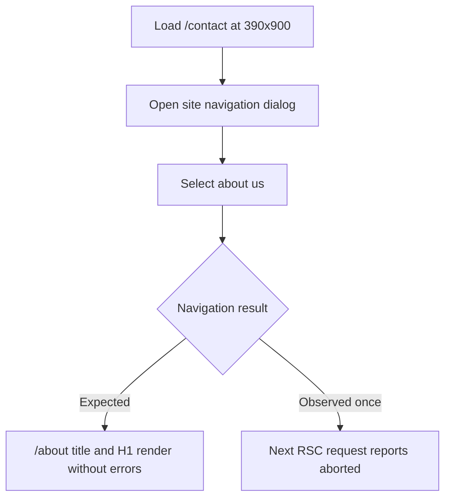

# Embeddings Maintenance and Navigation Stability Plan

<critical_warning>
> **CRITICAL WARNING:** Application navigation code must remain unchanged unless the mobile contact-to-about abort reproduces deterministically and evidence identifies a repository-owned race. Preserve the existing IntersectionObserver and `content-visibility` design, and do not treat offscreen blank regions in full-page captures as an application defect.
</critical_warning>

<important_note>
> **IMPORTANT NOTE:** Work directly from `main`, preserve and exclude unrelated or pre-existing changes, create exactly one scoped Conventional Commit after every required check passes, and do not amend, rebase, push, force-push, expose credentials, or make destructive external changes.
</important_note>

## 1. Goal

Remove the development warning that reports a 20-month-old `caniuse-lite` database through the package manager’s supported Browserslist update mechanism, while avoiding unrelated dependency churn. Establish whether the one observed aborted Next RSC request during mobile `/contact` → open navigation → `/about` is an application defect by adding a repeatable 20-iteration diagnostic/regression flow that records request failures, page errors, document title, and H1. Complete the work with clean automated checks, responsive browser evidence, an implementation record in this plan, and one scoped commit.

---

## 2. Current State Analysis

### 2.1 Current Implementation Overview

- The application is a Next.js App Router static export served locally by `npm run dev` on port `3002`.
- `src/components/RootNavigationPanel.jsx` renders the navigation dialog and closes it when a contained link is selected.
- `/contact` and `/about` are server-rendered routes with metadata titles `Contact Us` and `About Us`.
- The lockfile currently resolves `browserslist` 4.24.2 and `caniuse-lite` 1.0.30001684, which causes development startup to report that the browser database is 20 months old.
- Existing Node tests live in `test/*.test.mjs`; the repository has no configured Playwright npm script.

### 2.2 Current Flow

### 2.3 The Core Problem

The stale compatibility database warning is deterministic maintenance debt and should be removed with the supported `update-browserslist-db` workflow. The navigation abort is not deterministic: one mobile run reported an aborted Next RSC request, while two complete retries were clean. A speculative UI change could introduce regressions without fixing a proven repository defect, so a persistent diagnostic must first stress the exact interaction and classify failures.

### 2.4 Affected User Scenarios

- Developers starting the application receive a stale browser-compatibility warning that obscures useful startup output.
- Mobile visitors moving from the contact page to the about page could be affected only if the original abort represents a reproducible application race.
- Reviewers can misdiagnose `content-visibility: auto` or IntersectionObserver-controlled offscreen sections from full-page screenshots; targeted viewport evidence is required.

### 2.5 Technical Constraints

- Use npm’s supported Browserslist database update mechanism and inspect the exact `package-lock.json` delta.
- Do not introduce unrelated dependency updates or change `package.json` unless the supported updater requires it.
- Preserve contact copy, form field contract, navigation labels, minimal header design, animations, IntersectionObserver behaviour, and `content-visibility` behaviour.
- Verify port `3002` before browser work; start `npm run dev` only when no listener exists.
- Required checks are `npm run lint`, `npm run build`, `npm test`, and the focused navigation diagnostic.
- Browser validation must cover `1440x900` and `390x900`, check horizontal overflow, console errors, page errors, request failures, and changed/offscreen elements using targeted captures.

### 2.6 Existing Infrastructure That Can Be Reused

- `src/components/RootNavigationPanel.jsx` supplies stable dialog and link semantics for the browser flow.
- `test/*.test.mjs` supplies the project’s Node test conventions.
- `dev-browser` supplies persistent browser automation and screenshot capture.
- `/Users/sacino/.dev-browser/tmp/dev-browser-cross-app/embeddings/04-contact-mobile-filled-form.png` and `/Users/sacino/.dev-browser/tmp/dev-browser-cross-app/embeddings/06-home-desktop-service-timeline.png` provide the original targeted browser evidence.

---

## 3. Desired State

### 3.1 Desired State Requirements

- **REQ-1 (MUST):** `caniuse-lite` must be updated through npm’s supported Browserslist database command, with only the required lockfile packages changed.
- **REQ-2 (MUST):** Development startup must no longer emit the 20-month-old `caniuse-lite` warning.
- **REQ-3 (MUST):** A repeatable mobile diagnostic must run exactly 20 `/contact` → open navigation → `/about` iterations and record each iteration’s request failures, page errors, title, and H1.
- **REQ-4 (MUST):** Every clean iteration must end on `/about`, report the expected title and H1, and contain zero page errors and zero unexpected request failures.
- **REQ-5 (MUST NOT):** Application navigation, IntersectionObserver, animation, or `content-visibility` code must change unless the abort becomes deterministic and evidence proves a repository-owned race.
- **REQ-6 (MUST):** Contact form name, email, company, phone, message, and budget inputs must remain usable without submitting the form.
- **REQ-7 (MUST):** Required automated checks and responsive browser validation must pass before one scoped commit is created on `main`.

### 3.2 Defaults and Fallbacks

- **Default:** Treat failed or cancelled requests as diagnostic data, but classify expected browser cancellations separately from unexpected failures using URL, resource type, error text, and the final rendered state.
- **Fallback order:** Re-run the focused flow with recorded evidence; inspect the repository-owned event/navigation path; add a failing regression only if deterministic; change application code only after the responsible race is identified.
- **Compatibility:** Keep the current static export, Next navigation semantics, contact form contract, responsive layout, and reveal/rendering optimisations unchanged.

### 3.3 Verification Checklist

**Functional:**
- [ ] Twenty mobile navigation iterations reach `/about` with the expected title and H1.
- [ ] Unexpected request failures and page errors are zero, or a deterministic app race is reproduced and fixed.
- [ ] Contact form fields and budget selection accept values without submission.

**Defaults/Fallbacks:**
- [ ] No speculative application change is made for a transient browser cancellation.
- [ ] Diagnostic output retains per-iteration failure and rendered-state details.

**Compatibility:**
- [ ] Desktop and mobile pages have no horizontal overflow, console errors, or page errors.
- [ ] Targeted viewport evidence confirms offscreen/revealed sections without changing IntersectionObserver or `content-visibility` behaviour.

**Ops/Docs:**
- [ ] Startup warning is absent after the lockfile update.
- [ ] This plan contains the final Implemented Solution section and the single commit excludes unrelated changes.

---

## 4. Additional Context

### 4.1 User-Provided Context

The delegated source is `/Users/sacino/documents/todo/dev_browser_issue_remediation_threads_plan.md`, specifically section 2.5 and Step 5. The original navigation signal occurred once during mobile `/contact` → open navigation → `/about`; two focused retries were clean. The user requires a 20-iteration diagnostic before any application change, controlled Browserslist maintenance, full required validation, and exactly one local commit without any push or history rewriting.

### 4.2 Background and Decisions

- Full-page blank regions caused by deferred rendering are capture behaviour, not proof of an app defect. Scroll changed or lazy sections into the viewport, wait for layout, and capture targeted evidence.
- A reproducible diagnostic/regression artefact remains valuable even if all 20 iterations pass because it documents the transient signal and gives future maintenance a focused stability check.
- The dependency update and diagnostic are the concrete deliverables when no repository-owned navigation race reproduces.

---

## 5. Implementation Plan

### Step 1: Establish the Navigation Regression Boundary

**Objective:** Create and run the lowest viable repeatable diagnostic before considering an application fix.

#### 1.1 High-Level Approach

- Add a focused browser diagnostic under `scripts/browser/` that runs the mobile route flow exactly 20 times without entering Node’s recursive `npm test` discovery.
- Record iteration number, request failures, page errors, final URL, title, and H1 in machine-readable or clearly structured output.
- Fail the diagnostic for an incorrect final route/title/H1, any page error, or any unexpected request failure; retain enough request metadata to distinguish a browser cancellation from an application failure.
- Leave application navigation code unchanged unless the diagnostic deterministically fails and identifies a repository-owned race.

**Success Criteria:**

- One command runs exactly 20 iterations at a `390x900` viewport.
- Each recorded result includes final URL, title, H1, request failures, and page errors.
- All 20 iterations reach `/about`, the title contains `About Us`, and the H1 matches the rendered about-page heading.
- The pre-change run establishes either zero unexpected failures or a deterministic failing regression before any application code changes.

### Step 2: Refresh the Browserslist Database

**Objective:** Remove the stale database warning without unrelated dependency churn.

#### 2.1 High-Level Approach

- Run `npx update-browserslist-db@latest` through npm from the repository root.
- Review `package-lock.json` before and after, confirming changes are limited to the compatibility database and updater dependency graph required by the command.
- Start or restart development on port `3002` and inspect startup output for the stale warning.

**Success Criteria:**

- `package-lock.json` resolves a current `caniuse-lite` database through npm’s supported updater.
- Lockfile review finds no unrelated top-level dependency or package version churn.
- Fresh `npm run dev` startup output contains no warning that `caniuse-lite` is 20 months old.

### Step 3: Validate Responsive Behaviour and Repository Health

**Objective:** Prove the maintenance update and retained navigation behaviour work across required checks and viewports.

#### 3.1 High-Level Approach

- Run the focused test file, `npm test`, `npm run lint`, and `npm run build`.
- Use browser automation at `390x900` for the contact form and navigation flow, and at `1440x900` for contact/about and a targeted homepage service section.
- Check horizontal overflow, console errors, page errors, failed requests, final route, title, H1, and contact field/budget state without submitting.
- Capture screenshots to absolute paths after scrolling target sections into view and allowing the layout to settle.

**Success Criteria:**

- Focused diagnostic, `npm test`, `npm run lint`, and `npm run build` exit with status 0.
- Mobile contact inputs and budget selection retain entered values before navigation.
- Desktop and mobile checks report zero horizontal overflow, console errors, page errors, and unexpected request failures.
- Targeted screenshots show the contact/about states and homepage service content in the viewport.

### Step 4: Record and Commit the Implemented Scope

**Objective:** Deliver one reviewable commit containing only the plan, lockfile maintenance, diagnostic/regression artefact, and any proven fix.

#### 4.1 High-Level Approach

- Append an `Implemented Solution` section listing exact files, dependency deltas, diagnostic outcome, browser methodology, and validation results.
- Review `git diff`, `git status`, and the staged diff; exclude unrelated or pre-existing changes.
- Create exactly one scoped Conventional Commit on `main` without amending, rebasing, or pushing.

**Success Criteria:**

- The plan’s Implemented Solution section accurately lists every committed file and behaviour change.
- The staged diff contains only this plan, the required lockfile delta, diagnostic/regression artefacts, and a proven application fix if one was necessary.
- Exactly one new scoped Conventional Commit exists on `main`, and its hash is recorded for handoff.

---

## 6. Testing Plan

### 6.1 Source-of-Truth Regression Artefacts

- `/Users/sacino/.dev-browser/tmp/dev-browser-cross-app/embeddings/04-contact-mobile-filled-form.png`: proves the original mobile contact state and is the interaction starting point; post-change verification must fill the same contact contract without submission and navigate successfully.
- The original one-off aborted `/about?_rsc=...` request described in `/Users/sacino/documents/todo/dev_browser_issue_remediation_threads_plan.md`: proves a transient request signal that two clean retries did not reproduce; the 20-iteration diagnostic is derived from this exact route and interaction because the original ephemeral network event is not stored as a reusable test fixture.
- `/Users/sacino/.dev-browser/tmp/dev-browser-cross-app/embeddings/06-home-desktop-service-timeline.png`: proves the service timeline renders when targeted in the viewport; post-change evidence must use viewport scrolling rather than a full-page capture assertion.

<critical_warning>
> **CRITICAL WARNING:** Do not replace the exact contact-to-about interaction with direct URL navigation, and do not use full-page screenshot blank regions as a regression assertion. The synthetic repetition supplements the original ephemeral RSC failure by exercising the same menu interaction 20 times.
</critical_warning>

### 6.2 Automated Tests

| Test Case | Location and Framework | Expected Result | Command |
| --- | --- | --- | --- |
| Mobile contact-to-about stress flow | `scripts/browser/contact-about-navigation.dev-browser.js` using dev-browser | Exactly 20 iterations record final URL, title, H1, page errors, and request failures; all assertions pass or deterministically reproduce the race | `dev-browser --browser embeddings-navigation-classification-v2 --headless --timeout 180 run scripts/browser/contact-about-navigation.dev-browser.js` |
| Repository Node tests | `test/*.test.mjs`, Node test runner | All existing contract and source regressions pass | `npm test` |
| Lint | Next ESLint | Zero lint errors | `npm run lint` |
| Static export | Next build | Build and export complete without errors or stale Browserslist warning | `npm run build` |

### 6.3 Browser Validation

1. Mobile contact and navigation at `390x900`
   - Action: Load `/contact`, fill name, email, company, phone, message, and budget without submission; open the site navigation and select `about us`.
   - Expected: Values and budget selection work before navigation; `/about` renders the expected title and H1; no overflow, console errors, page errors, or unexpected request failures occur.
   - Verify: Browser state inspection plus targeted screenshots saved to absolute paths.
2. Desktop contact/about at `1440x900`
   - Action: Load `/contact` and `/about`, inspect visible headings and responsive layout.
   - Expected: Correct titles/H1 values, no horizontal overflow, console errors, page errors, or unexpected request failures.
   - Verify: Browser state inspection and targeted viewport screenshots.
3. Targeted homepage service evidence at desktop and mobile viewports
   - Action: Load `/`, scroll the service section into view, wait for the layout and animation to settle, and capture the viewport.
   - Expected: Service content is visible without changing the existing IntersectionObserver, animation, or `content-visibility` implementation.
   - Verify: Targeted screenshots and browser error/overflow inspection.

---

## 7. Implemented Solution

### Files Touched

- `package-lock.json`: Updated only the resolved `caniuse-lite` package from `1.0.30001684` to `1.0.30001803`, including its tarball URL and integrity value.
- `scripts/browser/contact-about-navigation.dev-browser.js`: Added a 20-iteration `390x900` diagnostic that records raw, expected, and unexpected request failures; page errors; final URL; exact title; and exact normalised H1 in `/Users/sacino/.dev-browser/tmp/contact-about-navigation-regression.json`.
- `documents/todo/embeddings_maintenance_navigation_stability_plan.md`: Added the standalone implementation plan and this implementation record.

### Key Behaviour and Methodology

- Ran npm’s supported `npx update-browserslist-db@latest` mechanism. Lockfile review confirmed a three-line package record update with no `package.json`, top-level dependency, Browserslist, updater, or unrelated lockfile churn.
- Fresh `npm run dev` startup completed in 2.1 seconds without the former 20-month-old `caniuse-lite` warning. The required production build also emitted no stale database warning.
- Repeated diagnostics showed the originally reported RSC abort is intermittent rather than deterministic: earlier 20-iteration runs recorded one and then two `GET`/`fetch` `net::ERR_ABORTED` events for `/about?_rsc=…`, while every affected iteration still reached the exact `/about` URL, title, and H1 with zero page errors. A fresh classified 20-iteration run recorded zero raw, expected, or unexpected failures.
- The diagnostic retains every raw failure and classifies only an aborted `/about?_rsc=` fetch as an expected client-navigation cancellation when the same iteration has the exact successful rendered state and zero page errors. Any other request failure, page error, route mismatch, title mismatch, or H1 mismatch fails the run.
- No application, navigation, IntersectionObserver, animation, or `content-visibility` code changed because the abort did not become deterministic and no repository-owned race was proven.
- Documentation sync review found no affected system architecture document: service-section animation behaviour was preserved, and the marketing positioning document is not updated from code maintenance.

### Validation Results

- `dev-browser --browser embeddings-navigation-classification-v2 --headless --timeout 180 run scripts/browser/contact-about-navigation.dev-browser.js`: Passed 20/20 iterations at `390x900`; exact URL/title/H1 passed; zero page errors; zero raw, expected, or unexpected request failures in the final run.
- `npm test`: Passed 56/56 Node tests.
- `npm run lint`: Passed with zero ESLint warnings or errors; Next printed only its existing `next lint` deprecation notice.
- `npm run build`: Passed compilation, static generation, and export; no Browserslist/caniuse-lite warning.
- Responsive dev-browser verification: Passed `/contact`, menu navigation, `/about`, and targeted `#services` checks at `390x900` and `1440x900`; contact values and budget selection were retained before navigation; horizontal overflow, console errors, page errors, and request failures were all zero.
- Screenshots: `/Users/sacino/.dev-browser/tmp/embeddings-maintenance/mobile-contact-filled.png`, `/Users/sacino/.dev-browser/tmp/embeddings-maintenance/mobile-about.png`, `/Users/sacino/.dev-browser/tmp/embeddings-maintenance/desktop-contact.png`, `/Users/sacino/.dev-browser/tmp/embeddings-maintenance/desktop-about.png`, `/Users/sacino/.dev-browser/tmp/embeddings-maintenance/mobile-services-targeted.png`, and `/Users/sacino/.dev-browser/tmp/embeddings-maintenance/desktop-services-targeted.png`.
