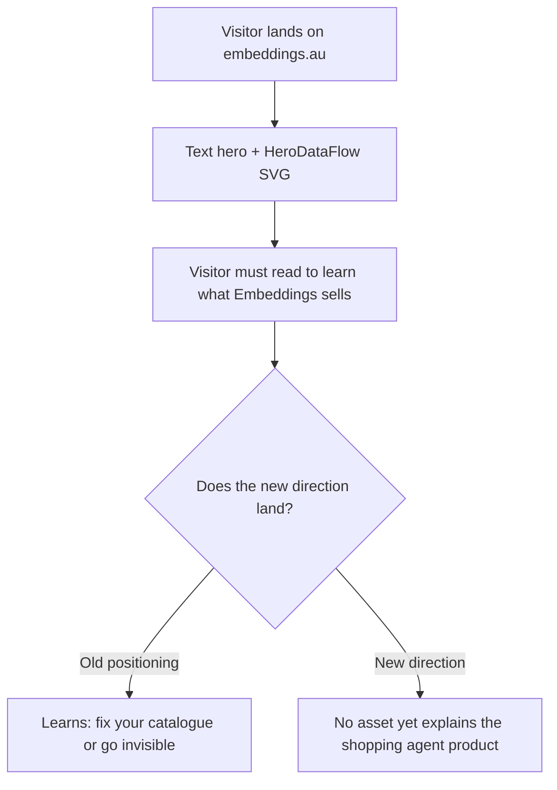

# ~~Site Hero Video — "One Conversation" Plan~~ ✅ **COMPLETED**

<critical_warning>
> **CRITICAL WARNING:** No competitor may appear in the finished video. Google, Bunnings Buddy, and any other named vendor MUST NOT be named, shown, implied, or paraphrased in on-screen copy. The source brief (`documents/reference/ai-shopping-agent.md`) is an internal opportunity document whose competitive claims are explicitly hedged ("reportedly", "as described in the transcript"). Nothing from it that names or characterises a competitor may reach the screen.
</critical_warning>

<critical_warning>
> **CRITICAL WARNING:** No marketing statistic may appear in the finished video. Conversion uplift, average-order-value multiples, cost per session, implementation weeks, and ARR figures are all banned from every frame, including the closing card. This was an explicit user instruction. Ordinary in-demo detail (product prices, torque ratings, battery capacities, an order total) is permitted and expected, because a shopping conversation without prices is not believable.
</critical_warning>

<important_note>
> **IMPORTANT NOTE:** This video is silent by design. The canonical HyperFrames silent marker is `music: none` in the `STORYBOARD.md` frontmatter **and** no `SCRIPT.md` file. Both conditions must hold. Do not improvise other spellings, do not generate narration, and do not generate background music. This is a deliberate creative decision, not a degraded fallback — see § 4.1.
</important_note>

<important_note>
> **IMPORTANT NOTE:** Because the video is silent, every idea must survive with the sound off. On-screen typography is the only narration channel. Each frame's readable text is specified verbatim in § 5 and MUST be used exactly as written, including British English spelling and the right single quotation mark (`’`, U+2019) for apostrophes.
</important_note>

---

## 0. Execution status — read this first

All eight steps are complete. An end-to-end review on 2026-08-11 found and corrected two
additional render defects: load-bearing product specifications failed contrast checks, and the
assembled root canvas was white, which produced grey flashes during dark crossfades. The video
was reassembled and rerendered after both fixes.

**Project root on disk:** `/Users/sacino/embeddings/videos/embeddings-shopping-agent/`
(referred to below as `PROJECT_ROOT`). It is gitignored and contains no partial frame output.

| Step | State | Evidence on disk |
| --- | --- | --- |
| 1. Setup and git hygiene | **Complete** | `.gitignore` has `videos/`; `PROJECT_ROOT/hyperframes.json` and `BRIEF.md` exist; preferences recorded |
| 2. Capture and design system | **Complete** | `capture/` populated, capture reported `ok: true`; `frame.md` built from the `broadside` preset and remixed onto the real brand tokens |
| 3. Storyboard | **Complete** | `STORYBOARD.md` — 7 frames, durations summing to 60s, `music: none`, no `SCRIPT.md` |
| 4. Audio (skipped by design) | **Complete** | No `SCRIPT.md`, no `audio_meta.json`, no audio staged |
| 5. Visual design | **Complete** | `STORYBOARD.md` carries `## Video direction`, per-frame time-coded shot sequences, handoff blocks; `assets/logo-0b414dc9.svg` staged |
| 6. Build frames and assemble | **Complete** | Seven animated HTML frames and `index.html` exist; every full-bleed ground uses a clip layer |
| 7. Transitions, checks, render | **Complete** | Transition verification and HyperFrames checks pass; the 60-second silent MP4 exists under `renders/` |
| 8. Repository validation | **Complete** | Site lint, static export, and all 67 Node.js tests pass; `.gitignore` is the only modified tracked file |

### Decisions made during execution that are not in the original step text

1. **Mode was switched to `autonomous`.** The user asked for end-to-end execution, so
   `BRIEF.md` and `STORYBOARD.md` both carry `mode: autonomous` and the collaborative review
   pauses in Steps 3, 5 and 7 were to be posted as heads-ups rather than blocking. **A new
   implementer who wants the review gates back must change `mode:` in `STORYBOARD.md` to
   `collaborative` and run the pauses as originally written.**
2. **The wordmark was staged by hand.** `stage-assets.mjs` searches only `capture/assets`,
   `capture/assets/videos` and `capture/screenshots`. The Embeddings wordmark lives at
   `capture/assets/svgs/logo-0b414dc9.svg`, one level deeper, so it was copied manually to
   `assets/logo-0b414dc9.svg`. The stager now reports `1/1 staged` because the destination
   already exists. If `assets/` is ever cleared, repeat that copy by hand.
3. **`asset_candidates` is empty on the six constructed-UI frames.** The stager treats any
   prose in that field as a filename and emits false 404 anomalies. Those frames carry an
   `asset_note:` line instead, explaining that they are intentionally typography-only. Only
   Frame 7 names a real asset.
4. **Cited motion rules were trimmed to 3-4 per frame.** `frame-packets.mjs` enforces a
   48000-byte packet ceiling and the first build failed at 64939 bytes for Frame 1 because
   too many rule recipes were being inlined. The shot sequences were rewritten to cite only
   the rules each frame genuinely leans on. Any future edit that adds rule citations risks
   breaching the same ceiling.
5. **The `broadside` preset worked; the `cartesian` fallback was not needed.**
   `build-frame.mjs` mapped the real brand onto it: ground `#000000`, text `#FFFFFF`, accent
   `#6EE7B7` (the site's emerald), display and body both Mona Sans, with the font face staged
   into `assets/fonts/`.

### One open risk

The `renders/` output and the whole `videos/` tree are gitignored, which is what the user
asked for. That means **the finished MP4 will exist only on the machine that renders it.**
Whoever finishes this needs a plan for getting the file to wherever it will be hosted; this
plan does not cover publishing it to the site.

---

## 1. Goal

Produce a 60-second, 1920x1080, silent MP4 that plays in the hero position on `embeddings.au` and explains what Embeddings does under its new product direction: an out-of-the-box, retailer-controlled AI shopping agent that runs on the retailer's own site.

The video is titled **"One Conversation"**. Its entire argument is a single unbroken chat thread on a fictional retailer's website that carries a shopper from an opening question, through comparison, through checkout completed inside the thread, and then days later back into the same thread for order status and a return. The video then pulls back twice: once beneath the thread to show the enriched, indexed catalogue and connected retailer systems the answers come from, and once out to the retailer's own configuration panel where a person edits the agent's wording and branding and the live thread updates.

### Why this concept

Embeddings is changing direction. The current site sells fear of disintermediation: AI agents shop on behalf of consumers, so fix your catalogue or become invisible. The new direction (`documents/reference/ai-shopping-agent.md`) sells ownership: you run the agent, on your site, in your brand, launched in days rather than as a multi-quarter engineering project. The antagonist changes from "the AI agent" to "the slow, engineer-gated widget you were offered".

Four concepts were considered and rejected for the hero position (§ 4.2). "One Conversation" won on three grounds:

1. **It answers "what is this company" in about three seconds with the sound off**, because the thing on screen is the product running. A hero viewer has just landed and does not know what you sell.
2. **It has no punchline to spoil**, so it survives looping, partial views, and rewatching. Concepts built on a reveal do not.
3. **It never argued from statistics**, so the no-numbers constraint costs it nothing. Its proof is demonstration.

### High-level success criteria

- `videos/embeddings-shopping-agent/renders/video.mp4` exists, is 1920x1080, and its duration is within 3 seconds of 60 seconds.
- The video contains no audio track content: no narration, no music, no sound effects.
- No competitor name and no marketing statistic appears in any frame.
- `npx hyperframes lint` and `npx hyperframes check` both exit 0 before the render.
- The site repository still passes `npm run lint`, `npm run build`, and `npm test` after the `.gitignore` change.
- No video artefact enters git history.

---

## 2. Current State Analysis

### 2.1 Current Implementation Overview

`/Users/sacino/embeddings` is a Next.js 14 App Router marketing site, Tailwind CSS, statically exported to `out/` and deployed to GitHub Pages at `embeddings.au` by `.github/workflows/deploy.yml`. Node 22.17.0. There is no server-side runtime and no database.

The site currently has **no video asset of any kind**, and no `videos/` directory. The homepage (`src/app/page.jsx`) opens on a text hero plus the `HeroDataFlow.jsx` animated SVG. This plan does not modify any site code, any component, or any page. It produces a standalone MP4 that a later, separate piece of work may place in the hero.

The site's present messaging is catalogue-readiness for agentic commerce, documented in `documents/agentic-shopping-positioning.md`. The homepage arc is Hero, Agentic Timeline, Why Now, Testimonial, Services (Catalogue Audit, Catalogue Freshness, Catalogue Enrichment, Contextual Catalogue Optimisation), Contact CTA.

### 2.2 Current Flow



### 2.3 The Core Problem

The new direction is a **product**, not a consultancy service, and products are far easier to understand by being shown than by being described. There is currently no asset on the site that shows the shopping agent working. A visitor arriving at the hero cannot see, in the first few seconds, that Embeddings builds an agent that lives on their own storefront, wears their brand, completes checkout, and handles post-sale questions.

### 2.4 Affected User Scenarios

| Scenario | Impact today |
| --- | --- |
| Retail digital lead lands on the hero cold | Reads catalogue-enrichment positioning, does not learn the agent product exists |
| Visitor watches with sound off (the hero default) | Any audio-dependent explanation is lost entirely |
| Visitor bails within 5 seconds | Must have already understood the offer, or the impression is wasted |
| Visitor loops the hero video | A reveal-based concept becomes worthless on the second pass |

### 2.5 Technical Constraints

- **HeyGen is not signed in.** `npx hyperframes auth status` reports "Not signed in to HeyGen". Local fallback engines are also unusable: Kokoro (voice) reports `deps missing` and MusicGen (music) reports `deps missing`. Narration and background music are therefore both unavailable without a browser OAuth sign-in or a large `pip install`. The silent decision (§ 4.1) removes this dependency entirely rather than working around it.
- **Static export.** The site builds with `next build` to `out/`. A root-level `videos/` directory is outside `src/` and `public/` and is not consumed by the export, so it cannot affect the build. This must still be verified (§ 5, Step 7).
- **Git hygiene.** The HyperFrames project produces captured screenshots, staged assets, HTML compositions, snapshot contact sheets, and an MP4. None of it may enter git history.
- **Canvas.** 1920x1080 (16:9), set once in `STORYBOARD.md` frontmatter as `format: 1920x1080`. Derived from the hero destination.
- **British English throughout**, per `AGENTS.md` `<content_rules>`. Apostrophes in any text that displays to a viewer use `’` (U+2019), never `'` (U+0027).

### 2.6 Existing Infrastructure That Can Be Reused

| Asset | Path | Use |
| --- | --- | --- |
| Product launch workflow | `/Users/sacino/.agents/skills/product-launch-video/SKILL.md` | The orchestration spine, Steps 0 to 6 |
| Frame presets | `/Users/sacino/.agents/skills/hyperframes-creative/frame-presets/` | 13 shipped presets; `broadside` is the pick (§ 5, Step 2) |
| Motion blueprints | `/Users/sacino/.agents/skills/hyperframes-animation/blueprints-index.md` | 22 proven shot shapes; one per frame, named in § 5 |
| Frame worker contract | `/Users/sacino/.agents/skills/hyperframes-core/references/frame-worker-core.md` | Prepended into `_role.md` by the packet builder |
| Storyboard format | `/Users/sacino/.agents/skills/hyperframes-core/references/storyboard-format.md` | Required frontmatter and per-frame keys |
| New direction brief | `/Users/sacino/embeddings/documents/reference/ai-shopping-agent.md` | The product being sold; source of every capability claim |
| Live site | `https://embeddings.au` | Capture target for brand colours, type, and assets |

---

## 3. Desired State

### 3.1 Desired State Requirements

- **REQ-1 (MUST)**: The finished MP4 is 1920x1080 and lands within 3 seconds of a 60-second target.
- **REQ-2 (MUST)**: The video is silent. `STORYBOARD.md` frontmatter contains `music: none`, no `SCRIPT.md` exists in the project, and `audio_meta.json` is absent.
- **REQ-3 (MUST)**: The entire piece reads with the sound off. Every frame carries the exact on-screen text specified in § 5.
- **REQ-4 (MUST)**: Frames 1 to 4 depict one continuous, unbroken conversation thread. Continuity is proven visually, not asserted: the thread scrolls back through its own earlier messages in Frame 4.
- **REQ-5 (MUST)**: The storefront and the agent wear a **fictional** retailer's brand, not Embeddings' brand, because the product's whole claim is that the agent wears the retailer's identity. Retailer name: **Yardline Hardware**. Embeddings' own brand appears only on the closing card.
- **REQ-6 (MUST NOT)**: No real retailer's name, logo, trade dress, or product photography appears. No real product brand appears on any product card. All product names, prices, and specifications are invented.
- **REQ-7 (MUST NOT)**: No competitor is named, shown, or implied, and no marketing statistic appears (see the two critical warnings above).
- **REQ-8 (MUST)**: The video shows all four differentiators from `documents/reference/ai-shopping-agent.md` § Customer Value Proposition, by demonstration rather than by claim: **more capability** (checkout in-thread, order status, returns), **more control** (self-service prompt and branding edits), **works with existing systems** (the connected catalogue, search, and API layer), and **faster launch** (stated only qualitatively on the closing card, with no figure).
- **REQ-9 (MUST)**: The catalogue foundation appears as its own beat. `documents/reference/ai-shopping-agent.md` § Connection to the Existing Embeddings Business positions catalogue enrichment as the entry product with the agent as the higher-value layer on top; without this beat the video sells a chat widget rather than the stack underneath it.
- **REQ-10 (MUST)**: The HyperFrames project lives at `/Users/sacino/embeddings/videos/embeddings-shopping-agent/` and `videos/` is added to `/Users/sacino/embeddings/.gitignore`.
- **REQ-11 (MUST NOT)**: No file under `videos/` is staged or committed.
- **REQ-12 (MUST)**: No site source file, component, page, or existing document is modified. The only tracked file this plan changes is `.gitignore`.
- **REQ-13 (SHOULD)**: The first 10 seconds stand alone as a silent looping segment, so the clip can later be reused as a background loop without a re-edit.

### 3.2 Defaults and Fallbacks

- **Style preset default**: `broadside`. Chosen because its bones match the site: a two-register dark surface system, a flat plane, 1px hairline dividers, and mono chrome, which suits UI-heavy frames (chat thread, config panel, data layer). Its own fire-orange accent and Barlow display are **not** used; `build-frame.mjs` remixes Embeddings' captured colours and fonts onto the preset's colour and type roles. The pick is the layout bones, not the colours.
- **Style preset fallback**: `cartesian` (hairline-only structural device, zero shadow, zero fill) if `broadside`'s dark register fights the captured brand tokens.
- **Capture fallback order**: `https://embeddings.au` is the capture target. If capture fails (non-zero exit, `ok: false`, or `capture/BLOCKED.md`), **stop and report**. Do not fabricate a synthetic no-capture fallback and do not consume partial output.
- **Audio**: none, unconditionally. If any step would generate audio, skip it.
- **Captions**: skipped, with the recorded reason `no narration (silent piece)`. There is no narration to caption.

### 3.3 Verification Checklist

**Functional:**
- [x] `videos/embeddings-shopping-agent/renders/video.mp4` exists at 1920x1080, duration within 3s of 60s
- [x] Seven frames exist under `compositions/frames/`, all marked `animated` in `STORYBOARD.md`
- [x] Frames 1 to 4 show one continuous thread; Frame 4 scrolls back through Frame 2's messages
- [x] Frame 5 shows the catalogue, index, and connected-systems layer beneath the thread
- [x] Frame 6 shows a config edit changing the live thread in the same beat
- [x] Frame 7 shows the Embeddings wordmark and the exact closing line from § 5

**Silence:**
- [x] `STORYBOARD.md` frontmatter contains `music: none`
- [x] No `SCRIPT.md` exists in the project directory
- [x] No `audio_meta.json` exists in the project directory
- [x] The rendered MP4 has no audio stream, or a silent one (verify with `ffprobe`)

**Content safety:**
- [x] Contact-sheet inspection confirms no competitor name appears in any frame
- [x] Contact-sheet inspection confirms no conversion, cost, ARR, or implementation-time statistic appears in any frame
- [x] All retailer and product names on screen are the invented ones listed in § 5

**Repository:**
- [x] `git -C /Users/sacino/embeddings check-ignore -v videos/embeddings-shopping-agent` reports the `.gitignore` rule
- [x] `git -C /Users/sacino/embeddings status --porcelain` lists no path under `videos/`
- [x] `npm run lint` exits 0
- [x] `npm run build` exits 0 and writes `out/`
- [x] `npm test` passes
- [x] `git -C /Users/sacino/embeddings diff --name-only` shows `.gitignore` as the only modified tracked file

---

## 4. Additional Context

### 4.1 User-Provided Context

The following decisions came directly from the user and are settled. Do not reopen them.

| Decision | User's answer | Consequence for the build |
| --- | --- | --- |
| Concept | "One Conversation", with the config-panel control act grafted on as the third act | The frame plan in § 5 |
| Placement | Site hero | 16:9, muted-first, must survive looping and partial views |
| Length | "pick a length that suits" — 60 seconds recommended and accepted | `duration: 60s` in frontmatter |
| Numbers | "we don't want to include specific numbers", scoped to **marketing claims only** | Product prices and specs stay; statistics go |
| Audio | Silent, typography-led | `music: none`, no `SCRIPT.md`, captions skipped |
| Project location | In the repo, gitignored | `videos/embeddings-shopping-agent/` plus a `.gitignore` entry |
| Retailer identity | Fictional retailer | Yardline Hardware, invented products |

The user chose silence over signing in to HeyGen after being told narration and music were unavailable. The stated reasoning, which the executor should preserve: hero videos autoplay muted anyway, "One Conversation" is already a text-led piece so the thread carries itself, and silence removes a dependency. **Build it as a designed silent piece, not as a video with the sound stripped out.** The difference matters: pacing, hold times, and on-screen typography must all assume no voice will ever explain anything.

The user also accepted two calls made on their behalf:

1. **The catalogue foundation beat was folded in** (Frame 5), because the brief positions enrichment as the entry product and without that beat the video sells a chat widget rather than the stack underneath it.
2. **No competitor appears.** On a hero, a competitor takedown reads as defensive, and the control act carries the same point by simply showing the retailer doing it themselves.

### 4.2 Background and Decisions

**The direction change.** Five concepts were pitched against the new direction in `documents/reference/ai-shopping-agent.md`. Four were rejected. Recording them here so the executor understands what "One Conversation" is deliberately not:

| Rejected concept | What it was | Why it lost |
| --- | --- | --- |
| The Afternoon | Split-screen implementation timelines, timestamps driving the cuts | Built entirely on figures. The no-numbers rule leaves nothing behind |
| The Change Request | A support ticket crawling through an external engineer versus the same edit done live in a self-service field | A competitor argument. Only works on a viewer who already knows the category and agreed to watch. Its device survives as Frame 6 |
| Everything It Can't Do | Opens as a generic assistant demo, then stacks its limits beside it | Worst hero failure mode: a viewer leaving at three seconds leaves thinking the generic assistant is the product |
| Now Hiring | A staff-noticeboard job ad, revealed at the end as the agent | Withholds the reveal. A hero cannot rely on people staying for a punchline. Also sells the category rather than Embeddings |

An earlier round of five concepts was pitched against the **old** positioning (catalogue readiness, agent disintermediation) and is entirely obsolete. Do not resurrect "Why the Agent Said No", "The Empty Result", "Feed View", "The Brand Film Nobody Watches", or "The Night Shift". They argue that you should be findable by someone else's agent, which is no longer the thesis.

**Domain background the executor needs.** Under the new direction, Embeddings proposes a configurable, retailer-controlled shopping agent platform installed as a JavaScript widget. Its capabilities, per the brief: product search and discovery, integration with existing product catalogues, support for multiple and retailer-owned search providers, self-service prompt and canned-response management, custom branding, reporting, PII scrubbing, custom API and tool integrations, order-status and return-status queries, and in-session checkout. The agent sits on top of an enriched, indexed catalogue. That ladder — enrich, index, agent, connect APIs — is the company's whole offer, and Frames 4, 5 and 6 exist to show its top three rungs.

**A documentation tension, deliberately out of scope.** `documents/agentic-shopping-positioning.md` describes the old catalogue-readiness positioning and is now partly superseded by `documents/reference/ai-shopping-agent.md`. `AGENTS.md` explicitly forbids updating the positioning document from code changes, and reconciling site messaging is not part of this plan. **Do not edit either document.** Neither of the two system architecture documents named in `AGENTS.md` (`documents/service-section-animations.md`, `documents/agentic-shopping-positioning.md`) is made inaccurate by this plan, because no site code changes, so no documentation update step is required.

**Why `broadside` and not a lighter preset.** The captured brand is a near-black canvas (`neutral-950`) with white type and hairline structure. Presets with cream paper and serif display (`cartesian`, `cobalt-grid`, `code-editorial`, `capsule`) fight that. `broadside` ships the two-register dark surface, the flat plane, and the 1px hairline divider system that UI frames need.

---

## 5. Implementation Plan

Work from `PROJECT_ROOT = /Users/sacino/embeddings/videos/embeddings-shopping-agent`. Run every relative-path command with that directory as the working directory. Let `SKILL_DIR = /Users/sacino/.agents/skills/product-launch-video` and `MEDIA_DIR = /Users/sacino/.agents/skills/media-use`.

Set `HYPERFRAMES_SKIP_SKILLS=1` on **every** `hyperframes` CLI invocation, so the CLI cannot replace the reviewed local skill bundle.

### ~~Step 1: Project setup and git hygiene~~ ✅ **COMPLETED**

**Status: COMPLETE.** All success criteria below were met and verified.

**Objective:** Create the HyperFrames project inside the repo without letting any of it reach git history.

#### 1.1 High-Level Approach

- Add `videos/` to `/Users/sacino/embeddings/.gitignore` under a comment reading `# HyperFrames video projects`. Do this **before** init, so nothing is ever untracked-and-visible.
- Initialise: `HYPERFRAMES_SKIP_SKILLS=1 npx hyperframes init "videos/embeddings-shopping-agent" --non-interactive --example=blank --skill=product-launch-video`
- Write `BRIEF.md` immediately after init (init refuses a non-empty directory, so never before). It must record: intent (sell, demonstrating the product running), the chosen concept verbatim from § 1, `length: 60s`, `destination: site hero`, `format: 1920x1080`, `mode: collaborative`, the silent decision, the fictional-retailer decision, the no-statistics constraint, and `style_preset: broadside`.
- Record the preference-backed answers: `node <MEDIA_DIR>/scripts/prefs.mjs record --hyperframes .`
- `npx hyperframes auth status` has already been run and reported not signed in. Do not sign in. Do not treat its exit code as a failure, and do not chain it with `&&`.

**Success Criteria:**
- `/Users/sacino/embeddings/.gitignore` contains a line `videos/`
- `git -C /Users/sacino/embeddings check-ignore -v videos/embeddings-shopping-agent` exits 0 and names the `videos/` rule
- `videos/embeddings-shopping-agent/hyperframes.json` exists
- `videos/embeddings-shopping-agent/BRIEF.md` exists and contains the strings `60s`, `1920x1080`, `broadside`, `silent`, and `Yardline Hardware`
- `git -C /Users/sacino/embeddings status --porcelain` lists no path beginning `videos/`

### ~~Step 2: Capture and design system~~ ✅ **COMPLETED**

**Status: COMPLETE.** Capture returned `ok: true` with 14 screenshots and 12 assets; `build-frame.mjs` exited 0.

**Objective:** Pull Embeddings' real brand tokens and assets from the live site, then bind them to a shipped frame preset.

#### 2.1 High-Level Approach

- Capture: `HYPERFRAMES_SKIP_SKILLS=1 npx hyperframes capture "https://embeddings.au" -o ./capture --json`
- Inspect the result immediately. A non-zero exit, `ok: false`, or the existence of `capture/BLOCKED.md` is a hard stop: report the recorded reason and do not consume partial screenshots, DOM, tokens, or assets.
- Build the design system: `node <SKILL_DIR>/scripts/build-frame.mjs --preset broadside --hyperframes .`
- This copies `broadside`'s `FRAME.md` to `frame.md` and remixes Embeddings' captured colours and fonts onto the preset's colour and type roles. Do not hand-edit `frame.md` unless a mapping is provably broken.
- If the script exits non-zero because the dark register cannot map, rerun with `--preset cartesian` and record the substitution in `BRIEF.md`.

**Success Criteria:**
- The capture JSON reports `ok: true` and `capture/BLOCKED.md` does not exist
- All four exist: `capture/extracted/tokens.json`, `capture/extracted/visible-text.txt`, `capture/extracted/asset-descriptions.md`, `capture/assets/`
- `capture/extracted/tokens.json` contains at least one colour value and at least one font family
- `build-frame.mjs` exits 0 and `frame.md` exists at the project root
- `frame.md`'s colour values include at least one colour drawn from `capture/extracted/tokens.json`, not only preset defaults
- The chosen preset is recorded as a preference: `node <MEDIA_DIR>/scripts/prefs.mjs record --key style_preset --workflow product-launch-video --hyperframes .`

### ~~Step 3: Storyboard~~ ✅ **COMPLETED**

**Status: COMPLETE.** `STORYBOARD.md` exists with all 7 frames. The review gate was run as an autonomous heads-up, not a blocking pause (see § 0).

**Objective:** Write the seven-frame plan, locked to 60 seconds, marked silent.

#### 3.1 Frontmatter

```yaml
format: 1920x1080
duration: 60s
music: none
message: Your shopping agent, on your site, in your brand, doing the whole journey
arc: Ask → Discover → Buy → Support → Foundation → Control → Brand
audience: Digital and e-commerce leads at medium-to-large Australian online retailers
mode: collaborative
```

#### 3.2 The seven frames

Durations sum to exactly 60 seconds. `type` values map to the storyboard frame enum.

| # | Title | Type | Duration | Transition in | Blueprint |
| --- | --- | --- | --- | --- | --- |
| 1 | The Ask | hook | 6s | cut | `prompt-type-submit-generate` |
| 2 | Discovery | feature_showcase | 10s | cut | `agent-progress-theater` |
| 3 | Checkout | feature_showcase | 9s | cut | `cursor-ui-demo` |
| 4 | Three Days Later | feature_showcase | 10s | crossfade | `transcript-scroll-artifact-reveal` |
| 5 | Underneath | product_intro | 10s | cut | `zoom-out-workspace-reveal` |
| 6 | Yours To Change | key_feature | 10s | crossfade | `panel-edit-live-sync` |
| 7 | Close | branding | 5s | cut | `titlecard-reveal` |

Frame 5's `transition_in` MUST be `cut`. The frame opens tight on the exact thread state Frame 4 ends on and pulls back in one continuous move; a crossfade would break the illusion that it is the same surface.

#### 3.3 Exact on-screen copy

Use these strings verbatim. British English. Apostrophes are `’` (U+2019).

**Persistent chip, Frames 1 to 4 only**, small mono, top-left, entering once in Frame 1 and never moving: `one conversation`. This is the silent piece's continuity device — it tells the viewer, without narration, that the thread never breaks.

**Frame 1 — The Ask.** A Yardline Hardware storefront with a small agent launcher. The launcher opens and the shopper types:

> I’m rebuilding my back deck. What cordless drill should I get?

**Frame 2 — Discovery.** Agent reply, then three product cards resolving inline, then a follow-up that narrows to one.

> Agent: For a deck rebuild you’ll want torque and battery life. Here are three that suit.

Product cards (all invented; no real brand may be substituted):

| Product | Price | Spec line |
| --- | --- | --- |
| Yardline 18V Brushless Drill Driver | $189 | 60Nm torque · 2 × 4.0Ah batteries |
| Yardline 18V Compact Drill | $129 | 44Nm torque · 1 × 2.0Ah battery |
| Halden 20V Hammer Drill Kit | $249 | 70Nm torque · hammer mode · 2 × 5.0Ah |

> Shopper: Which one handles hardwood?
> Agent: The Halden. Hammer mode drives into hardwood decking without pre-drilling.

**Frame 3 — Checkout.** The purchase completes inside the thread. No new page, no redirect.

> Shopper: Add it with a spare battery.

Then an in-thread cart summary showing the two line items and a total, a `Pay now` control, and a confirmation state reading:

> Order confirmed.

**Frame 4 — Three Days Later.** A time marker reads `3 days later`. The thread scrolls back up through Frame 2's product cards and Frame 3's confirmation before settling, proving it is the same conversation. Then:

> Shopper: Where’s my order?
> Agent: Out for delivery. Arriving today.
> Shopper: Can I return the spare battery?

The payoff artefact is a return label appearing in the thread.

**Frame 5 — Underneath.** One continuous decelerating pull-back from the thread reveals the layers below it. Layer labels, in order top to bottom: `enriched catalogue`, `search index`, `your systems: orders · returns · stock`. One line resolves at the end:

> Every answer comes from your catalogue — enriched, indexed, and connected to the systems you already run.

**Frame 6 — Yours To Change.** A configuration panel bound to the live thread. Two edits happen, each updating the thread in the same beat: a canned response is retyped, and the accent colour is changed. One line resolves:

> Change what it says and how it looks, yourself.

**Frame 7 — Close.** Embeddings wordmark, then one line:

> Your shopping agent. Your site, your brand, your rules.

Then `embeddings.au`.

#### 3.4 Review gate

After drafting, open the Studio board, present the plan as a proposal, and ask the two questions: approve or change, and sketches first (recommended) or skip. Feedback loops through chat or `.hyperframes/frame-comments.json` until approved. Revise exactly the frames named, delete the comments file, and re-present.

**Success Criteria:**
- `STORYBOARD.md` exists with the frontmatter in § 3.1, including `music: none`
- Exactly 7 frames exist, with the titles, types, durations, and `transition_in` values in the § 3.2 table
- The 7 frame durations sum to exactly 60 seconds
- Every visual frame has an `asset_candidates` list drawn from `capture/extracted/asset-descriptions.md`
- **No `SCRIPT.md` file exists in the project directory**
- Every string in § 3.3 appears verbatim in the corresponding frame's narrative
- No frame narrative contains the strings `Google`, `Bunnings`, `Buddy`, `conversion`, `ARR`, `per session`, or `weeks`
- The user approved the frame-by-frame plan

### ~~Step 4: Audio — skipped~~ ❌ **SKIPPED/NOT APPLICABLE**

**Status: COMPLETE.** Verified silent: no `SCRIPT.md`, no `audio_meta.json`, no audio staged, durations still sum to 60s.

**Objective:** Confirm the project is correctly marked silent and generate nothing.

#### 4.1 High-Level Approach

The canonical silent marker is `music: none` in the `STORYBOARD.md` frontmatter **and** no `SCRIPT.md`. Both are established in Step 3. `audio.mjs` recognises this combination and generates nothing, removing any stale `audio_meta.json`. Do not run TTS. Do not run BGM lookup. Do not run SFX fetch. Do not run `sync-durations` — with no narration, the storyboard's authored durations are final and must not be overwritten.

**Success Criteria:**
- No `audio_meta.json` exists in the project directory
- No `SCRIPT.md` exists in the project directory
- No file exists under `assets/audio/` or equivalent audio staging directory
- Frame durations in `STORYBOARD.md` still sum to exactly 60 seconds

### ~~Step 5: Visual design~~ ✅ **COMPLETED**

**Status: COMPLETE**, with two deviations recorded in § 0: the sketch pass was skipped (autonomous mode) and cited motion rules were trimmed to 3-4 per frame to fit the packet size ceiling.

**Objective:** Turn each storyboard frame into a time-coded shot sequence with explicit layout, motion, and cross-frame handoffs.

#### 5.1 High-Level Approach

- Run the sketch pass first: wireframe all 7 frames, mark each `built`, pause for the one layout question when the board is full, and revise only the frames named until confirmed.
- Then edit `STORYBOARD.md` in place. Do not create a second storyboard. Do not write HTML in this step. Do not change story, copy, `asset_candidates`, or `transition_in`.
- For each frame, write a `Scene N (a–b s): …` sequence that instantiates the frame's blueprint with this video's content. **Pace reveals across the full frame duration.** With no voiceover to pace against, use reading time: any line of on-screen copy must hold legible for at least 1.5 seconds after it finishes animating in, and the three product cards in Frame 2 must not all arrive before 40% of that frame's duration has elapsed.
- Add one video-wide `## Video direction` block.

#### 5.2 Required handoffs

Two element continuities cross frame boundaries. Both need matching `handoff_out:` on the outgoing frame and `handoff_in:` on the incoming frame, each naming the element and stating **every** field — x, y, scale, opacity, motion direction, motion speed — even where a value does not change, because a constant is `opacity: 1`, not an omission.

| Seam | Element | Why it matters |
| --- | --- | --- |
| Frame 4 → Frame 5 | The conversation thread panel | Frame 5 opens tight on Frame 4's exact end state and pulls back continuously. A mismatch makes the pull-back pop |
| Frame 5 → Frame 6 | The thread, now small inside the layer stack | Frame 6 binds the config panel to that same thread. It must not jump position |

Frames 1 → 2 → 3 → 4 also share the thread surface and the persistent `one conversation` chip. The chip enters once in Frame 1 and never moves; give every frame from 1 to 4 the same chip position and opacity in its handoff block.

#### 5.3 Asset staging

`node <SKILL_DIR>/scripts/stage-assets.mjs --storyboard ./STORYBOARD.md --hyperframes .`

**Success Criteria:**
- Every one of the 7 frames has a time-coded `Scene N (a–b s)` sequence whose final scene's end time equals that frame's duration
- Every frame names a blueprint id from the § 3.2 table
- A `## Video direction` block exists once in `STORYBOARD.md`
- Frames 4, 5, and 6 carry `handoff_out`/`handoff_in` blocks naming x, y, scale, opacity, motion direction, and motion speed for the thread panel
- Frames 1 through 4 each state the `one conversation` chip's position and opacity
- `assets/` contains every asset named in a frame's `asset_candidates`
- The sketch board was confirmed by the user
- No motion name is used that is absent from `/Users/sacino/.agents/skills/hyperframes-animation/rules-index.md`

### ~~Step 6: Build frames and assemble~~ ✅ **COMPLETED**

**Status: COMPLETE.** Seven HTML compositions exist under `compositions/frames/`, every frame is
marked `animated` in `STORYBOARD.md`, and the assembled `index.html` exists. No caption group was
created. Every frame paints its full-bleed ground on a `class="clip"` layer.

**Objective:** Produce seven HTML compositions and one playable index.

#### 6.1 High-Level Approach

- Build the packets: `node <SKILL_DIR>/scripts/frame-packets.mjs --project "$PROJECT_DIR" --storyboard "$PROJECT_DIR/STORYBOARD.md"`
- Dispatch **one sub-agent per frame**, in parallel where possible, otherwise in waves. Each worker receives `_role.md` and exactly one frame packet, plus a dispatch context carrying `PROJECT_DIR`, `frame_id`, whether a confirmed sketch exists on disk, canvas size `1920x1080`, and **captions: disabled**, so no worker reserves a keep-out band for a caption track that will never exist.
- Workers read only their packet and `frame.md`. They never open `STORYBOARD.md` and never edit it. Each writes only its own `compositions/frames/NN-*.html`.
- Full-bleed backgrounds ride on a `class="clip"` layer, never on `#root`. A `background` set on the `#root` / `data-composition-id` element is clip-gated to the frame's window and is not a dependable ground, so dark content can land on the black host `body` and render invisible.
- As each worker returns, mark that frame `animated` in `STORYBOARD.md`.
- Assemble: `node <SKILL_DIR>/scripts/assemble-index.mjs --storyboard ./STORYBOARD.md --hyperframes .`
- **Do not run `captions.mjs`.** Record `captions: skipped (no narration — silent piece)`.

**Success Criteria:**
- Seven files exist under `compositions/frames/`, one per frame, named `NN-*.html`
- All 7 frames are marked `status: animated` in `STORYBOARD.md`
- `index.html` exists at the project root
- No `caption_groups.json` exists
- No worker modified `STORYBOARD.md` (verify: the file's frame copy still matches § 3.3 verbatim)
- Each frame's HTML paints its full-bleed ground on a `class="clip"` layer, not on `#root`

### ~~Step 7: Transitions, checks, and render~~ ✅ **COMPLETED**

**Status: COMPLETE.** Both crossfades pass transition verification. HyperFrames lint and check
exit 0, all 58 sampled text checks pass WCAG AA, and the final render is 1920x1080, exactly 60
seconds, 1,800 frames at 30fps, with no audio stream. The encoded MP4 was played from 0 to 60
seconds in the browser and ended without a media, console, or page error.

**Objective:** Verify the assembled video and produce the final MP4.

#### 7.1 High-Level Approach

```bash
node <SKILL_DIR>/scripts/transitions.mjs inject --storyboard ./STORYBOARD.md --hyperframes .
node <SKILL_DIR>/scripts/transitions.mjs verify --storyboard ./STORYBOARD.md --index ./index.html
HYPERFRAMES_SKIP_SKILLS=1 npx hyperframes lint
HYPERFRAMES_SKIP_SKILLS=1 npx hyperframes check
HYPERFRAMES_SKIP_SKILLS=1 npx hyperframes snapshot --at <frame midpoints, and each cut minus 0.1s and plus 0.2s>
```

`snapshot` stitches into `snapshots/contact-sheet.jpg`. Inspect the midpoint frames for layout failures, then compare the pair around every cut. A continuing element must hold its promised position, scale, opacity, and direction. Fix any visible pop before rendering.

If a command fails, surface stderr and stop. Do not pile on recovery commands. Make the cheapest safe edit to the offending `compositions/frames/NN-*.html` and rerun the failed check.

Then pause for the user's final look: one question on the Studio board — render now, or what changes? Render only after approval:

```bash
HYPERFRAMES_SKIP_SKILLS=1 npx hyperframes render --skill=product-launch-video --quality high --output renders/video.mp4
```

Do not rerun `lint`, `check`, or `snapshot` after rendering unless asked.

**Success Criteria:**
- `transitions.mjs verify` exits 0
- `npx hyperframes lint` exits 0
- `npx hyperframes check` exits 0
- `snapshots/contact-sheet.jpg` exists and was inspected
- At the Frame 4 → 5 cut, the thread panel's position, scale, and opacity match between the minus-0.1s and plus-0.2s snapshots
- The user approved at the review pause
- `renders/video.mp4` exists, is 1920x1080, and its duration is within 3 seconds of 60 seconds (verify with `ffprobe -v error -show_entries format=duration -show_entries stream=width,height`)
- `ffprobe` reports no audio stream, or an audio stream that is silent

### ~~Step 8: Repository validation~~ ✅ **COMPLETED**

**Status: COMPLETE.** `npm run lint` exits 0 with zero errors, `npm run build` exits 0 and writes
`out/`, and `npm test` passes 67/67. The build's generated `public/sitemap.xml` date-only change
was removed after validation, so `.gitignore` is the only modified tracked file.

**Objective:** Prove the only tracked change is `.gitignore` and that the site is unaffected.

#### 8.1 High-Level Approach

Run from `/Users/sacino/embeddings`. These are the validation commands mandated by `AGENTS.md` `<validation_commands>`. Run all three even though no site code changed, because a tracked file was modified.

```bash
npm run lint
npm run build
npm test
```

Then confirm git state.

**Success Criteria:**
- `npm run lint` exits 0 with zero errors
- `npm run build` exits 0 and `out/` is written
- `npm test` passes with zero failing tests
- `git -C /Users/sacino/embeddings diff --name-only` outputs exactly `.gitignore`
- `git -C /Users/sacino/embeddings status --porcelain` shows no path under `videos/`
- No commit is created (committing is not part of this plan)

---

## 6. Testing Plan

### 6.1 Source-of-Truth Artefacts

This plan builds a new asset rather than fixing a reported defect, so there is no failing production artefact to regress against. The artefacts below are instead the **content sources of truth**: the finished video must be checked against them, because every capability the video demonstrates must be one the product actually claims.

| Artefact | Path | Why it is relevant | Expected outcome |
| --- | --- | --- | --- |
| New direction brief | `/Users/sacino/embeddings/documents/reference/ai-shopping-agent.md` | The definitive list of what the agent does. Every capability shown must appear in § Proposed Product or § Longer-Term Product Scope | Frames 2, 3, 4, 5, 6 each map to a listed capability. No frame shows a capability absent from this document |
| Old positioning | `/Users/sacino/embeddings/documents/agentic-shopping-positioning.md` | Establishes catalogue enrichment as the entry product, which Frame 5 depends on | Frame 5's layer labels match the catalogue services described here. This file is **read-only** for this plan |
| Project rules | `/Users/sacino/embeddings/AGENTS.md` | British English, `’` apostrophes, and the mandatory validation commands | All on-screen copy uses British English and `’`. All three validation commands run in Step 8 |
| Captured brand tokens | `videos/embeddings-shopping-agent/capture/extracted/tokens.json` | The real brand colours and fonts the frames must use | `frame.md` carries at least one colour from this file |
| Rendered contact sheet | `videos/embeddings-shopping-agent/snapshots/contact-sheet.jpg` | The only way to verify what actually reaches the screen | Inspected for banned content, layout failures, and cut continuity |

### 6.2 Automated Checks

`AGENTS.md` `<testing_rules>` defines the site's validation commands and its Node test suite in `test/*.test.mjs`. This plan adds no site code and therefore adds no new Node test. The existing suite runs as a regression check on the `.gitignore` change.

| Check | Command | Working directory | Expected result |
| --- | --- | --- | --- |
| Site lint | `npm run lint` | `/Users/sacino/embeddings` | Exit 0, zero errors |
| Static export | `npm run build` | `/Users/sacino/embeddings` | Exit 0, `out/` written |
| Node test suite | `npm test` | `/Users/sacino/embeddings` | All `test/*.test.mjs` pass |
| Composition lint | `HYPERFRAMES_SKIP_SKILLS=1 npx hyperframes lint` | `PROJECT_ROOT` | Exit 0 |
| Composition check | `HYPERFRAMES_SKIP_SKILLS=1 npx hyperframes check` | `PROJECT_ROOT` | Exit 0 |
| Transition verify | `node <SKILL_DIR>/scripts/transitions.mjs verify --storyboard ./STORYBOARD.md --index ./index.html` | `PROJECT_ROOT` | Exit 0 |
| Ignore rule | `git -C /Users/sacino/embeddings check-ignore -v videos/embeddings-shopping-agent` | any | Exit 0, names the `videos/` rule |
| Render probe | `ffprobe -v error -show_entries format=duration -show_entries stream=width,height -of default=nw=1 renders/video.mp4` | `PROJECT_ROOT` | `width=1920`, `height=1080`, duration 57 to 63 |
| Silence probe | `ffprobe -v error -select_streams a -show_entries stream=codec_type -of csv=p=0 renders/video.mp4` | `PROJECT_ROOT` | Empty output, or a silent stream |

### 6.3 Manual Verification Scenarios

Each is checked against `snapshots/contact-sheet.jpg` and a playback of `renders/video.mp4`.

1. **Silent comprehension.** Play the video with the sound off, from a cold start.
   - Action: watch once, without pausing.
   - Expected: a viewer can state what Embeddings sells, without reading anything outside the video.
   - Verify: every frame's on-screen line is legible for at least 1.5 seconds after it finishes animating in.

2. **Thread continuity.** Confirm Frames 1 to 4 read as one conversation.
   - Action: step through the contact sheet across the 1→2, 2→3, and 3→4 cuts.
   - Expected: the `one conversation` chip holds identical position and opacity across all four; Frame 4 visibly scrolls back through Frame 2's product cards and Frame 3's confirmation.
   - Verify: chip x/y identical in all four midpoint snapshots.

3. **Pull-back continuity.** Confirm the Frame 4 → 5 seam does not pop.
   - Action: compare the snapshots at the cut minus 0.1s and plus 0.2s.
   - Expected: the thread panel holds position, scale, and opacity across the cut, then begins the pull-back.
   - Verify: no visible jump in the pair.

4. **Live sync.** Confirm Frame 6 shows cause and effect in one beat.
   - Action: play Frame 6 at quarter speed.
   - Expected: the canned response retypes and the accent colour changes, and the thread behind updates within the same beat, never after a cut.
   - Verify: at least one snapshot inside Frame 6 shows the panel mid-edit and the thread already changed.

5. **Content safety sweep.** Confirm nothing banned reached the screen.
   - Action: read every frame of the contact sheet.
   - Expected: no occurrence of Google, Bunnings, Buddy, any real retailer or product brand, or any conversion, cost, ARR, or implementation-time figure.
   - Verify: also grep the built HTML — `grep -ri -E "google|bunnings|buddy|conversion|ARR|per session" compositions/frames/` returns no match.

6. **Repository cleanliness.** Confirm the video never enters git.
   - Action: `git -C /Users/sacino/embeddings status --porcelain` after the render completes.
   - Expected: no path under `videos/` appears, and `.gitignore` is the only modified tracked file.
   - Verify: `git -C /Users/sacino/embeddings diff --name-only` outputs exactly `.gitignore`.

---

## Implemented Solution

Steps 6, 7 and 8 were executed to completion. Steps 1 to 5 were already on disk and were not
re-run. The finished MP4 is at `videos/embeddings-shopping-agent/renders/video.mp4`.

### Files touched

**Tracked (site repo) — 1 intended:**
- `.gitignore` — already carried `videos/` from Step 1. Unchanged this run.
- `documents/todo/hero_video_one_conversation_plan.md` — this file (untracked).

`npm run build` regenerated `public/sitemap.xml` with current-date `<lastmod>` values. That
date-only generated change was removed after validation, so it is not part of the final diff.

**Untracked (all under the gitignored `videos/` tree):**
- `compositions/frames/01-the-ask.html` … `07-close.html` — seven new sub-compositions.
- `STORYBOARD.md` — all 7 frames flipped `status: outline` → `status: animated`. No copy changed.
- `index.html` — regenerated by `assemble-index.mjs`, then stamped by `transitions.mjs inject`.
- `assets/fonts/IBMPlexMono-Regular.woff2`, `assets/fonts/IBMPlexMono-Medium.woff2` — newly staged.
- `snapshots/` — contact sheets and verification stills.
- `renders/video.mp4` — the deliverable.

### Key implementation decisions

- **IBM Plex Mono was missing and had to be staged.** `frame.md` assigns `typography.label`
  (all kickers, chrome, mono chrome) to IBM Plex Mono, but only `MonaSans-Regular.woff2` had been
  staged. Every worker would have named a font with no `@font-face`, and the render machine would
  have silently substituted a generic face. Both weights were fetched to `assets/fonts/` before
  dispatch and all seven frames declare all three `@font-face` rules.
- **Mona Sans is declared `font-weight: 200 900`.** The staged file is byte-identical to the
  captured `Mona-Sans.var.*.woff2` variable font despite the `-Regular` filename, so declaring the
  full axis range lets weights 500/600 resolve without synthetic bolding.
- **Blueprints were not inlined by the packet builder.** This build of `frame-packets.mjs` has no
  blueprint support (no `## Selected blueprint` section, no `blueprint` reference anywhere in the
  script), so each worker was pointed at
  `/Users/sacino/.agents/skills/hyperframes-animation/blueprints/<id>.md` directly.
- **Id prefixes are `f1-`…`f7-`, not the frame_id.** A CSS selector may not begin with a digit, so
  `#01-the-ask-panel` would be invalid. `data-composition-id` and the `window.__timelines` keys
  still use the exact frame_id.
- **Frame 2's three agent working-state labels are invented copy.** The shot sequence mandates
  "three status phrases swapping in place" without supplying them: `READING CATALOGUE` /
  `MATCHING SPECIFICATIONS` / `RANKING OPTIONS`. British English, no figure, no competitor.
- **Frame 5's third plate label wraps onto two lines.** `your systems: orders · returns · stock`
  measures 562px and the plate is 400px wide. Broken at the colon; wording and middots unchanged.
- **Frame 7's Scene 3 was moved from 3.6–5.0s to 3.0–3.45s.** The storyboard's own Video direction
  declares "the whole of Frame 7 after 3.6s" a held read, which contradicts a Scene 3 that types
  through to 5.0s. Resolved in favour of the hold; `embeddings.au` still gets a 1.55s legible hold.

### Defects found on the contact sheet and fixed

1. **Frame 4 → 5 hard cut popped (the plan's named verification gate).** Frame 5 reconstructed the
   thread panel as empty placeholder rectangles, so at the cut Frame 4's three text bubbles,
   delivery strip and return label were replaced by blank boxes at different sizes and positions.
   Fixed by rebuilding Frame 5's opening pose as an exact mirror of Frame 4's end pose — same block
   tops (derived from Frame 4's build-time column arithmetic: region top 55 + block top − 1174.4),
   same bubble text, same 50-bar barcode sequence lifted from Frame 4, and panel chrome aligned to
   the pixel (head 55px, composer 71px, agent dot inset 24px).
2. **Frame 2's first two product cards were on screen from frame zero.** The Scene 5 depth-of-field
   `fromTo` at t=8.0s declares `opacity: 1` as its *from* value, and GSAP renders `fromTo` from-values
   at build time by default, overriding the CSS `opacity: 0`. Fixed with `immediateRender: false`.
   The cards now arrive in the Scene 3 cascade as designed.
3. **Frame 2 → 3 hard cut broke thread continuity.** Frame 3's carried-in history was a different,
   shorter stack: the Halden card sat at the panel top with a thumbnail and no price or spec line,
   and the `Which one handles hardwood?` bubble was absent entirely. Fixed by rebuilding Frame 3's
   column as an absolutely-positioned mirror of Frame 2's coordinate space (card tops 327/438/549,
   follow-up 670, answer 767), reproducing the two blurred-and-dimmed siblings and the mint-edged
   focal card, and adding explicit scroll poses `Y0 = −278` (Frame 2's exact final offset),
   `Y1 = −370`, `Y2 = Y1 − 346`. A second `immediateRender: false` was needed on the Scene 2 proxy
   tween, whose `onUpdate` fired at build time and parked the column 92px off the handoff.

   Measured effect: PSNR across the cut improved from **22.3 dB to 35.0 dB** (unrelated-frame
   control: 18.1 dB). The Frame 4 → 5 cut measures **31.6 dB**.

4. **`transitions.mjs inject` failed on both crossfades.** `extendFrameTail` only recognises a frame
   root that carries `data-duration`, and the two crossfade-outgoing frames did not. Added
   `data-start`/`data-duration` to the roots of `03-checkout` and `05-underneath`; the injector then
   extended each by the 0.5s overlap (9s→9.5s, 10s→10.5s).

5. **The `3 days later` marker was unreadable at 2.53:1.** In a silent video that marker carries the
   entire time jump. Recoloured from `cream-hint` `#48504D` to `rgba(255,255,255,0.72)` — the same
   sanctioned chrome treatment as the `one conversation` chip.

6. **Product specification and fulfilment detail was also unreadable at 2.53:1.** The independent
   review found the same `cream-hint` token on required Frame 2 product specifications and carried
   detail in Frames 3 to 5. Recoloured those lines to `rgba(255,255,255,0.72)`. HyperFrames now
   reports 58/58 contrast checks passed, including 13/13 at the previously failing 11-second sample.

7. **Crossfades exposed a white assembled canvas.** Both outgoing and incoming compositions are
   partially transparent during a crossfade, so the white root canvas showed through as a grey
   flash. Added an explicit black `canvas` colour to `frame.md`, reassembled `index.html`, reinjected
   transitions, and rerendered. The encoded MP4 now holds a black field through both crossfades.

### Validation

| Check | Command | Result |
| --- | --- | --- |
| Transition verify | `transitions.mjs verify` | Exit 0 — 2 transitions, cross-track, overlap > 0, both ids referenced |
| Composition lint | `npx hyperframes lint` | **Exit 0** — 0 errors, 22 warnings (Studio edit-target ids, file size) |
| Composition check | `npx hyperframes check` | **Passed** — 0 errors; 58/58 contrast checks pass |
| Render probe | `ffprobe` | `width=1920 height=1080`, duration `60.000000`, 1800 frames @ 30fps, 4.6 MB |
| Silence probe | `ffprobe -select_streams a` | Empty — **no audio stream exists** |
| Site lint | `npm run lint` | Exit 0, zero errors |
| Static export | `npm run build` | Exit 0, `out/` written, 10 pages |
| Node test suite | `npm test` | 67/67 pass, 0 fail |
| Ignore rule | `git check-ignore -v` | `.gitignore:25: videos/` matches the render path |
| Repo cleanliness | `git diff --name-only` / `git status --porcelain` | `.gitignore` is the only modified tracked file; no path under `videos/` |
| Encoded playback | Browser at desktop and mobile viewports | Played 0–60s at 5×; ended cleanly with no media, console, page, or overflow error |

**Node version gate:** `npm run build` fails on the default shell Node (22.23.1) —
`scripts/check-node-version.mjs` requires exactly the `.nvmrc` pin, 22.17.0. All site commands were
run under `nvm use`.

**Residual warnings, all non-rendering concerns:**
- HyperFrames lint reports 22 warnings: 20 timeline layers do not have Studio edit-target ids, and
  two self-contained frame compositions exceed the preferred source-file length. These do not
  affect the encoded video, runtime, layout, or contrast checks.
- `content_overlap` at t=25.25s and t=45.25s is measured *inside* the two crossfades, where two
  frames legitimately paint at once.
- `container_overflow` on the Frame 2 message column and `panel_out_of_canvas` on Frame 1's header
  are the intentional thread scroll and camera push.

HyperFrames has no motion sidecars for this project, so its Motion section is disabled rather than
an independent assertion suite. Motion was verified through the 19-point composition snapshot set,
targeted seam stills, the encoded-video contact sheet, and full 0–60-second browser playback.

### Open item carried forward

The plan's § "One open risk" still stands: `videos/` is gitignored, so `renders/video.mp4` exists
only on this machine. Publishing it to the site hero is explicitly out of this plan's scope and has
not been done. No site source file, component, or page was modified.
