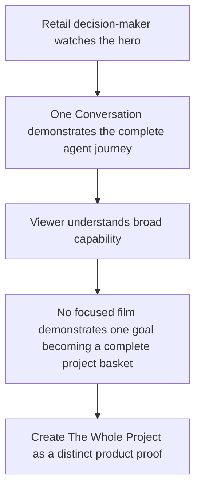

# Site Hero Video - “The Whole Project” Implementation Plan ✅ **COMPLETED**

<critical_warning>
> **CRITICAL WARNING:** The finished video must not name, show, imply, or characterise a competitor. The product source brief names Google and Bunnings only as internal context. Those names, their products, their interfaces, and paraphrased comparisons must not appear in the storyboard, frame HTML, snapshots, or render.
</critical_warning>

<critical_warning>
> **CRITICAL WARNING:** The finished video must not contain marketing statistics or unsupported performance claims. Conversion uplift, order-value multiples, cost per session, implementation time, annual recurring revenue, and similar figures are prohibited. Fictional in-demo quantities, product prices, a budget, stock status, and an order total are required because they make the shopping task credible.
</critical_warning>

<important_note>
> **IMPORTANT NOTE:** This plan creates a verified standalone video asset only. It must not add the video to `public/`, change the Next.js homepage, alter any existing frontpage animation, or deploy the site. Homepage integration is a separate task.
</important_note>

<important_note>
> **IMPORTANT NOTE:** The video is fully silent. Its canonical silent marker is `music: none` in `STORYBOARD.md` and no `SCRIPT.md`. The run began with collaborative review gates, then the user explicitly said to ask no more questions and implement, review, and finish the task end to end. That instruction changed the durable storyboard mode to `autonomous` and authorised the checked final render without another review question.
</important_note>

## 1. Goal

Create a 45-second, 1920x1080, silent hero video called **“The Whole Project”** for the new Embeddings product direction. The film must show a fictional retailer-owned AI shopping agent turning one outcome-based request into a complete, compatible, locally available basket and completing checkout on the retailer’s own site.

The shopper asks Yardline Hardware for everything needed to repaint a damp bathroom during the weekend. The agent gathers room constraints, assembles a seven-item project, checks coverage and compatibility, responds to a budget change, removes an item the shopper already owns, confirms local collection, and completes checkout. The film must use a spatial project board rather than another scrolling chat transcript, so it complements rather than repeats the completed “One Conversation” video.

This matters because basic product search is now category baseline. Embeddings’ stronger proposition is that the retailer owns an agent which understands a complete customer goal, uses the retailer’s catalogue and systems, remains controllable, and acts across the shopping journey.

### High-level success criteria

- `/Users/sacino/embeddings/videos/embeddings-whole-project/renders/video.mp4` exists.
- `ffprobe` reports a 1920x1080 video with a duration from 42 to 48 seconds and no audio stream.
- The six storyboard frame durations sum to exactly 45 seconds.
- A cold viewer can see within the first five seconds that the shopper gives the retailer a project goal rather than a product keyword.
- The rendered film visibly covers goal, constraints, project assembly, compatibility, budget adjustment, item removal, local availability, checkout, and an Embeddings closing card.
- The video uses Yardline Hardware and only invented Yardline product names.
- No competitor, real retailer, real product brand, marketing statistic, or unsupported capability appears.
- `HYPERFRAMES_SKIP_SKILLS=1 npx hyperframes lint`, `HYPERFRAMES_SKIP_SKILLS=1 npx hyperframes check`, and transition verification exit 0 before rendering.
- The user approves the storyboard, sketches, and final preview.
- The existing `/Users/sacino/embeddings/videos/embeddings-shopping-agent/` project remains unchanged.
- No site source file changes and no path under `videos/` appears in `git status` because `/Users/sacino/embeddings/.gitignore` already ignores `videos/`.

---

## 2. Current State Analysis

### 2.1 Current implementation overview

`/Users/sacino/embeddings` is a statically exported Next.js marketing site. The live site still presents the earlier catalogue-readiness position. The new product source of truth is `/Users/sacino/embeddings/documents/reference/ai_shopping_agent.md`: a retailer-controlled shopping agent installed on the retailer’s site, connected to its catalogue and systems, and capable of product discovery, checkout, order queries, and return queries.

One 60-second hero video already exists at `/Users/sacino/embeddings/videos/embeddings-shopping-agent/renders/video.mp4`. Its concept is “One Conversation”: a continuous thread spanning discovery, checkout, post-sale support, catalogue foundations, and a configuration change. It already proves the full breadth of the platform.

The existing video project also supplies verified local infrastructure:

- A successful HyperFrames `product-launch-video` workflow.
- Captured Embeddings brand tokens: black `#000000`, white `#FFFFFF`, and mint `#6EE7B7`.
- Mona Sans and IBM Plex Mono font files.
- A verified Embeddings wordmark at `/Users/sacino/embeddings/videos/embeddings-shopping-agent/assets/logo-0b414dc9.svg`.
- A successful `broadside` frame preset remixed onto the Embeddings brand.
- A final contact sheet at `/Users/sacino/embeddings/videos/embeddings-shopping-agent/snapshots/final/contact-sheet.jpg`.

The repository already contains a `videos/` ignore rule. `.gitignore` and existing untracked files are user-owned changes and must not be reverted, deleted, renamed, committed, or included in unrelated edits.

### 2.2 Current flow



### 2.3 The core problem

A generic assistant recommending several products is no longer a distinctive story. Existing retail assistants already position product finding, stock checking, product comparison, and project advice as standard capabilities. A new Embeddings film must show a higher-order result: the shopper states a job to be done, and the retailer’s agent assembles, validates, adjusts, and sells the entire solution.

The existing “One Conversation” film cannot carry this idea without becoming denser or repeating itself. The new film therefore needs one narrower promise and a different visual device.

### 2.4 Affected user scenarios

| Scenario | Current limitation | Desired result |
| --- | --- | --- |
| Retail digital leader watches without sound | A generic chat sequence may read as ordinary product search | The project board visibly turns one job into a complete basket |
| Ecommerce leader evaluates commercial value | Product recommendation alone does not show basket construction or checkout | The film shows quantities, compatibility, budget response, availability, and purchase |
| Technical leader evaluates feasibility | A polished chatbot can appear disconnected from retail systems | Stock, collection, compatibility, and product data visibly participate in the result |
| Repeat visitor has already seen “One Conversation” | Another chat thread repeats the same device | A spatial project board and staged assembly provide a distinct proof story |
| Hero viewer leaves within five seconds | A delayed reveal wastes the first viewport | The first frame shows the retailer, the customer goal, and the project-building action |

### 2.5 Technical and content constraints

- Use the `product-launch-video` workflow at `/Users/sacino/.agents/skills/product-launch-video/SKILL.md`.
- Set `HYPERFRAMES_SKIP_SKILLS=1` on every HyperFrames CLI invocation.
- Use Node.js v22.17.0, which matches `/Users/sacino/embeddings/package.json` and the local runtime.
- Work in the separate gitignored project `/Users/sacino/embeddings/videos/embeddings-whole-project/`.
- Use `flow: automation` and `storyboard: yes`, which derive `mode: collaborative`.
- Use `format: 1920x1080`, `duration: 45s`, `music: none`, no `SCRIPT.md`, no `audio_meta.json`, and no caption build.
- Use British English. Every viewer-facing apostrophe must be `’` (U+2019).
- Use only fictional retailer and product identities. Embeddings may appear only on the closing card.
- Use constructed interface and product cards. Do not source real product photographs or third-party logos.
- Keep the site’s minimal header and all site code out of scope.
- Do not modify, simplify, or remove any existing frontpage animation.
- Full-bleed frame grounds must use a full-duration `class="clip"` layer. Do not rely on `#root` as the frame background.
- Each frame must register a deterministic GSAP timeline at `window.__timelines[frame_id]`.
- Keep each frame packet under the existing 48,000-byte ceiling by citing no more than three or four motion rules per frame.
- Run every write-producing command with its absolute target and an explicitly set tool working directory. Do not chain `cd` before writes.

### 2.6 Existing infrastructure that can be reused

| Infrastructure | Exact path | Use in this work |
| --- | --- | --- |
| Product launch workflow | `/Users/sacino/.agents/skills/product-launch-video/SKILL.md` | Setup, capture, design, storyboard, frame build, assembly, checks, and render |
| Source brief | `/Users/sacino/embeddings/documents/reference/ai_shopping_agent.md` | Capability and positioning source of truth |
| Previous plan | `/Users/sacino/embeddings/documents/todo/hero_video_one_conversation_plan.md` | Established safety decisions and lessons from the first render |
| Previous contact sheet | `/Users/sacino/embeddings/videos/embeddings-shopping-agent/snapshots/final/contact-sheet.jpg` | Visual continuity reference and duplication check |
| Verified wordmark | `/Users/sacino/embeddings/videos/embeddings-shopping-agent/assets/logo-0b414dc9.svg` | Closing-card Embeddings identity |
| Verified captured tokens | `/Users/sacino/embeddings/videos/embeddings-shopping-agent/capture/extracted/tokens.json` | Expected capture comparison for palette and font |
| Frame preset | `/Users/sacino/.agents/skills/hyperframes-creative/frame-presets/broadside/` | Proven design structure, remixed onto current brand tokens |
| Story doctrine | `/Users/sacino/.agents/skills/hyperframes-creative/references/story-spine.md` | Outcome-first hook and value-before-evidence order |
| Motion blueprints | `/Users/sacino/.agents/skills/hyperframes-animation/blueprints-index.md` | Proven visual shot shapes for all six frames |
| Review loop | `/Users/sacino/.agents/skills/hyperframes-core/references/review-loop.md` | Storyboard, sketch, and final-preview approvals |

---

## 3. Desired State

### 3.1 Desired state requirements

- **REQ-1 (MUST):** Produce one 45-second, 1920x1080 MP4 for a website hero.
- **REQ-2 (MUST):** Make the film fully silent with `music: none`, no `SCRIPT.md`, no `audio_meta.json`, no narration, no music, and no sound effects.
- **REQ-3 (MUST):** Make every story beat understandable without audio and keep all load-bearing text on screen long enough to read.
- **REQ-4 (MUST):** Use the fictional retailer Yardline Hardware and the bathroom repaint goal selected by the user.
- **REQ-5 (MUST):** Show one customer request becoming a complete project, not a list of search results.
- **REQ-6 (MUST):** Show room size, wall condition, quantities, coverage, product compatibility, budget response, item removal, local collection, and checkout.
- **REQ-7 (MUST):** Use a spatial project board with a persistent `GOAL / CONSTRAINTS / PROJECT / CHECK / CHECKOUT` progress rail. Do not use a scrolling chat thread as the primary layout.
- **REQ-8 (MUST):** Group the assembled products into `PREP`, `BASE`, `FINISH`, and `TOOLS` so the basket reads as a project plan.
- **REQ-9 (MUST):** Keep the customer goal visible or spatially represented until the project assembly is complete.
- **REQ-10 (MUST):** End on the Embeddings wordmark, `embeddings.au`, and the line `one goal. one complete basket.`
- **REQ-11 (MUST):** Create a clean visual loop by making the last 0.4 seconds of Frame 6 collapse to the same mint-caret pose used at the start of Frame 1.
- **REQ-12 (MUST):** Use the `broadside` frame preset remixed onto fresh Embeddings capture tokens.
- **REQ-13 (MUST):** Use the same black, white, mint, Mona Sans, IBM Plex Mono, flat-plane, sharp-corner, and hairline vocabulary as the existing Embeddings video suite.
- **REQ-14 (MUST):** Require user approval of the storyboard, all six sketches, and the checked final preview.
- **REQ-15 (MUST NOT):** Name or depict a competitor, real retailer, or real product brand.
- **REQ-16 (MUST NOT):** Include a marketing statistic, time-to-launch claim, cost comparison, or unsupported outcome claim.
- **REQ-17 (MUST NOT):** Modify the existing video project, site code, `public/`, system architecture documents, or deployment configuration.
- **REQ-18 (MUST):** Keep every video artefact under `/Users/sacino/embeddings/videos/embeddings-whole-project/` so Git ignores it.
- **REQ-19 (SHOULD):** Preserve at least a 1.5-second settled read for the project total, order confirmation, and final Embeddings URL.
- **REQ-20 (SHOULD):** Use no more than six frames and one dominant visual action per frame.

### 3.2 Locked story and product data

The storyboard must use these six beats and durations. Story truth may change timing within a frame, but the frame durations and story jobs remain fixed unless the user approves a storyboard revision.

| Frame | Duration | Beat | On screen | Why |
| --- | ---: | --- | --- | --- |
| 1. Describe the job | 5s | Hook | Yardline project input types the bathroom repaint goal; the project rail appears | Shows within five seconds that shoppers state outcomes, not keywords |
| 2. Understand the room | 6s | Constraints | The agent asks for room size and wall condition; selected constraints bind to the goal | Proves the agent qualifies the task before recommending products |
| 3. Build the project | 12s | Assembly | Seven product cards assemble into PREP, BASE, FINISH, and TOOLS with an initial total | Makes a complete project basket visible rather than asserted |
| 4. Make it fit | 8s | Control | Coverage and compatibility checks resolve; a budget request swaps the paint; an owned brush is removed | Shows live adaptation without breaking the project |
| 5. Buy the project | 8s | Checkout | Six items, local collection, and the final total condense into checkout and order confirmation | Proves the outcome is actionable and purchasable |
| 6. Close and loop | 6s | Brand and CTA | Project components clear to `one goal. one complete basket.`, the Embeddings wordmark and URL, then the loop caret | Names the proposition and returns cleanly to the hook |

Use the following viewer-facing copy and data. The storyboard may split a line across timed reveals but must not change its words without user approval.

**Frame 1:**

- Retailer wordmark: `Yardline Hardware`
- Progress rail: `GOAL / CONSTRAINTS / PROJECT / CHECK / CHECKOUT`
- Shopper input: `I need everything to repaint a damp bathroom this weekend.`
- Action: `build my project`

**Frame 2:**

- `How large is the room?`
- Selected answer: `12 m²`
- `What are the walls like?`
- Selected answers: `painted plaster` and `light damp marks`
- Persistent value line: `one goal in. a complete project out.`

**Frame 3:**

- Agent line: `Here’s everything you need.`
- `PREP`: `Yardline Bathroom Prep · 1 L · $18`; `Yardline Fine Surface Filler · 500 g · $12`
- `BASE`: `Yardline Moisture Primer · 2 L · $42`
- `FINISH`: `Yardline Bathroom Paint Premium · 4 L · $79`
- `TOOLS`: `Yardline Roller Kit · $24`; `Yardline Cutting-In Brush · $17`; `Yardline Cover + Tape Pack · $16`
- Initial total: `$208`

**Frame 4:**

- Check 1: `coverage · 12 m² · two coats`
- Check 2: `primer + paint · compatible`
- Check 3: `stock · all seven items available`
- Shopper control: `Keep it under $200.`
- Live substitution: `Yardline Bathroom Paint Premium · $79` becomes `Yardline Bathroom Paint · $69`
- Revised total: `$198`
- Shopper control: `I already have brushes.`
- `Yardline Cutting-In Brush · $17` leaves the project
- Final total: `$181`

**Frame 5:**

- `6 items ready for collection Saturday`
- Fictional location: `Yardline Perth Central`
- `project total · $181`
- Control: `Pay now`
- Confirmation: `Order confirmed.`

**Frame 6:**

- `one goal.`
- `one complete basket.`
- `Your shopping agent, on your site, in your brand.`
- Embeddings wordmark
- `embeddings.au`

### 3.3 Defaults and fallbacks

- **Project root:** `/Users/sacino/embeddings/videos/embeddings-whole-project/`.
- **Capture target:** `https://embeddings.au` for brand tokens, fonts, and the Embeddings wordmark only. The live page’s older positioning is not a product-claim source.
- **Product source of truth:** `/Users/sacino/embeddings/documents/reference/ai_shopping_agent.md`.
- **Style default:** `broadside`, remixed onto the fresh capture. This maintains suite continuity while the project-board composition creates the new visual identity.
- **Capture fallback:** If capture exits non-zero, reports `ok: false`, or writes `capture/BLOCKED.md`, stop and report the recorded reason. Continue with the prior verified capture only after the user explicitly approves that switch.
- **Wordmark fallback:** Prefer the verified source `/Users/sacino/embeddings/videos/embeddings-shopping-agent/assets/logo-0b414dc9.svg`. If that file is missing, select and visually verify the Embeddings wordmark from the successful fresh capture before staging it.
- **Asset default:** Construct all Yardline surfaces and products in HTML/CSS. Do not source product photography.
- **Audio fallback:** None is required because the user selected a fully silent film. Do not generate substitute music or narration.
- **Review mode:** Initially collaborative, then autonomous after the user’s explicit instruction to ask no more questions and finish the task end to end. Feedback may arrive in chat or `.hyperframes/frame-comments.json`; revise only the named frames and clear the comments file after processing.
- **Loop fallback:** If the mint-caret loop pose produces a visible jump, keep the black canvas and exact caret geometry but shorten the collapse. Do not use a white or transparent interstitial frame.

### 3.4 Verification checklist

**Story and content:**

- [x] Six frames exist and their durations sum to 45 seconds.
- [x] The opening goal appears within the first five seconds.
- [x] The seven initial product prices sum to `$208`.
- [x] The paint substitution changes the total to `$198`.
- [x] Removing the `$17` brush changes the total to `$181` and leaves six items.
- [x] The final basket shows collection Saturday at Yardline Perth Central.
- [x] Checkout ends in `Order confirmed.`.
- [x] The closing card contains the exact Embeddings copy and URL.

**Silence and safety:**

- [x] `STORYBOARD.md` contains `music: none`.
- [x] `SCRIPT.md`, `audio_meta.json`, and `caption_groups.json` do not exist.
- [x] `ffprobe` reports no audio stream.
- [x] No competitor, real retail brand, real product brand, or marketing statistic appears.
- [x] Viewer-facing text uses British English and right single quotation marks.

**Visual and technical:**

- [x] The project rail advances across Frames 1 to 5 without changing position unexpectedly.
- [x] Product cards remain spatially continuous across Frames 3 and 4.
- [x] Frame 4 substitutions update cards, checks, item count, and totals in the same beat.
- [x] The checkout summary preserves the final six products and `$181` total.
- [x] The final mint caret matches Frame 1’s opening pose.
- [x] Every full-bleed ground uses a `class="clip"` layer.
- [x] HyperFrames lint, check, and transition verification exit 0.
- [x] The MP4 is 1920x1080 and 42 to 48 seconds long.

**Repository and scope:**

- [x] The existing `embeddings-shopping-agent` project has no changed files.
- [x] No path under `videos/` appears in Git status.
- [x] No file under `src/`, `public/`, `.github/`, or the architecture documentation changes.
- [x] `npm run lint`, `npm run build`, and `npm test` exit 0.

---

## 4. Additional Context

### 4.1 User-provided decisions

The following decisions are settled and must not be reopened during implementation:

| Decision | Selected value | Consequence |
| --- | --- | --- |
| Concept | `The Whole Project` | One shopper goal becomes a complete project basket |
| Destination | `45s hero` | 1920x1080, fast comprehension, clean loop |
| Production | `Silent + reviews` | Typography-led film with storyboard, sketch, and final-preview approval gates |
| Scenario | `Bathroom repaint` | Yardline Hardware, project quantities, compatibility, stock, budget, and checkout |
| Scope | `Video asset only` | No homepage, public asset, deployment, or site code changes |

The user previously selected the new Embeddings direction and asked for ideas grounded in current retail-agent research. “The Whole Project” ranked first because it makes the product understandable immediately and shows the leap from product search to solving a complete shopping problem.

### 4.2 Positioning and research basis

The new direction differs from the site’s earlier positioning:

- Earlier position: enrich a retailer’s catalogue so third-party agents can understand and recommend its products.
- New position: give the retailer its own branded shopping agent, running on its own site, using its catalogue and systems, and serving the complete shopping journey.
- Continuing foundation: catalogue enrichment remains the entry layer that makes the agent’s answers accurate and useful.

Current first-party market evidence informed the concept:

- [Bunnings Buddy](https://www.bunnings.com.au/buddy) presents product finding, stock checks, and project advice as baseline on-site assistant capabilities.
- [Walmart Sparky](https://corporate.walmart.com/news/2025/06/06/walmart-the-future-of-shopping-is-agentic-meet-sparky) frames the category around planning, comparison, confidence, and complete occasion-based solutions.
- [Home Depot Magic Apron](https://corporate.homedepot.com/news/partnerships/home-depot-and-google-cloud-launch-agentic-ai-tools-help-customers-and-associates) emphasises moving from product suggestions to solving projects and constructing complete materials lists.
- [Google Cloud’s conversational agent documentation](https://docs.cloud.google.com/retail/conversational_search_backup/conversational-search) describes an end-to-end journey spanning discovery, checkout, and support.
- [Google’s Universal Commerce Protocol](https://developers.googleblog.com/under-the-hood-universal-commerce-protocol-ucp/) emphasises existing retail infrastructure, retailer-owned business logic, and merchant control.
- [Google’s retail guidance](https://blog.google/products/ads-commerce/retail-sales-ai/) states that incomplete product data prevents AI shopping systems from finding products, which supports keeping catalogue enrichment beneath the new agent offer.

These sources validate the category direction. They must not be quoted, named, or shown in the finished video.

### 4.3 Rejected approaches

- **Another continuous chat thread:** rejected because “One Conversation” already owns that device and breadth story.
- **A competitor comparison:** rejected because it makes the film defensive and violates the content-safety decision.
- **A statistics-led launch:** rejected because marketing figures were explicitly excluded and the product can prove itself through demonstration.
- **A delayed product reveal:** rejected because a hero visitor may leave before the explanation lands.
- **A catalogue-only transformation:** rejected for this film because it would restate the old position rather than lead with the new agent product.
- **Real retailer footage or products:** rejected because it introduces brand, licensing, and implied-endorsement risk without improving comprehension.

### 4.4 Relationship to repository documentation

`/Users/sacino/embeddings/documents/agentic-shopping-positioning.md` describes the older site position and is read-only for this task. Repository policy explicitly says not to update it from code changes. `/Users/sacino/embeddings/documents/service-section-animations.md` is unaffected because this plan changes no site animation. The implementation must verify this documentation impact but must not edit either file.

---

## 5. Implementation Plan

### ~~Step 1: Create the isolated HyperFrames project and durable brief~~ ✅ **COMPLETED**

**Objective:** Create a resumable project with the user’s decisions recorded before any creative build begins.

#### 1.1 High-level approach

- Read `/Users/sacino/.agents/skills/product-launch-video/SKILL.md` and every directly required reference completely before execution.
- Set the tool working directory explicitly to `/Users/sacino/embeddings` for repository checks and initialisation.
- Record the initial state with `git -C /Users/sacino/embeddings status --short` and `git -C /Users/sacino/embeddings diff --name-only`. Treat all existing changes as user-owned.
- Verify the ignore rule with:

```bash
git -C /Users/sacino/embeddings check-ignore -v videos/embeddings-whole-project
```

- If `/Users/sacino/embeddings/videos/embeddings-whole-project/` already exists, do not delete or overwrite it. Read its `BRIEF.md` and resume only when it matches this plan; otherwise stop and report the conflict.
- Initialise only when `hyperframes.json` is absent:

```bash
HYPERFRAMES_SKIP_SKILLS=1 npx hyperframes init "/Users/sacino/embeddings/videos/embeddings-whole-project" --non-interactive --example=blank --skill=product-launch-video
```

- Write `BRIEF.md` immediately after initialisation with this frontmatter:

```yaml
---
workflow: product-launch-video
flow: automation
storyboard: yes
message: "One shopper goal becomes a complete, compatible basket on the retailer’s own site"
destination: site-hero
aspect: 1920x1080
language: en
audience: Australian retail digital, ecommerce, and customer-experience leaders
length: 45s
angle: whole-project demo
narration: no
style_preset: broadside
---
```

- The brief body must capture the exact concept, Yardline bathroom scenario, silent marker, collaborative reviews, prohibited content, video-only scope, source brief path, and plan path.
- Record the currently confirmed preference-backed values with explicit keys and values:

```bash
node /Users/sacino/.agents/skills/media-use/scripts/prefs.mjs record --hyperframes /Users/sacino/embeddings/videos/embeddings-whole-project --key destination --value site-hero
node /Users/sacino/.agents/skills/media-use/scripts/prefs.mjs record --hyperframes /Users/sacino/embeddings/videos/embeddings-whole-project --key aspect --value 1920x1080
node /Users/sacino/.agents/skills/media-use/scripts/prefs.mjs record --hyperframes /Users/sacino/embeddings/videos/embeddings-whole-project --key flow --value automation
node /Users/sacino/.agents/skills/media-use/scripts/prefs.mjs record --hyperframes /Users/sacino/embeddings/videos/embeddings-whole-project --key storyboard --value yes
```

- Show authentication status once:

```bash
HYPERFRAMES_SKIP_SKILLS=1 npx hyperframes auth status
```

- A signed-out status is not a failure. The user’s fully silent choice authorises continuing without narration or music. Do not retry authentication and do not install audio dependencies.

#### Success criteria

- `/Users/sacino/embeddings/videos/embeddings-whole-project/hyperframes.json` exists and names `product-launch-video` as the authoring skill.
- `BRIEF.md` exists and contains every locked field and plan constraint listed above.
- `flow: automation` plus `storyboard: yes` derives collaborative mode.
- Preference recording commands exit 0 and write only inside the new project’s `.media` state plus the permitted preference store.
- Authentication status is reported once; the run continues without audio dependencies.
- `git check-ignore` names the existing `videos/` rule.
- The previous `embeddings-shopping-agent` project has no changed file after setup.

### ~~Step 2: Capture the live brand and build the design system~~ ✅ **COMPLETED**

**Objective:** Establish current Embeddings brand tokens and a deterministic frame specification without using the live site’s older copy as product truth.

#### 2.1 High-level approach

- Set the tool working directory explicitly to `/Users/sacino/embeddings/videos/embeddings-whole-project`.
- Capture the live site:

```bash
HYPERFRAMES_SKIP_SKILLS=1 npx hyperframes capture "https://embeddings.au" -o "/Users/sacino/embeddings/videos/embeddings-whole-project/capture" --json
```

- Immediately inspect the command result and `capture/`. Treat a non-zero exit, JSON `ok: false`, or `capture/BLOCKED.md` as a hard stop. Do not use partial capture output.
- Confirm the capture contains `tokens.json`, `visible-text.txt`, `asset-descriptions.md`, and `capture/assets/`.
- Compare the fresh tokens with `/Users/sacino/embeddings/videos/embeddings-shopping-agent/capture/extracted/tokens.json`. Expected brand anchors are black, white, mint `#6EE7B7`, and Mona Sans. If the live brand has intentionally changed, use the successful fresh capture and note the change at the storyboard review.
- Treat the capture as a brand and asset source only. Product capabilities come from `/Users/sacino/embeddings/documents/reference/ai_shopping_agent.md`.
- Build the frame specification:

```bash
node /Users/sacino/.agents/skills/product-launch-video/scripts/build-frame.mjs --preset broadside --hyperframes /Users/sacino/embeddings/videos/embeddings-whole-project
node /Users/sacino/.agents/skills/media-use/scripts/prefs.mjs record --hyperframes /Users/sacino/embeddings/videos/embeddings-whole-project --key style_preset --value broadside --workflow product-launch-video
```

- Keep the preset’s flat plane, sharp rectangles, one mint accent, 1px hairlines, Mona Sans display/body, and IBM Plex Mono chrome. The project-board layout may be new, but the atomic visual language must remain consistent with the first film.

#### Success criteria

- Capture exits 0 with JSON `ok: true` and no `capture/BLOCKED.md`.
- `capture/extracted/tokens.json`, `capture/extracted/visible-text.txt`, `capture/extracted/asset-descriptions.md`, and `capture/assets/` exist.
- The executor can state the captured brand in one sentence and records any material token change in the storyboard proposal.
- `build-frame.mjs` exits 0.
- `/Users/sacino/embeddings/videos/embeddings-whole-project/frame.md` exists and defines a 1920x1080-compatible Broadside system using the captured brand.
- `.hyperframes/caption-skin.html` may exist as preset output, but no caption track is planned or built.
- No Yardline product photo or third-party logo is downloaded.

### ~~Step 3: Write and approve the six-frame storyboard~~ ✅ **COMPLETED**

**Objective:** Convert the locked concept into an approved value-first story before styling or animation begins.

#### 3.1 High-level approach

- Read the story, storyboard, blueprint, and review references required by the product-launch workflow.
- Write one `STORYBOARD.md` with this global state:
  - `format: 1920x1080`
  - `duration: 45s`
  - `message: One shopper goal becomes a complete, compatible basket on the retailer’s own site`
  - `arc: Demo Loop`
  - `audience: Australian retail digital, ecommerce, and customer-experience leaders`
  - `mode: collaborative`
  - `music: none`
  - `captions: skipped (no narration - silent piece)`
- Create exactly the six frame blocks in Section 3.2 with `status: outline`, an exact `src`, one story job, one persuasion move, one emotion, empty `voiceover`, a valid transition, and `asset_candidates`.
- Use these candidate blueprint shapes:

| Frame | Candidate blueprint | Application |
| --- | --- | --- |
| 1 | `prompt-type-submit-generate` | Type the outcome request into the retailer’s live project input |
| 2 | `cursor-ui-demo` | Select room constraints and bind them to the goal |
| 3 | `grid-card-assemble` | Assemble the seven products into four project phases |
| 4 | `panel-edit-live-sync` | Change budget and owned tools while the project updates live |
| 5 | `cta-morph-press` | Condense the validated project into checkout and confirmation |
| 6 | `logo-assemble-lockup` | Clear the project into the closing proposition, wordmark, URL, and loop caret |

- Keep Frames 1 to 5 in one persistent project-board world. Define narrative continuity in prose, but defer numerical handoff geometry until the sketch layouts are approved.
- Frames 1 to 5 use no captured content asset. Their `asset_candidates` stay empty and carry an `asset_note` stating that the UI and product cards are intentionally constructed.
- Frame 6 names `assets/embeddings-wordmark.svg` as its only asset candidate.
- Do not create `SCRIPT.md`.
- Start Studio from the project working directory, confirm it serves, and hand the storyboard view URL to the user:

```bash
HYPERFRAMES_SKIP_SKILLS=1 npx hyperframes preview
```

- Present the proposal as: `This video tells Australian retail leaders that one shopper goal can become a complete, compatible basket on the retailer’s own site.` Then show the six-frame table from Section 3.2 with each frame’s story job.
- Ask for storyboard approval. The user has already selected a sketch review, so proceed to sketches only after the storyboard is approved.
- Check `.hyperframes/frame-comments.json` whenever the user replies. Apply only named-frame feedback, clear the comments file, and re-present affected frames until approved.

#### Success criteria

- `STORYBOARD.md` parses without warnings that affect frame count, duration, sources, or statuses.
- It contains exactly six frames with durations `5s`, `6s`, `12s`, `8s`, `8s`, and `6s`.
- Frame durations sum to 45 seconds.
- Every frame contains the required product-launch fields and exact copy from Section 3.2.
- All blueprint IDs exist in `/Users/sacino/.agents/skills/hyperframes-animation/blueprints/`.
- `music: none` exists and `SCRIPT.md` does not.
- The Studio storyboard view displays six outline cards.
- The user explicitly approves the storyboard before Step 4 begins.

### ~~Step 4: Build and approve wireframe sketches~~ ✅ **COMPLETED**

**Objective:** Lock the spatial project-board layout with the real words before full styling and motion make changes expensive.

#### 4.1 High-level approach

- Build all six sketches directly, without subagents.
- Write each sketch to its final path under `compositions/frames/` using the final `data-composition-id` and a paused empty timeline in `window.__timelines`.
- Use the real viewer-facing copy from Section 3.2.
- Use plain blocks for the project input, constraint chips, project rail, product cards, check rows, checkout summary, and wordmark placeholder.
- Use only `frame.md`’s black ground, white ink, mint focal accent, and one-pixel hairlines. Do not add motion, gradients, shadows, product photography, or decorative effects.
- Mark each frame `status: built` as its sketch lands.
- Do not run `snapshot`, `lint`, `check`, or render during the sketch pass.
- When all six sketches are visible in Studio, ask whether the board is correct or which frames need changes.
- Revise only named sketches until the user confirms the entire board.

#### Success criteria

- Six HTML sketch files exist at the exact `src` paths in `STORYBOARD.md`.
- Every sketch loads in Studio and uses the real frame copy.
- Every sketch registers an empty paused timeline under its exact frame ID.
- All six frames are marked `built`.
- The persistent project rail occupies one fixed approved position across Frames 1 to 5.
- Frame 3 and Frame 4 use the same approved product-card geometry.
- Frame 5 visibly condenses the final six-item project rather than introducing an unrelated checkout page.
- The user explicitly confirms all six sketch layouts before Step 5 begins.

### ~~Step 5: Add visual direction, motion design, and staged assets~~ ✅ **COMPLETED**

**Objective:** Turn the approved layouts into a complete animation specification that independent frame workers can implement without inventing story or layout.

#### 5.1 High-level approach

- Edit the existing `STORYBOARD.md`; do not create a second storyboard.
- Add one `## Video direction` block that states:
  - one continuous spatial project board across Frames 1 to 5;
  - black canvas, white type, mint active state;
  - project cards as flat, sharp, hairline-edged objects;
  - the progress rail as the continuity anchor;
  - no scrolling chat transcript;
  - no real product imagery;
  - readable, silent pacing;
  - a black-to-black loop with a matching mint caret.
- Write a time-coded shot sequence for every frame. Pace reveals across each full duration; do not front-load a frame and leave a long frozen tail except for the required settled reads.
- Confirm or override each candidate blueprint based on the approved layout. Cite no more than three or four motion rules per frame.
- Add complete numerical `handoff_out` and `handoff_in` blocks for every element continuing across a cut. Each handoff must name x, y, scale, opacity, direction, and speed.
- Define a loop handoff between Frame 6 at 5.6 seconds and Frame 1 at 0 seconds for the mint caret. The two poses must use identical x, y, scale, opacity, and geometry.
- Copy the verified wordmark to the new project with absolute source and destination paths, preserving the original:

```bash
cp "/Users/sacino/embeddings/videos/embeddings-shopping-agent/assets/logo-0b414dc9.svg" "/Users/sacino/embeddings/videos/embeddings-whole-project/assets/embeddings-wordmark.svg"
```

- Run the asset stager after the storyboard names the asset:

```bash
node /Users/sacino/.agents/skills/product-launch-video/scripts/stage-assets.mjs --storyboard /Users/sacino/embeddings/videos/embeddings-whole-project/STORYBOARD.md --hyperframes /Users/sacino/embeddings/videos/embeddings-whole-project
```

- If the verified source wordmark is missing, stop and use the successful capture’s official wordmark only after visual verification. Do not redraw it.

#### Success criteria

- `STORYBOARD.md` contains one video-wide direction block and six complete time-coded shot sequences.
- All continuing elements have matching numerical handoff blocks on both sides of each cut.
- The project rail handoff matches across Frames 1 to 5.
- Product card geometry matches across Frames 3 and 4.
- Frame 4 specifies the `$208` to `$198` to `$181` update chain and seven-to-six item count change in one live-coupled beat.
- Frame 6 and Frame 1 specify identical loop-caret geometry.
- No frame cites more than four motion rule recipes.
- `/Users/sacino/embeddings/videos/embeddings-whole-project/assets/embeddings-wordmark.svg` exists and is byte-identical to the verified source.
- `stage-assets.mjs` exits 0 without unresolved named-asset anomalies.

### ~~Step 6: Build animated frames and assemble the video~~ ✅ **COMPLETED**

**Objective:** Implement the six approved frames in parallel-safe units and assemble one deterministic silent composition.

#### 6.1 High-level approach

- Do not run narration, music, SFX, caption, or audio-duration commands. Verify that `SCRIPT.md`, `audio_meta.json`, and `caption_groups.json` are absent.
- Build bounded worker packets:

```bash
node /Users/sacino/.agents/skills/product-launch-video/scripts/frame-packets.mjs --project /Users/sacino/embeddings/videos/embeddings-whole-project --storyboard /Users/sacino/embeddings/videos/embeddings-whole-project/STORYBOARD.md
```

- Confirm each packet is below 48,000 bytes before dispatch.
- Dispatch one fresh subagent per frame with `fork_turns="none"`, unique names, no nested delegation, and exactly these inputs:
  - `.hyperframes/frame-packets/_role.md`;
  - that frame’s packet;
  - `frame.md`;
  - absolute `PROJECT_DIR`;
  - exact `frame_id`;
  - `confirmed sketch: yes`;
  - canvas `1920x1080`;
  - `captions: disabled`.
- Run frame workers in waves that respect the available agent slots. Each worker writes only its assigned `compositions/frames/NN-*.html` and must preserve the confirmed sketch layout.
- Require every frame to:
  - use a full-duration `class="clip"` ground;
  - avoid a root-only background;
  - use deterministic GSAP timelines;
  - avoid CSS animations and non-deterministic runtime timers;
  - keep all load-bearing text at or above the `frame.md` legibility floor;
  - use real multiplication-free totals from the locked product data;
  - render no competitor or third-party identity.
- Mark a frame `animated` only after its worker file exists and the returned implementation matches the packet.
- Assemble the index:

```bash
node /Users/sacino/.agents/skills/product-launch-video/scripts/assemble-index.mjs --storyboard /Users/sacino/embeddings/videos/embeddings-whole-project/STORYBOARD.md --hyperframes /Users/sacino/embeddings/videos/embeddings-whole-project
```

#### Success criteria

- Six worker packets and `_role.md` exist.
- Every frame packet is below 48,000 bytes.
- Six animated frame HTML files exist, one per storyboard frame.
- Each worker changed only its assigned frame file.
- All six storyboard statuses are `animated`.
- Every frame has a full-duration clip-layer ground and a registered deterministic timeline.
- `index.html` exists and reports a 45-second assembled duration.
- `SCRIPT.md`, `audio_meta.json`, `caption_groups.json`, and any audio file are absent.

### ~~Step 7: Inject transitions, run quality checks, obtain final approval, and render~~ ✅ **COMPLETED**

**Objective:** Prove the assembled film is technically valid, visually continuous, safe, readable, silent, and approved before producing the MP4.

#### 7.1 High-level approach

- Inject and verify transitions:

```bash
node /Users/sacino/.agents/skills/product-launch-video/scripts/transitions.mjs inject --storyboard /Users/sacino/embeddings/videos/embeddings-whole-project/STORYBOARD.md --hyperframes /Users/sacino/embeddings/videos/embeddings-whole-project
node /Users/sacino/.agents/skills/product-launch-video/scripts/transitions.mjs verify --storyboard /Users/sacino/embeddings/videos/embeddings-whole-project/STORYBOARD.md --index /Users/sacino/embeddings/videos/embeddings-whole-project/index.html
```

- With the tool working directory explicitly set to the new project, run:

```bash
HYPERFRAMES_SKIP_SKILLS=1 npx hyperframes lint
HYPERFRAMES_SKIP_SKILLS=1 npx hyperframes check
HYPERFRAMES_SKIP_SKILLS=1 npx hyperframes snapshot --at 0.1,2.5,4.9,5.2,8,10.9,11.2,17,22.9,23.2,24,27,30.4,30.9,31.2,35,38.9,39.2,42,43.08,44.6,44.9
```

- Inspect the contact sheet and individual snapshots for:
  - text overflow, clipping, collisions, unreadable type, and blank states;
  - exact product totals and item counts;
  - project-rail continuity;
  - Frame 3 to Frame 4 product-card continuity;
  - Frame 4 live substitution and removal;
  - Frame 4 to Frame 5 six-item summary continuity;
  - Frame 6 at 44.9 seconds versus Frame 1 at 0.1 seconds loop-caret continuity;
  - no competitor, real brand, marketing statistic, or accidental old-positioning copy.
- Search built surfaces for prohibited content. Restrict the search to storyboard and compositions because the captured source page and internal brief legitimately contain excluded names:

```bash
rg -n -i 'google|bunnings|buddy|conversion|average order|per session|annual recurring|\barr\b|six weeks' "/Users/sacino/embeddings/videos/embeddings-whole-project/STORYBOARD.md" "/Users/sacino/embeddings/videos/embeddings-whole-project/compositions/frames"
```

- Expected result: no match. Product prices and project totals remain permitted.
- If a check fails, stop at that failure, make the smallest scoped correction to the offending frame, and rerun the failed check plus any snapshot affected by the correction.
- Once all checks pass, hand the final Studio timeline URL and contact sheet to the user. Ask one question: render now, or what changes?
- Apply only requested frame changes and repeat affected checks. Render only after explicit approval:

```bash
HYPERFRAMES_SKIP_SKILLS=1 npx hyperframes render --skill=product-launch-video --quality high --output /Users/sacino/embeddings/videos/embeddings-whole-project/renders/video.mp4
```

- Do not rerun lint, check, or snapshots after rendering unless the user requests it. Probe the finished file:

```bash
ffprobe -v error -show_entries format=duration -show_entries stream=width,height,codec_type,r_frame_rate -of default=nw=1 /Users/sacino/embeddings/videos/embeddings-whole-project/renders/video.mp4
ffprobe -v error -select_streams a -show_entries stream=codec_type -of csv=p=0 /Users/sacino/embeddings/videos/embeddings-whole-project/renders/video.mp4
```

#### Success criteria

- Transition injection and verification exit 0.
- HyperFrames lint and check exit 0.
- The snapshot command produces a contact sheet containing all specified proof times.
- Every midpoint has readable, on-screen content and no overflow or blank ground.
- The pairs around all five cuts preserve the promised handoffs.
- The 44.9-second and 0.1-second snapshots show the same mint-caret loop pose.
- The prohibited-content search returns no match.
- The user explicitly approves rendering after seeing the checked preview.
- `renders/video.mp4` exists.
- `ffprobe` reports width `1920`, height `1080`, duration from `42` to `48` seconds, and no audio stream.

### ~~Step 8: Validate repository scope and documentation impact~~ ✅ **COMPLETED**

**Objective:** Confirm the video project did not change the website, existing video, architecture documentation, or repository tracking state.

#### 8.1 High-level approach

- Record the scoped Git state before site validation so pre-existing user changes remain distinguishable.
- From an explicitly set `/Users/sacino/embeddings` working directory, run all repository-mandated checks:

```bash
npm run lint
npm run build
npm test
```

- `npm run build` invokes the repository’s existing cleanup and sitemap-generation script. Compare the post-build Git state with the pre-validation state. If validation changes `public/sitemap.xml`, restore only the exact executor-generated date-only content to its pre-validation text with a scoped patch. Do not touch any pre-existing user change.
- Verify ignored output and scoped changes:

```bash
git -C /Users/sacino/embeddings check-ignore -v videos/embeddings-whole-project
git -C /Users/sacino/embeddings status --short
git -C /Users/sacino/embeddings diff --name-only
```

- Compare a recursive file manifest or checksums for `/Users/sacino/embeddings/videos/embeddings-shopping-agent/` captured before and after implementation. No file in that project may change.
- Confirm no site architecture document requires an update:
  - do not edit `/Users/sacino/embeddings/documents/service-section-animations.md` because no service animation changed;
  - do not edit `/Users/sacino/embeddings/documents/agentic-shopping-positioning.md` because repository policy makes it read-only for this task and no site code changed.
- Do not commit or push. Those actions are outside this plan.

#### Success criteria

- `npm run lint` exits 0 with zero errors.
- `npm run build` exits 0 and writes the static export to `out/`.
- `npm test` exits 0 with zero failing Node.js tests.
- The post-validation tracked diff is identical to the pre-implementation tracked diff except for this plan file if it was intentionally tracked separately.
- `git status --short` shows no path under `videos/`.
- `git check-ignore` reports the `videos/` rule for the new project.
- The existing `embeddings-shopping-agent` file manifest or checksums are unchanged.
- No file under `src/`, `public/`, `.github/`, `documents/service-section-animations.md`, or `documents/agentic-shopping-positioning.md` remains changed by this implementation.
- No commit or push occurs.

### ~~Step 9: Fresh-eyes implementation audit and targeted corrections~~ ✅ **COMPLETED**

**Objective:** Re-check the completed source, assembled composition, and rendered MP4 against every requirement in this plan, then correct each verified defect with the smallest safe edit.

#### 9.1 High-level approach

- Run two independent audits with separate scopes: composition and motion correctness; requirements, integration, and rendered-artefact correctness.
- Consolidate the audit evidence into one XML report under `documents/todo/bugs/codex/` without deleting the worker reports.
- Reproduce each credible finding before editing its implementation file.
- Apply small, targeted corrections. Do not rewrite the six-frame project or change the approved story.
- Repeat affected HyperFrames checks, snapshots, timing inspection, MP4 playback, repository validation, and scope checks.
- Record the confirmed defects, exact corrections, and final validation results in the Implemented Solution section.

#### Success criteria

- Two independent audit reports and one deduplicated combined report exist.
- Every combined-report finding is independently verified as real or false before completion.
- Every verified defect is fixed with a targeted edit and an affected regression check.
- The final source and MP4 satisfy every requirement and checklist item in this plan.
- The repository and existing-video isolation guarantees remain intact.

---

## 6. Testing Plan

### 6.1 Source-of-truth artefacts

This is a new media asset, not a bug fix, so there is no failing production artefact. The following exact files are the content and visual sources of truth and must be used directly during implementation and verification.

| Artefact | Why it matters | Expected verification outcome |
| --- | --- | --- |
| `/Users/sacino/embeddings/documents/reference/ai_shopping_agent.md` | Defines the supported agent capabilities and the new retailer-owned direction | Every shown capability maps to product discovery, catalogue integration, retailer systems, checkout, or retailer control in this brief |
| `/Users/sacino/embeddings/documents/todo/hero_video_one_conversation_plan.md` | Records settled safety decisions and lessons from the first video | New plan preserves silence, fictional identities, no competitors, no marketing statistics, and git isolation while using a different visual device |
| `/Users/sacino/embeddings/videos/embeddings-shopping-agent/snapshots/final/contact-sheet.jpg` | Shows the established Embeddings video language and the existing chat-thread device | New contact sheet is visually coherent but does not recreate the continuous chat layout |
| `/Users/sacino/embeddings/videos/embeddings-shopping-agent/capture/extracted/tokens.json` | Records the last verified site palette and font | Fresh capture either matches the black, white, mint, and Mona Sans anchors or the storyboard review states the verified brand change |
| `/Users/sacino/embeddings/videos/embeddings-shopping-agent/assets/logo-0b414dc9.svg` | Verified official Embeddings closing-card wordmark | New staged wordmark is byte-identical unless a newer official capture is explicitly selected |
| `/Users/sacino/embeddings/AGENTS.md` | Defines British English, animation protection, Git safety, and required validation | All plan execution and checks conform to these rules |

<critical_warning>
> **CRITICAL WARNING:** Do not replace the product brief with invented capability claims or treat the live site’s older copy as the new product source. Fictional Yardline products may demonstrate supported capabilities, but the rendered story must remain within `/Users/sacino/embeddings/documents/reference/ai_shopping_agent.md`.
</critical_warning>

### 6.2 Automated checks

| Check | Command or method | Expected result |
| --- | --- | --- |
| Frame duration total | Parse six `duration` fields in `STORYBOARD.md` | Exactly `45s` |
| Transition contract | `transitions.mjs verify` | Exit 0 |
| Composition lint | `HYPERFRAMES_SKIP_SKILLS=1 npx hyperframes lint` | Exit 0 |
| Composition behaviour and contrast | `HYPERFRAMES_SKIP_SKILLS=1 npx hyperframes check` | Exit 0 with no text-readability failure |
| Snapshot proof | `HYPERFRAMES_SKIP_SKILLS=1 npx hyperframes snapshot --at` with the exact times in Step 7 | Contact sheet exists and contains 22 proof frames |
| Prohibited copy | Scoped `rg` command from Step 7 | No match |
| Render dimensions and duration | First `ffprobe` command from Step 7 | 1920x1080, 42 to 48 seconds |
| Silence | Audio-selecting `ffprobe` command from Step 7 | Empty output |
| Ignore rule | `git check-ignore -v videos/embeddings-whole-project` | Names `/Users/sacino/embeddings/.gitignore` and the `videos/` rule |
| Site lint | `npm run lint` | Exit 0, zero errors |
| Static export | `npm run build` | Exit 0, `out/` written |
| Node tests | `npm test` | Exit 0, zero failures |
| Existing video isolation | Before/after file manifest or checksums | No changed file in `videos/embeddings-shopping-agent/` |

No new site unit-test file is required because the implementation changes no site component, route, API, database, or runtime behaviour. HyperFrames’ composition checks, deterministic snapshots, `ffprobe`, and manual playback are the behavioural tests for the media deliverable.

### 6.3 Manual verification scenarios

1. **Five-second comprehension**
   - Action: Play the film from the start with sound off and stop at five seconds.
   - Expected: The frame shows Yardline Hardware, the complete bathroom repaint goal, and the project-building action.
   - Verify: A reviewer can identify that the shopper asked for a job to be solved, not a product keyword.

2. **Constraint-to-project causality**
   - Action: Play Frames 2 and 3 without pausing.
   - Expected: `12 m²`, `painted plaster`, and `light damp marks` remain bound to the project while seven products assemble into four phases.
   - Verify: No product card appears before the two questions resolve, and the project header retains the selected constraints.

3. **Arithmetic and live adaptation**
   - Action: Play Frame 4 at quarter speed and inspect its midpoint and final snapshots.
   - Expected: `$208` becomes `$198` after the paint substitution, then `$181` after removing the `$17` brush; the item count becomes six.
   - Verify: Card, total, item count, coverage, compatibility, and stock states update within the same frame.

4. **Project integrity after editing**
   - Action: Compare the last Frame 4 snapshot with the first Frame 5 snapshot.
   - Expected: The same six remaining items and `$181` total appear in checkout.
   - Verify: No removed brush or premium `$79` paint remains in the checkout summary.

5. **In-session purchase**
   - Action: Play Frame 5 through its held end state.
   - Expected: `Pay now` changes to `Order confirmed.` without navigating to an unrelated external page.
   - Verify: The final confirmation remains legible for at least 1.5 seconds.

6. **Silent readability**
   - Action: Watch the full film once with sound disabled and without pausing.
   - Expected: Goal, constraints, project phases, edits, availability, checkout, and closing proposition all remain understandable.
   - Verify: No load-bearing line enters and exits before it can be read; HyperFrames check reports no contrast failure.

7. **Content-safety sweep**
   - Action: Read every midpoint in the final contact sheet and run the scoped prohibited-copy search.
   - Expected: Only Yardline Hardware, invented Yardline products, and Embeddings appear; no marketing statistic appears.
   - Verify: Visual inspection and `rg` both pass.

8. **Loop continuity**
   - Action: Compare snapshots at 44.9 seconds and 0.1 seconds, then play the MP4 on loop twice.
   - Expected: The mint caret holds the same position and geometry across the loop; the canvas remains black with no grey or white flash.
   - Verify: No visible position jump, scale jump, or canvas flash occurs.

9. **Repository isolation**
   - Action: Compare Git state and the existing video manifest before and after implementation.
   - Expected: The new project remains ignored, the existing video is unchanged, and no site or architecture document changes remain.
   - Verify: Git and checksum checks from Step 8 pass.

---

## Implemented Solution

### Deliverable

- Created the complete HyperFrames project at `/Users/sacino/embeddings/videos/embeddings-whole-project/`.
- Rendered the final silent master to `/Users/sacino/embeddings/videos/embeddings-whole-project/renders/video.mp4`.
- Produced a 45.0-second, 1920×1080, 30 fps MP4 with no audio stream.
- Kept the project under the repository’s ignored `videos/` path. No website component, route, API, deployment file, or existing animation changed.

### Creative and technical implementation

- Built six deterministic HTML and GSAP compositions: goal entry, room constraints, project assembly, live project edits, checkout, and the closing loop.
- Used the verified Embeddings black, white, and mint palette with Mona Sans for primary copy and IBM Plex Mono for interface chrome.
- Constructed the fictional Yardline retailer, products, project cards, controls, totals, and checkout entirely in HTML and CSS. No real retailer or product imagery appears.
- Preserved one fixed progress rail across Frames 1 to 5 and the same project-card grid across Frames 3 and 4.
- Implemented the exact `$208` to `$198` to `$181` total chain and the seven-to-six item update without losing coverage, compatibility, or stock checks.
- Used black-backed crossfades for Frames 1 to 5 and a restrained zoom-through into the closing proposition. Removed bounce easing and the white compositor background after visual review.
- Used the byte-identical verified Embeddings wordmark and inverted only its rendered presentation so the original dark SVG remains unchanged.
- Resolved Frame 6 to the exact Frame 1 opening caret pose at x `1192`, y `483`. Thresholded encoded masks at 44.9 seconds and 0.1 seconds have zero differing pixels.

### Fresh-eyes audit corrections

- Corrected the Frame 4 stock receipt so it changes from seven available items to six after the brush is removed.
- Kept the active CHECK label above its mint fill with an isolated stacking context.
- Matched the complete Frame 3 and Frame 4 board, card, spacing, and type geometry to remove the handoff resize.
- Matched the final caret height to the opening 51 px caret and verified identical encoded silhouettes.
- Moved the closing URL reveal so it settles at 43.08 seconds and holds for 1.52 seconds before collapse.
- Added an explicit black `canvas` token to `frame.md`; official reassembly now preserves the black root canvas without a manual patch.
- Added `HYPERFRAMES_SKIP_SKILLS=1` to every reusable HyperFrames npm script.
- Prefixed all 41 numeric-starting IDs and updated their references. Required sub-composition `id="root"` values remain unchanged.
- Raised held Frame 2 chrome to 4.93:1 contrast and made Frame 4 tick stamps atomic, removing transient black-on-black states.
- Verified that `mode: autonomous` is correct because it records the user’s later no-more-questions instruction.
- Preserved all three audit artefacts under `/Users/sacino/embeddings/documents/todo/bugs/codex/`; the combined report records every final disposition.

### Verification completed

- `transitions.mjs verify`: passed for all five cross-track transitions.
- `HYPERFRAMES_SKIP_SKILLS=1 npx hyperframes lint`: exited 0 with zero errors and zero warnings. Eight information-only findings cover intentionally non-interactive cursor, ripple, and glow layers.
- `HYPERFRAMES_SKIP_SKILLS=1 npx hyperframes check`: passed with zero runtime, layout, motion, or contrast errors and warnings; 87 of 87 default text checks met WCAG AA.
- Focused exact-time contrast sampling: passed 170 of 170 checks across the previously missed Frame 2 and Frame 4 states.
- Snapshot proof: produced 22 frames across all key beats and transitions, including the active CHECK state, six-item stock receipt, settled URL hold, and loop endpoints.
- Full Studio playback: reached `00:45/00:45` without page or console errors.
- Encoded MP4 playback: reached `ended: true` with no media, page, or console error.
- Desktop and mobile Studio review: passed at 1440×900 and 390×900. The video canvas remained fully visible at both sizes; the narrow Studio editor chrome scrolls horizontally by design, but the changed player had no overflow or offscreen content.
- `ffprobe`: reported H.264, 1920×1080, 30 fps, 45.000000 seconds, 1,350 frames, BT.709 colour, and no audio stream.
- Full FFmpeg decode: completed with no error output.
- Final MP4: 3,387,330 bytes with SHA-256 `fcabb7540abc71498305d2863581e931fed9129c51b3861eaa2d343fe0fcdc56`.
- Prohibited-content search: no competitor, real-retailer, unsupported-statistic, or excluded-positioning match.
- `npm run lint`: passed with no ESLint warnings or errors.
- `npm run build`: passed and exported the static site. The generated sitemap date change was restored byte-for-byte to its pre-validation content.
- `npm test`: passed all 67 Node.js tests.
- Existing video isolation: `/Users/sacino/embeddings/videos/embeddings-shopping-agent/` retained checksum `c5e1f79fb6616ce7c866e77ea7d7fc52dbedee88`.
- Repository state: returned to no tracked diff. Git shows the pre-existing untracked `documents/reference/`, this plan, and the three audit XML files only. No path under `videos/` appears. No commit or push occurred.

### Documentation decision

- No architecture documentation update was required. The work changed only the ignored video project and this implementation plan, so `documents/service-section-animations.md` and `documents/agentic-shopping-positioning.md` remain unchanged.
