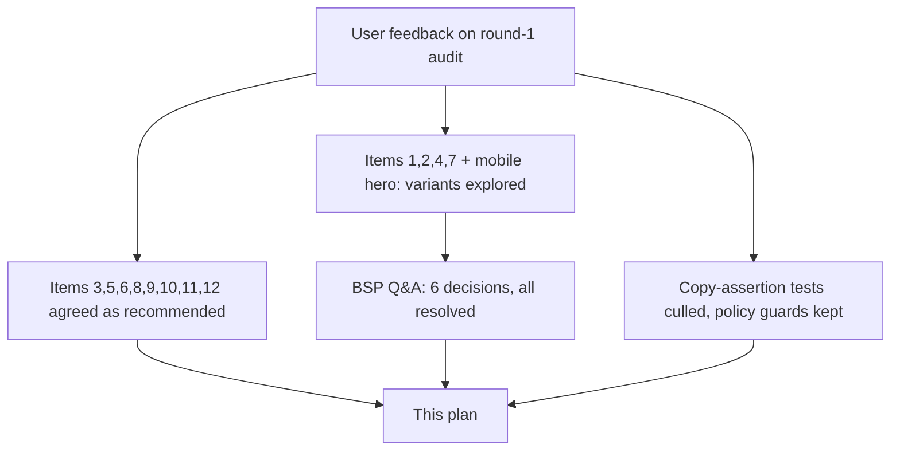

# ~~Homepage Copy Refinement Plan (Post-Migration Round 2)~~ ✅ **COMPLETED**

<critical_warning>
> **CRITICAL WARNING:** The claims policy from the completed owned-agent migration remains binding on every string this plan touches. No site file may name Google, Bunnings, or Buddy as a competitor or incumbent (the exact phrase `Google Retail Search` is allowed ONLY in the search-platform integration lists in `src/app/page.jsx` and `src/app/process/page.jsx`, never inside `AgentConversationShowcase.jsx`). No uplift figures, per-session pricing, ARR figures, "cheaper"/"lower cost" claims, or pricing-model descriptions anywhere. Competitor contrast stays implicit ("not rented", "live in weeks", "change it yourself"). Demo/reporting values must read as product-UI mockup, never as promised results (no "up to", no "ROI", no "uplift" — a kept test enforces this). The sitewide claims-scan test (`test/homepage-owned-agent-positioning.test.mjs`, final test block) is KEPT by this plan and must pass.
</critical_warning>

<critical_warning>
> **CRITICAL WARNING:** Animation designs are protected by `AGENTS.md` `<animation_standards>`. Every change in this plan is text-string, colour/class, or small static-markup level. Do NOT change keyframes, timing values, particle systems, SVG paths, `<animate>` elements, or reveal choreography in `HeroDesktopDataFlow.jsx`, `HeroDataFlow.jsx`, `AgentConversationShowcase.jsx`, `CatalogueTransformation.jsx`, the service timeline animations, or `ContactSection.jsx`. Never add `prefers-reduced-motion` or similar accessibility media-query gating. The user explicitly authorised the mobile hero card redesign (Step 5) and the desktop hero SVG text swaps (Step 4); everything else stays at copy/colour level.
</critical_warning>

<important_note>
> **IMPORTANT NOTE:** Step 1 (test cull) MUST land before or in the same change as the copy edits. Several existing tests assert the exact strings this plan replaces (hero H1 pills, showcase beats, "No ticket. No release cycle.", GTIN `0614141123456` in the showcase, WhyNow `$5T`/`81%` stat presence). Editing copy before culling those assertions breaks `npm test` mid-stream.
</important_note>

## 1. Goal

Apply the user-approved second round of copy, layout, and tone refinements to the embeddings.au homepage (plus one process-page line), following the completed owned-agent migration. The user's feedback themes: the page is still too wordy near the top, some copy is insider jargon ("grounded in your catalogue", "no ticket, no release cycle", "engineering ticket"), the mobile hero's customer card does not read as an agent chat, duplicated market stats overwhelm, and several dark-panel text elements fail contrast. Additionally, cull the overly prescriptive copy-assertion tests while keeping policy and structural guards.

Done means: all copy strings in §5 are shipped verbatim, the mobile hero card 3 is a two-beat attributed chat, the desktop hero SVG chat tells the on-story dress/checkout narrative, no "ticket"/"release cycle" language remains in `src/`, the test suite is culled per §5 Step 1 and passes, `npm run lint` / `npm run build` / `npm test` pass under Node v22.17.0, and dev-browser verification at 1440x900 and 390x900 shows no console errors or horizontal overflow.

---

## 2. Current State Analysis

### 2.1 Current Implementation Overview

Static-export Next.js 14 App Router marketing site (Tailwind, GitHub Pages, no server runtime). The homepage (`src/app/page.jsx`) renders: hero (H1 `The shopping agent that’s actually yours` + subhead + buttons + three proof pills + `HeroDataFlow` visual) → `#agent` showcase section (`AgentConversationShowcase.jsx`) → `#why-now` dark timeline (4 stat cards) → "the shift" WhyNow section (3 stat cards) → testimonial → `#services` (CatalogueTransformation + ServiceTimelineLeftRail) → ContactSection CTA.

Current strings this plan replaces:

| Location | Current copy | Problem |
| --- | --- | --- |
| `page.jsx` hero subhead (~line 530) | "We build shopping agents that Australian retailers own. Grounded in your enriched catalogue and connected to your commerce systems, your agent takes customers from first question to checkout, and keeps helping after the sale." | "Grounded in your catalogue" is jargon for decision-makers; too long (34 words) |
| `page.jsx` `heroProofSignals` (~line 102) | `One chat / discovery to checkout`, `Yours / brand, prompts, data`, `Weeks / from catalogue to live` | Labels read as internal shorthand |
| `page.jsx` `AgentShowcase` body (~line 231) | 69-word paragraph incl. "that usually cost a support ticket", "You control the prompts…", platform sentence | Too long; support-ticket phrasing off; control claim duplicates the control strip that shows it |
| `page.jsx` timeline heading (~line 260) | `Agentic shopping isn&rsquo;t coming &mdash; it&rsquo;s here` | Em dash; no terminal full stop; user wants improvement |
| `page.jsx` timeline card 2 | stat `UCP`, statLabel `protocol launched`, text `Google launches Universal Commerce Protocol` | Insider jargon without context |
| `page.jsx` WhyNow title (~line 420) | `Your customers will talk to an AI agent. Make sure it’s yours` | Missing terminal full stop (punctuation consistency) |
| `page.jsx` `whyNowCards` | Card 1 `$5T` (McKinsey) and card 3 `81%` (Deloitte) duplicate timeline cards 4 and 3 exactly, one viewport apart | 7 stat cards, 2 duplicated claims = data overload |
| `page.jsx` Services body (~line 487) | Ends "No other consultancy in Australia has this combination of LLM pipeline expertise and data engineering capability." | Insider boast; user chose to cut it |
| `AgentConversationShowcase.jsx:141` | `GTIN {gtin}` rendered in chat product cards at 10px `text-neutral-400` on white | ~2.5:1 contrast (fails AA); internal data a shopper would never see |
| `AgentConversationShowcase.jsx:249` | `tone rule` label `text-white/35` | ~3.1:1 contrast, fails AA |
| `AgentConversationShowcase.jsx:297` | `sample` chip `text-white/40` | ~3.8:1 contrast, fails AA |
| `AgentConversationShowcase.jsx:312` | Analytics tile labels `text-[0.65rem] text-white/45` | ~4.5:1 borderline at 10px |
| `AgentConversationShowcase.jsx:282-285` | Caption "No ticket. No release cycle. Your team changes the agent’s prompts, tone, and rules directly." as `text-sm text-neutral-400` | Insider jargon ("tickets", "release cycles"); styled as fine print despite being the key control message |
| `AgentConversationShowcase.jsx:322-324` | Caption "Reporting your team can act on." as `text-sm text-neutral-400` | Numbers dominate; control/actionability under-emphasised |
| `HeroDataFlow.jsx:99-110` | Mobile card 3 "Your customer": one unattributed white box ("Found it. Sapphire Blue Midi, size 10, in stock. Checkout here in this chat?") + footer "Sold in one conversation" | Reads as an input field, not an agent message (user attached a screenshot of this exact problem) |
| `HeroDataFlow.jsx:61-63` | Mobile card 1 list: `complete attributes / rich descriptions / live stock signal` | Mildly insider phrasing |
| `HeroDesktopDataFlow.jsx:976` | Column 3 label `Consumer` | Off-terminology (mobile says "Your customer") |
| `HeroDesktopDataFlow.jsx:1015,1023` | Ask: "Find me the best running / shoes under $200" | Off the site's single demo-product universe (Sapphire dress) |
| `HeroDesktopDataFlow.jsx:1056,1073,1090` | Reply: "Based on 12 catalogues, I / recommend the Nike Pegasus / 41 — $189, in stock, 4.8★" | "Based on 12 catalogues" is the OLD external-agent story (an agent scanning many retailers); off-universe product; stops before checkout |
| `process/page.jsx:203` | "routine changes never wait on an engineering ticket." | Same insider "ticket" language the user rejected |

### 2.2 Current Flow

### 2.3 The Core Problem

The migrated page tells the right story but over-explains it, repeats its own evidence, uses insider language in customer-facing copy, and under-styles its strongest control message. Prescriptive copy-assertion tests make every copy iteration expensive.

### 2.4 Affected User Scenarios

| Scenario | Current experience | Post-plan experience |
| --- | --- | --- |
| Retail decision-maker skimming the hero | 34-word subhead with "grounded in your catalogue" jargon | 24-word plain-speech subhead with after-sale emphasis |
| Mobile visitor reading the hero visual | Card 3 bubble reads as an input field with no speaker | Two-beat attributed chat ending in a paid state |
| Visitor scanning the dark sections | 7 stat cards with 2 duplicated claims; low-contrast labels | 5 unique stat presentations; AA-compliant labels; control-led reporting |
| Developer changing site copy | Exact-string tests break on every wording tweak | Policy/structural guards only; copy iterates freely |

### 2.5 Technical Constraints

- **Static export**: no server runtime; `AgentConversationShowcase.jsx` must remain a Server Component (no `'use client'`) — a kept test enforces this.
- **Content rules (`AGENTS.md`)**: British English; `’` (U+2019) apostrophes in ALL user-facing strings (including new chat bubbles and chips); nav/footer labels stay lowercase; no em dashes in new body copy (use commas or full stops).
- **Animation protection**: see critical warning above.
- **React/Next work MUST follow the `vercel-react-best-practices` skill** — read it before writing the Step 5 and Step 6 markup changes.
- **Validation gate (`AGENTS.md` `<testing_rules>`)**: `npm run lint` (zero errors), `npm run build`, `npm test` under Node v22.17.0 (`nvm use 22.17.0`; `scripts/check-node-version.mjs` hard-fails other versions); dev-browser verification on `http://localhost:3002` at 1440x900 and 390x900; final report must include a Validation Summary.
- **Desktop SVG text width limits**: ask-bubble lines render at 8px within a 128px-wide bubble (~26 chars max per line); reply lines at 7.5px within 140px (~27 chars max). The replacement strings in Step 4 respect these; verify visually for overflow.
- **`SectionIntro` children**: the agent-section body becomes two `
` elements inside `SectionIntro`; inspect `src/components/SectionIntro.jsx` to apply a lighter style to the second paragraph without breaking its layout contract.
- The comment above `heroProofSignals` in `page.jsx` describes the pills; keep it accurate after the pill swap.

### 2.6 Existing Infrastructure That Can Be Reused

- Chat-bubble idiom from `AgentConversationShowcase.jsx` (`CustomerBeat`: right-aligned `bg-neutral-950` white text with `rounded-br-md`; `AgentBeat`: left-aligned `bg-neutral-100`/white with `rounded-bl-md`; `sr-only` speaker prefixes) — reuse for the mobile hero card 3 mini chat.
- The "your brand" chip style in the showcase browser chrome (`rounded-full bg-neutral-950 px-2.5 py-1 text-[0.65rem] font-semibold text-white`) — reuse as the "your agent" tag on the mobile card 3 agent bubble.
- The showcase paid chip pattern (emerald pill with dot) — reuse (statically, no new keyframes) for the mobile card 3 "Paid · order confirmed" footer.
- Demo-product universe: Sapphire Blue A-Line Midi Dress, $189.00, size 10 — already used in `CatalogueTransformation.jsx`, `ContactSection.jsx`, and the showcase; the desktop SVG and mobile hero re-copy stays inside this universe.

---

## 3. Desired State

### 3.1 Desired State Requirements

- **REQ-1 (MUST)**: Hero subhead is exactly: `We build shopping agents that Australian retailers own. Your agent takes customers from first question to checkout, and keeps helping after the sale.` No occurrence of "Grounded in your" remains in the hero.
- **REQ-2 (MUST)**: Hero pills are exactly: `Sold / in one conversation`, `Yours / not rented`, `Live / in weeks` (stat / label). The `aria-label="Your shopping agent at a glance"` and the no-source conditional rendering stay.
- **REQ-3 (MUST)**: Desktop hero SVG (`HeroDesktopDataFlow.jsx`): column 3 label is `Your customer`; the customer ask and agent reply use the dress-universe strings in Step 4; no path, keyframe, `<animate>`, or layout attribute changes; the `Ask anything...` input bar and typing dots stay as chat chrome.
- **REQ-4 (MUST)**: Agent section body in `page.jsx` is two paragraphs: P1 `Your agent greets customers on your site, answers from your catalogue, takes payment in the chat, and handles the follow-ups, from ‘where’s my order?’ to returns.` and P2 (visually lighter) `It plugs into the search you already run: Algolia, Coveo, Elasticsearch, Google Retail Search, or your own index.` The platform sentence stays in `page.jsx`, never in `AgentConversationShowcase.jsx`.
- **REQ-5 (MUST)**: Control strip: caption replaced by promoted headline `Change it yourself. Live in seconds.` (font-display, `text-lg sm:text-xl`, white) + support line `Your team edits the agent’s prompts, tone, and rules directly.`; the aria-hidden `live in seconds` chip is removed (sr-only equivalent text stays); the Publish→Live animation is unchanged.
- **REQ-6 (MUST)**: Reporting panel: caption replaced by promoted headline `Reporting your team can act on.` (same display treatment); one product-UI insight row added linking metric to action (`drop-off: delivery questions` → `reply updated · live`); tile values de-emphasised one size step (`text-base sm:text-lg`).
- **REQ-7 (MUST)**: Dark-panel small text meets WCAG AA 4.5:1: `tone rule` label ≥ `text-white/60`; `sample` chip ≥ `text-white/60`; analytics tile labels ≥ `text-white/70` at `text-xs`.
- **REQ-8 (MUST)**: No GTIN line renders inside the showcase conversation product cards (the `gtin` field may remain in data as a React key).
- **REQ-9 (MUST)**: Timeline heading is `Agentic shopping isn’t coming. It’s here.` (no em dash) and WhyNow title is `Your customers will talk to an AI agent. Make sure it’s yours.` (terminal full stop). Punctuation rule: sentence-form section titles take a terminal full stop; fragments (hero H1, agent section title) take none.
- **REQ-10 (MUST)**: WhyNow cards 1 (`Disintermediation`) and 3 (`The race is on`) no longer render an oversized stat or statLabel; they lead with their title at display scale. Card 2 keeps `393%` + statLabel unchanged. All three source links remain. The homepage renders `81%` and `$3–5T`/`$5T` only on the timeline (once each) and `393%` in WhyNow (once).
- **REQ-11 (MUST)**: Timeline card 2 reads: stat `UCP` (unchanged), statLabel `agent checkout standard`, text `Google launches UCP, an open standard for agent checkout` (source link and brand logos unchanged).
- **REQ-12 (MUST)**: Services body is exactly: `Everything your agent says starts with your product data. Our four services turn the catalogue into an asset an agent can read, trust, and sell from. The same enriched data keeps you visible wherever external AI agents shop.` (the boast sentence is cut; the single external-agent supporting-benefit mention is retained).
- **REQ-13 (MUST)**: `grep -rin "ticket\|release cycle" src/` returns no matches (agent body, showcase caption, and `process/page.jsx:203` all reworded).
- **REQ-14 (MUST)**: Mobile hero card 3 is a two-beat attributed chat per Step 5: right-aligned dark customer bubble, left-aligned white agent bubble tagged `your agent`, footer chip `Paid · order confirmed` (replacing `Sold in one conversation`), with sr-only speaker prefixes and an updated wrapper aria-label. Card 1 list uses the plainer strings in Step 5; card 2 is unchanged.
- **REQ-15 (MUST)**: Tests are culled per Step 1 scope: exact-copy assertions deleted; claims-policy scans, contact field contract/Formspree/a11y/validation tests, Server-Component/animation-contract/structural/JSON-LD/image-priority guards all kept. No NEW copy-assertion tests are added anywhere in this plan.
- **REQ-16 (MUST NOT)**: No animation design changes; no `prefers-reduced-motion`; no `'use client'` added to the showcase; no contact form field changes; no changes to the hero H1, buttons, testimonial, capability chips, analytics tile values, timeline card 1/3/4 copy, `CatalogueTransformation.jsx`, `ServiceTimelineLeftRail.jsx`, or `ContactSection.jsx`.
- **REQ-17 (MUST)**: `documents/agentic-shopping-positioning.md` is updated so its Messaging Priority Matrix and agent-showcase description quote the shipped strings (no stale `No ticket. No release cycle.` or old pill references). `documents/service-section-animations.md` is checked and updated only if it quotes the services intro body. `AGENTS.md` `<key_templates>` descriptions are verified still accurate (no edit expected).
- **REQ-18 (MUST)**: All new user-facing strings use British English and `’` apostrophes; no em dashes in any new copy.

### 3.2 Defaults and Fallbacks

- **Defaults**: implement the exact strings in §5. Executor latitude exists ONLY for: line-break positions inside the desktop SVG bubbles (stay within char limits), Tailwind spacing utilities when integrating the new headline/insight-row markup, and the second-paragraph styling in the agent section (default `mt-4 text-base text-neutral-600`).
- **Fallback order for uncertainty**: (1) this plan, (2) `documents/reference/ai_shopping_agent.md` (capability ceiling — nothing may be shown or claimed that is not in its § Proposed Product / § Longer-Term Product Scope), (3) `AGENTS.md`.
- **Compatibility**: the `heroProofSignals` conditional source-pill rendering (renders a source link only when `source` exists) must keep working; new pills omit `source`.

### 3.3 Verification Checklist

**Functional:**
- [x] Hero subhead, pills, agent body, control headline, reporting headline + insight row, services body, timeline heading, UCP card, WhyNow title all match §3.1 verbatim
- [x] Mobile hero card 3 renders the two-beat chat with `your agent` tag and `Paid · order confirmed` chip at 390px
- [x] Desktop SVG shows `Your customer` label and dress-universe chat at ≥1024px with no text overflow

**Claims policy:**
- [x] `grep -rn "Bunnings\|Buddy" src/` returns nothing; `grep -n "Google" src/components/AgentConversationShowcase.jsx` returns nothing
- [x] `grep -rin "ticket\|release cycle" src/` returns nothing (REQ-13)
- [x] `grep -rin "up to\|ROI\|uplift" src/components/AgentConversationShowcase.jsx` returns nothing

**Tests:**
- [x] Culled test files contain no assertions on hero H1, showcase beat/control/chip strings, pill names, process-page copy phrases, contact stable-copy strings, or WhyNow `$5T`/`81%` presence
- [x] `npm test` passes; kept guards (claims scans, field contract, structural) all still present and passing

**Ops/Docs:**
- [x] `documents/agentic-shopping-positioning.md` contains no `No ticket. No release cycle.` and references the shipped pill set
- [x] Lint, build, tests, and both-viewport dev-browser checks pass

---

## 4. Additional Context

### 4.1 User-Provided Context

The user reviewed the round-1 audit (12 recommendations) and responded per item. Direct decisions:

1. **Subhead**: "'Grounded in your catalogue' is a bit too confusing/jargon for many decision makers… Could mention it further down." Liked the short variant best but asked to explore (a) variants using "your agent takes customers from first question to checkout, and keeps helping after the sale" and (b) less stilted first sentences. **BSP selection: the after-sale variant in REQ-1** (keeps the preferred first sentence, adds the after-sale beat and "your agent").
2. **Pills**: "explore other pills. Perhaps ones that are more catchy, flow better, or are more suitable for above the fold. Get creative." **BSP selection: `Sold / in one conversation`, `Yours / not rented`, `Live / in weeks`** over "plain promises", "journey framing", and "bold contrast" sets. The `Sold in one conversation` mobile-hero footer duplication is resolved by Step 5's footer change to `Paid · order confirmed`.
3. **Desktop SVG fixes**: agreed as recommended.
4. **Agent body ending**: "'that usually cost a support ticket' feels a bit off". **BSP selection: `…and handles the follow-ups, from ‘where’s my order?’ to returns.`** (concrete, mirrors the showcase's actual beats, no phrase collision with the subhead). Rejected: "without a support ticket" (retains jargon), "keeps helping after the sale" (would duplicate the chosen subhead verbatim), minimal variant (loses post-sale specificity).
5. **Contrast fixes**: agreed. 6. **GTIN removal**: agreed.
7. **Control message**: user pushed back on "No ticket. No release cycle." — "a little bit 'insider baseball'… Maybe we just talk about control and speed of able to make the changes themselves, rather than tickets and release cycles." **BSP selection: `Change it yourself. Live in seconds.`** as the promoted headline (the font-size promotion from round-1 feedback stands; only the wording changed). Rejected: "You make the change. It’s live in seconds." / "Your agent, your rules. Changed in seconds." / "No waiting on anyone." **Stated assumption (user did not override): the same language policy applies site-wide, so `process/page.jsx:203` "engineering ticket" is also reworded (Step 9).**
8. **Reporting emphasis** (control over numbers, reduce data): agreed. 9. **Timeline heading**: agreed. 10. **Punctuation rule**: agreed. 11. **Stat de-duplication via title-led WhyNow cards 1/3**: agreed. 12. **Jargon**: agreed; "cut the sentence mentioned" (the services boast sentence is deleted outright, not rewritten).
13. **Tests (verbatim)**: "these tests seem way too prescriptive. My intuition is to cull such overly prescriptive tests, which in this case are validating exact copy, and seem excessive and inflexible while offering little value (just check it post implementation?). If you agree, we should just cull these." **BSP selection: cull exact-copy assertions, KEEP policy guards** (claims-policy scans, contact field contract, structural/animation contracts). Rejected: culling everything copy-adjacent (would leave the no-competitor/no-pricing rules unguarded); keep-and-update (perpetuates the maintenance tax).
14. **Mobile hero**: the user attached a screenshot (`/Users/sacino/.t3/userdata/attachments/9df4cebb-72f0-41a7-915b-6a6d81c4dd77-453b1f3b-62a4-4900-8f88-560b552f4f1f.png`) showing card 3's bubble reading as an unattributed input field: "it's not clear… that 'Found it. Sapphire Blue Midi…' is from an AI agent. I think we could make this entire section look more like a chat interaction and improve the design + wording. The other sections could probably be improved too." **BSP selection: mini chat in card 3 + light copy touch-ups to card 1; card 2 unchanged.** Rejected: minimal labelling fix (still one-sided), full three-card conversation redesign (discards the catalogue → agent → customer flow narrative).

### 4.2 Background and Decisions

- **Hero H1 is settled and untouched**: `The shopping agent that’s actually yours` (user-selected during the migration after competitor slogan research).
- **Round-1 feedback already shipped context**: the round-1 audit (this plan's parent) was itself a response to feedback that the page was "too wordy", with contrast, font-size, and internal-information complaints. Items agreed there and unchanged here: showcase placement, capability chips, timeline cards 1/3/4, testimonial (catalogue story is intentional entry-product proof — do not invent agent testimony).
- **Why "Based on 12 catalogues" must go**: it describes an agent shopping across many retailers' catalogues — the platform-agent story the site now positions AGAINST. The owned agent answers from ONE retailer's catalogue.
- **Why the insight row is safe**: drop-off analytics is inside the product reference's capability ceiling (`documents/reference/ai_shopping_agent.md` § Proposed Product lists drop-off, containment, escalation analytics). The row must read as product UI (sample data), like the existing tiles.
- **Metadata is out of scope**: `pageMetadata.home.description` also contains "Grounded in your enriched catalogue", but the user's jargon feedback targeted the subhead specifically ("Could mention it further down"); metadata is search-facing, not the subhead. Leave `src/lib/metadata.js` and `src/schemas/organization-schema.js` untouched.
- **Contact page is out of scope**: no contact copy changes; `AGENTS.md` contact rules stay as-is. Only the contact test's stable-copy assertion block is culled (the AGENTS.md rules themselves still lock that copy for future work).
- **Contrast math (for reference)**: on the `bg-neutral-950` (#0a0a0a) panels, `text-white/35` ≈ 3.1:1, `white/40` ≈ 3.8:1, `white/45` ≈ 4.5:1 (borderline), `white/60` ≈ 7.3:1, `white/50` ≈ 5.3:1. GTIN `text-neutral-400` (#a3a3a3) on white ≈ 2.5:1. WCAG AA requires 4.5:1 below ~18px.
- **The completed migration plan** (`documents/todo/owned_agent_site_copy_migration_plan.md`) is a historical record; do not edit it even where this plan supersedes its strings.

---

## 5. Implementation Plan

### ~~Step 1: Cull prescriptive copy tests (keep policy and structural guards)~~ ✅ **COMPLETED**
**Objective:** Remove exact-copy assertions so the copy edits in Steps 2-9 cannot break tests, while preserving the claims-policy and structural guards.

#### 1.1 High-Level Approach
- `test/homepage-owned-agent-positioning.test.mjs`: DELETE the whole test blocks `homepage leads with the owned shopping agent` and `agent showcase renders the conversation, controls, and reporting`. KEEP unchanged: `agent showcase ships as a static server component`, `agent showcase avoids competitor naming and result claims`, `agent showcase animations stay in shared css`, `agent showcase description lists put each term before its definition`, `site copy keeps competitor names and internal figures off the page`.
- `test/homepage-stat-source-links.test.mjs`: in `homepage Why Now statistics render visible server text`, remove the `$5T` and `81%` stat-presence assertions (Step 8 removes those stats); keep the `393%` assertion and the transparent-wrapper structural assertion. In `homepage proof strip and hero spacing stay mobile-readable`, delete the `['One chat', 'Yours', 'Weeks']` pill loop; keep the grid-class and hero-spacing assertions. Keep all other test blocks (source labels, Adobe figure, JSON-LD, service loop, proof-label absence) unchanged.
- `test/process-page-catalogue-positioning.test.mjs`: DELETE the test blocks `process page describes the owned-agent journey instead of generic AI consulting`, `process page covers checkout, post-sales, control, and analytics`, and `process images include journey-stage signal overlays`. KEEP: `process page renders the three journey stages in order`, `process page prioritises the first visual after the intro`, `process image signal overlays stay mobile-safe`.
- `test/contact-form-contract.test.mjs`: in `contact page copy no longer asks for removed catalogue fields`, delete the `stablePhrase` loop only; keep the `removedPhrase` loop and every other test block (AGENTS.md rules, Formspree, field contract, a11y, validation).
- Do not add any new copy-assertion tests in this or any later step.

**Success Criteria:**
- `grep -c "The shopping agent that’s actually yours\|No ticket\|One chat\|Your agent starts here" test/*.test.mjs` returns 0 matches across all test files
- `grep -n "Bunnings" test/homepage-owned-agent-positioning.test.mjs` still matches (claims scan kept)
- `grep -n "name=\"budget\"\|formspree" test/contact-form-contract.test.mjs` still matches (field contract kept)
- `npm test` passes with the culled suite against the CURRENT (pre-Step-2) code

### ~~Step 2: Hero subhead and pills (`src/app/page.jsx`)~~ ✅ **COMPLETED**
**Objective:** Ship the chosen subhead and pill set.

#### 2.1 High-Level Approach
- Replace the hero subhead `
` with: `We build shopping agents that Australian retailers own. Your agent takes customers from first question to checkout, and keeps helping after the sale.`
- Replace `heroProofSignals` entries with `{ stat: 'Sold', label: 'in one conversation' }`, `{ stat: 'Yours', label: 'not rented' }`, `{ stat: 'Live', label: 'in weeks' }` (no `source` keys). Update the comment above the array to describe the new pills accurately. H1, buttons, `aria-label`, grid classes, and the conditional source rendering all stay.

**Success Criteria:**
- `grep -c "keeps helping after the sale" src/app/page.jsx` returns 1; `grep -c "Grounded in your" src/app/page.jsx` returns 0
- `grep -n "stat: 'Sold'\|stat: 'Yours'\|stat: 'Live'" src/app/page.jsx` returns 3 lines; `grep -n "stat: 'One chat'\|stat: 'Weeks'" src/app/page.jsx` returns 0
- `npm run lint` passes

### ~~Step 3: Agent section intro (`src/app/page.jsx`)~~ ✅ **COMPLETED**
**Objective:** Halve the intro; keep the platform sentence as a lighter second line in `page.jsx`.

#### 3.1 High-Level Approach
- In `AgentShowcase`, replace the single body `
` with two paragraphs (REQ-4 strings). Inspect `SectionIntro.jsx` first; style P2 lighter (default `mt-4 text-base text-neutral-600`, adjust to the component's layout contract). The `‘where’s my order?’` quotes use `‘`/`’` (U+2018/U+2019).

**Success Criteria:**
- `grep -c "from ‘where’s my order?’ to returns" src/app/page.jsx` returns 1; `grep -c "usually cost a support ticket\|You control the prompts" src/app/page.jsx` returns 0
- `grep -c "Algolia, Coveo, Elasticsearch, Google Retail Search" src/app/page.jsx` returns 1 (still in `page.jsx`, still absent from `AgentConversationShowcase.jsx`)
- Section title `One conversation from ‘I’m looking for…’ to ‘it’s on its way’` is unchanged (fragment: no terminal full stop per REQ-9 rule)

### ~~Step 4: Desktop hero SVG re-copy (`src/components/HeroDesktopDataFlow.jsx`)~~ ✅ **COMPLETED**
**Objective:** Text-level swaps so the desktop chat tells the owned-agent dress story.

#### 4.1 High-Level Approach
- Line 976: `Consumer` → `Your customer`.
- Ask bubble text elements (lines ~1015, ~1023): `Find me the best running` / `shoes under $200` → `Wedding guest dress,` / `size 10, under $200?` (20 and 19 chars — within the ~26-char limit).
- Reply text elements (lines ~1056, ~1073, ~1090): `Based on 12 catalogues, I` / `recommend the Nike Pegasus` / `41 — $189, in stock, 4.8★` → `Found it: Sapphire Blue` / `Midi, size 10, in stock.` / `$189. Pay here in the chat?` (23/24/27 chars — within the ~27-char limit; the `<tspan>` star markup in line 3 is removed with its string). Every `<animate>` child stays exactly as-is.
- Keep the `Ask anything...` input bar, blinking cursor, and typing dots unchanged (chat chrome). Wrapper aria-labels (already retailer-owned) stay.

**Success Criteria:**
- `grep -c "Your customer" src/components/HeroDesktopDataFlow.jsx` ≥ 1; `grep -c "Consumer</text>\|Nike\|Pegasus\|running\|12 catalogues" src/components/HeroDesktopDataFlow.jsx` returns 0
- `git diff src/components/HeroDesktopDataFlow.jsx` touches only `<text>`/`<tspan>` content lines and the line-976 label (no `d=`, no `<animate>`, no keyframe, no coordinate attribute changes)
- dev-browser at 1440x900: reply text does not overflow its bubble (visual check, screenshot captured)

### ~~Step 5: Mobile hero rework (`src/components/HeroDataFlow.jsx`)~~ ✅ **COMPLETED**
**Objective:** Card 3 becomes an attributed two-beat chat ending in a paid state; card 1 loses insider phrasing.

#### 5.1 High-Level Approach
- Read the `vercel-react-best-practices` skill before editing (AGENTS.md requirement).
- Card 1 list strings: `complete attributes` / `rich descriptions` / `live stock signal` → `full product details` / `descriptions that sell` / `live stock levels`. Heading and `enriched` badge unchanged. Card 2 unchanged.
- Card 3 (`Your customer` card, emerald container kept): replace the single white box + footer with:
  1. Customer bubble, right-aligned: `max-w`-constrained `rounded-2xl rounded-br-md bg-neutral-950 px-3 py-2 text-xs leading-5 text-white`, text `Wedding guest dress, size 10, under $200?`, preceded by `Customer: `.
  2. Agent bubble, left-aligned: a small tag `your agent` (chip style from §2.6) above or beside a `rounded-2xl rounded-bl-md bg-white px-3 py-2 text-xs leading-5 text-neutral-600 shadow-sm` bubble, text `Found it: Sapphire Blue Midi, size 10, in stock. Pay here in the chat?`, preceded by `Your agent: `.
  3. Footer chip replacing `Sold in one conversation`: `Paid · order confirmed` as an emerald pill (`rounded-full border border-emerald-200 bg-white px-3 py-1 text-xs font-semibold text-emerald-700` with a static `h-2 w-2 rounded-full bg-emerald-500` dot; no new keyframes).
- Update the wrapper aria-label to: `Enriched retail catalogue data powering the retailer’s own AI agent, which answers a customer in a branded chat and takes payment in the conversation.`
- Grid, connectors, card order, and the card-2 ping animation are unchanged. No new client JS.

**Success Criteria:**
- `grep -c "your agent" src/components/HeroDataFlow.jsx` ≥ 1 (tag); `grep -c "Paid · order confirmed" src/components/HeroDataFlow.jsx` returns 1; `grep -c "Sold in one conversation\|Checkout here in\|live stock signal" src/components/HeroDataFlow.jsx` returns 0
- Both bubbles carry `sr-only` speaker prefixes; the file still contains no `@keyframes` additions and no `prefers-reduced-motion`
- dev-browser at 390x900: card 3 renders customer bubble right-aligned, agent bubble left-aligned with visible `your agent` tag, paid chip below; no horizontal overflow (screenshot captured)

### ~~Step 6: Showcase contrast, GTIN, control strip, reporting (`src/components/AgentConversationShowcase.jsx`)~~ ✅ **COMPLETED**
**Objective:** Fix AA failures, remove internal data, promote the control and reporting messages, add the insight row.

#### 6.1 High-Level Approach
- `ProductCard`: delete the `GTIN {gtin}` `
`; keep `gtin` in `recommendedProducts` as the React key.
- Contrast: `tone rule` label `text-white/35` → `text-white/60`; `sample` chip `text-white/40` → `text-white/60`; tile `<dt>` labels `text-[0.65rem] … text-white/45` → `text-xs … text-white/70`.
- `ControlStrip`: remove the aria-hidden `live in seconds` chip span (keep the sr-only `Publishing a rule takes it live in seconds.`). Replace the caption `
` with: headline `
Change it yourself. Live in seconds.
` + support `
Your team edits the agent’s prompts, tone, and rules directly.
`. Publish→Live animation untouched.
- `AnalyticsTiles`: tile `<dd>` `text-lg … sm:text-xl` → `text-base … sm:text-lg`. Replace the caption with headline `
Reporting your team can act on.
`. Below it add the insight row (`mt-3`): two chips joined by an aria-hidden `→` — left `drop-off: delivery questions` (neutral chip, e.g. `rounded-full border border-white/15 px-2.5 py-1 text-xs text-white/70`), right `reply updated · live` (emerald accent, e.g. `text-emerald-300` variant of the same chip) — plus sr-only: `Example insight: customers drop off at delivery questions, and the corrected reply is already live.` No "up to"/"ROI"/"uplift" anywhere (kept test enforces).
- Component stays a Server Component; conversation beats, reveal delays, chips, and demo values unchanged.

**Success Criteria:**
- `grep -c "GTIN {gtin}\|No ticket\|release cycle\|text-white/35\|text-white/40\|text-white/45" src/components/AgentConversationShowcase.jsx` returns 0
- `grep -c "Change it yourself. Live in seconds.\|Reporting your team can act on.\|drop-off: delivery questions\|reply updated · live" src/components/AgentConversationShowcase.jsx` returns 4 matching lines (one each)
- `node --test test/homepage-owned-agent-positioning.test.mjs` passes (Server Component, claims, shared-CSS, and `<dl>` guards)
- dev-browser at 1440x900 and 390x900: both panel headlines render in display type larger than the support text; insight row visible; no overflow

### ~~Step 7: Timeline heading, UCP card, WhyNow title (`src/app/page.jsx`)~~ ✅ **COMPLETED**
**Objective:** Punctuation consistency and jargon translation.

#### 7.1 High-Level Approach
- Timeline `<h2>`: `Agentic shopping isn&rsquo;t coming &mdash; it&rsquo;s here` → `Agentic shopping isn&rsquo;t coming. It&rsquo;s here.` (keep the existing HTML-entity apostrophe style).
- Timeline card 2 (`timelineItems[1]`): `statLabel: 'protocol launched'` → `'agent checkout standard'`; `text: 'Google launches Universal Commerce Protocol'` → `'Google launches UCP, an open standard for agent checkout'`. `stat`, `source`, `brandLogos` unchanged.
- WhyNow `SectionIntro` title: append terminal full stop → `Your customers will talk to an AI agent. Make sure it’s yours.`

**Success Criteria:**
- `grep -c "isn&rsquo;t coming. It&rsquo;s here." src/app/page.jsx` returns 1; `grep -c "coming &mdash;" src/app/page.jsx` returns 0. The testimonial's existing `&mdash;` (inside the `<Testimonial>` block) remains untouched — `grep -c "mdash" src/app/page.jsx` returns exactly 1 after this step
- `grep -c "agent checkout standard\|an open standard for agent checkout" src/app/page.jsx` returns 2 lines; `grep -c "protocol launched\|launches Universal Commerce Protocol" src/app/page.jsx` returns 0
- `grep -c "Make sure it’s yours." src/app/page.jsx` returns 1

### ~~Step 8: WhyNow stat de-duplication (`src/app/page.jsx`)~~ ✅ **COMPLETED**
**Objective:** Cards 1 and 3 lead with titles; only the unique Adobe stat keeps the oversized treatment.

#### 8.1 High-Level Approach
- `whyNowCards`: remove `stat` and `statLabel` from card 1 (`Disintermediation`) and card 3 (`The race is on`); card 2 (`393%` / Adobe) unchanged. Bodies, titles, and `source` values unchanged on all three.
- `WhyNow` render: make the stat block conditional. When `stat` is present, render the current markup unchanged. When absent, render the `title` in the leading slot at `font-display text-3xl font-medium tracking-tight text-neutral-950 sm:text-4xl` and skip the duplicate `<h3>` below (keep the divider, body, and `SourceLink`). Adjust the `min-h-[2.5rem]` statLabel spacer so the three cards stay visually aligned at `lg` width (executor latitude on exact spacing utilities).

**Success Criteria:**
- `grep -c "stat: '\$5T'\|stat: '81%'" src/app/page.jsx` returns 0 inside `whyNowCards` (the timeline's `81%` card remains — verify it still renders `AnimatedStat value={81}`)
- All three WhyNow cards render their `SourceLink` (dev-browser check); `393%` renders once in WhyNow
- `node --test test/homepage-stat-source-links.test.mjs` passes (culled version from Step 1)
- dev-browser at 1440x900: three cards align in one row with no empty stat voids; at 390x900 they stack with no overflow

### ~~Step 9: Services body and process-page line (`src/app/page.jsx`, `src/app/process/page.jsx`)~~ ✅ **COMPLETED**
**Objective:** Cut the insider boast; finish the no-ticket language policy.

#### 9.1 High-Level Approach
- Services `SectionIntro` body → the REQ-12 string (three sentences; boast deleted; external-agent clause becomes its own sentence).
- `process/page.jsx:203`: the full current sentence (Operate stage) is `Then we hand over the controls. Your team changes prompts, policies, and canned responses directly, with versioning, review, and rollback behind them, so routine changes never wait on an engineering ticket.` Replace only the final clause so it ends `…so routine changes never wait on anyone else.` (the `<strong>` markup around `prompts, policies, and canned responses` stays).

**Success Criteria:**
- `grep -c "No other consultancy" src/app/page.jsx` returns 0; `grep -c "The same enriched data keeps you visible" src/app/page.jsx` returns 1
- `grep -rin "ticket\|release cycle" src/` returns 0 matches (REQ-13 — this is the final source of "ticket" after Steps 3 and 6)
- `node --test test/process-page-catalogue-positioning.test.mjs` passes (culled version)

### ~~Step 10: Documentation consistency~~ ✅ **COMPLETED**
**Objective:** No project document quotes copy this plan replaced.

#### 10.1 High-Level Approach
- `documents/agentic-shopping-positioning.md` — five stale references, verified during planning:
  - Line 55 (matrix, customer control): replace `("no ticket, no release cycle")` with `("Change it yourself. Live in seconds.")`; the `Hero pill \`Yours\`` reference stays true (the `Yours` pill survives with a new label).
  - Line 56 (matrix, in-conversation checkout): `Hero pill \`One chat\`` → `Hero pill \`Sold\``.
  - Line 62 (matrix, speed/flexibility): `Hero pill \`Weeks\`` → `Hero pill \`Live\``.
  - Line 100 (showcase description): replace the quoted `"No ticket. No release cycle."` with `"Change it yourself. Live in seconds."`.
  - Line 363 (homepage structure): update the pill list to `\`Sold\` (in one conversation), \`Yours\` (not rented), \`Live\` (in weeks)`.
  - After the line edits, grep the file for `One chat`, `no ticket`, `Grounded in your` to confirm nothing was missed. This is a user-authorised copy-direction update, permitted despite the AGENTS.md rule against code-driven updates to this file.
- `documents/service-section-animations.md`: grep for the old services intro body (`No other consultancy`, `read, trust, and sell from`); update its § Section Copy only if it quotes the changed `page.jsx` services intro (its primary contract is `ServiceTimelineLeftRail.jsx` strings, which this plan does not touch).
- `AGENTS.md`: verify `<key_templates>` descriptions for `HeroDataFlow.jsx` and `AgentConversationShowcase.jsx` remain accurate (catalogue → your agent → your customer flow; conversation/control/analytics/chips) — no edit expected; edit only if a description now states something false.

**Success Criteria:**
- `grep -rin "no ticket\|release cycle" documents/agentic-shopping-positioning.md` returns 0
- `grep -c "Change it yourself. Live in seconds." documents/agentic-shopping-positioning.md` ≥ 1
- No occurrence of `One chat` as a current-pill reference in `documents/agentic-shopping-positioning.md` (historical references inside `documents/todo/owned_agent_site_copy_migration_plan.md` are exempt — do not edit that file)

### ~~Step 11: Full validation~~ ✅ **COMPLETED**
**Objective:** Prove the change set against the project validation gate.

#### 11.1 High-Level Approach
- Under Node v22.17.0 (`nvm use 22.17.0`): `npm run lint`, `npm run build`, `npm test`.
- Verify `http://localhost:3002` responds (start `npm run dev` from the repo root if not). dev-browser sweep at 1440x900 and 390x900 of `/` (hero incl. pills and both hero visuals, `#agent` showcase incl. control/reporting panels, timeline, shift cards, services) and `/process` (the reworded Operate line). Capture screenshots with absolute paths; check console errors, page errors, horizontal overflow.
- Run the §3.3 claims-policy greps.
- Final report includes the Validation Summary (automated checks + browser scenarios + outcomes) per `AGENTS.md` `<ui_verification>`.

**Success Criteria:**
- All three commands exit 0; every §3.3 checklist item checked
- Screenshots exist for: desktop hero, mobile hero card 3, showcase panels (both viewports), WhyNow cards, timeline heading
- No console errors, page errors, or horizontal overflow at either viewport on `/` or `/process`

---

## 6. Testing Plan

### 6.1 Source-of-Truth Regression Artefacts

- **`/Users/sacino/.t3/userdata/attachments/9df4cebb-72f0-41a7-915b-6a6d81c4dd77-453b1f3b-62a4-4900-8f88-560b552f4f1f.png`** (verified present on disk) — the user's screenshot of the mobile hero "Your customer" card. It proves the real defect: the agent message renders as an unattributed white box indistinguishable from an input field. Expected post-fix behaviour: at 390px the card shows a right-aligned dark customer bubble and a left-aligned white agent bubble with a visible `your agent` tag, ending in a `Paid · order confirmed` chip. Verification is manual/visual: capture the post-fix 390x900 dev-browser screenshot of the same card and compare composition against the artefact (speaker attribution must be unambiguous).

<critical_warning>
> **CRITICAL WARNING:** The attached screenshot above is the regression source of truth for Step 5. Do not substitute a synthetic mock-up for the comparison; the post-fix dev-browser screenshot of the live card at 390px is the required verification evidence.
</critical_warning>

### 6.2 Unit Tests

All tests are Node.js `node:test` files in `test/*.test.mjs` per `AGENTS.md` `<testing_rules>`. This plan adds NO new copy-assertion tests (user decision). The culled suite is the coverage:

| Test Case | Component | Expected Result |
| --- | --- | --- |
| Culled suite passes pre-copy-change | `test/*.test.mjs` after Step 1 | `npm test` exits 0 against unchanged `src/` |
| Claims scan still guards | `test/homepage-owned-agent-positioning.test.mjs` | Fails if `Bunnings`/`Buddy`/pricing figures introduced; passes on final code |
| Showcase structural guards | same file | Server Component, shared-CSS animation contract, `<dl>` order, no-competitor/no-ROI all pass on final code |
| Stat-source policy | `test/homepage-stat-source-links.test.mjs` (culled) | Source labels + `393%` + JSON-LD + spacing assertions pass on final code |
| Process structure | `test/process-page-catalogue-positioning.test.mjs` (culled) | Stage order + image priority + mobile-safe classes pass |
| Contact contract | `test/contact-form-contract.test.mjs` (culled) | Field contract, Formspree, a11y, validation assertions pass unchanged |
| Untouched suites | `hero-data-flow-second-consumer-bubble-padding-symmetry`, `responsive-heavy-visuals`, `catalogue-transformation-responsive-steps`, `contact-section-snippet-opacity`, all others | Pass without modification. Verified during planning: `hero-data-flow-second-consumer-bubble-padding-symmetry.test.mjs` parses only the desktop SVG second response bubble's geometry (rect `y`/`height`, text `y`/`fontSize`, and requires exactly three `<text>` nodes in that block) — Step 4 swaps string content only and keeps all three text nodes, so it stays green |

Validation command: `npm test` (all), or `node --test test/<file>.test.mjs` per file.

### 6.3 Integration Tests

1. Homepage desktop sweep
   - Action: dev-browser at 1440x900 loads `http://localhost:3002/`, scrolls hero → `#agent` → `#why-now` → shift → `#services`
   - Expected: new subhead/pills/heading/UCP/WhyNow strings render; desktop SVG shows `Your customer` + dress chat with no bubble overflow; showcase headlines in display type; insight row visible; no console/page errors; no horizontal overflow
   - Verify: screenshots at each section (absolute paths) + console log check
2. Homepage mobile sweep
   - Action: dev-browser at 390x900 loads `/`, scrolls the same sections
   - Expected: mobile card 3 two-beat chat with `your agent` tag and paid chip; subhead ≤ ~6 lines; agent-section P1/P2 both render; WhyNow cards stack cleanly
   - Verify: screenshot of card 3 compared against the §6.1 artefact + full-section screenshots
3. Process page line
   - Action: dev-browser loads `/process` at both viewports, scrolls to Operate
   - Expected: reworded self-service sentence; no "ticket" text anywhere on the page
   - Verify: visual check + `grep -rin "ticket" src/app/process/`
4. Anchor integrity
   - Action: navigate to `/#agent`, `/#why-now`, `/#services`, `/#proof`
   - Expected: each anchor scrolls to its section (unchanged behaviour)
   - Verify: dev-browser navigation check

---

## 7. Implemented Solution

Implemented 2026-08-16. All 11 steps shipped and validated.

### Files touched

**Tests culled (Step 1):**
- `test/homepage-owned-agent-positioning.test.mjs` — deleted `homepage leads with the owned shopping agent` and `agent showcase renders the conversation, controls, and reporting` blocks plus the now-unused `homePagePath` const; kept the Server-Component, claims-scan, shared-CSS, `<dl>`-order, and sitewide claims-policy guards.
- `test/homepage-stat-source-links.test.mjs` — removed the `$5T`/`81%` presence assertions (kept `393%` + transparent-wrapper structural guard) and the `['One chat', 'Yours', 'Weeks']` pill loop (kept grid/spacing assertions).
- `test/process-page-catalogue-positioning.test.mjs` — deleted the owned-agent-journey, capability-coverage, and signal-overlay copy blocks; kept stage order, image priority, and mobile-safe overlay guards.
- `test/contact-form-contract.test.mjs` — deleted the `stablePhrase` loop only; the `removedPhrase` loop and all field-contract/Formspree/a11y/validation blocks kept.

**Source (Steps 2–9):**
- `src/app/page.jsx` — hero subhead (REQ-1); `heroProofSignals` → `Sold / in one conversation`, `Yours / not rented`, `Live / in weeks` with updated comment (REQ-2); agent intro split into P1 + lighter P2 `mt-4 text-base text-neutral-600` (REQ-4); timeline heading `Agentic shopping isn&rsquo;t coming. It&rsquo;s here.` (REQ-9); UCP card statLabel `agent checkout standard` + text `Google launches UCP, an open standard for agent checkout` (REQ-11); WhyNow title terminal full stop (REQ-9); `whyNowCards` 1/3 stripped of `stat`/`statLabel` with explanatory comments, render made conditional — stat cards keep the oversized markup, stat-less cards lead with the title at `font-display text-3xl sm:text-4xl` (REQ-10); services body → REQ-12 string (boast cut).
- `src/components/HeroDesktopDataFlow.jsx` — six text-content lines only: `Consumer` → `Your customer`; ask `Wedding guest dress,` / `size 10, under $200?`; reply `Found it: Sapphire Blue` / `Midi, size 10, in stock.` / `$189. Pay here in the chat?` (star `<tspan>` removed with its string). No path/keyframe/`<animate>`/coordinate changes (verified via `git diff`).
- `src/components/HeroDataFlow.jsx` — card 1 list → `full product details` / `descriptions that sell` / `live stock levels`; card 3 rebuilt as two-beat chat (right-aligned dark customer bubble, left-aligned white agent bubble with aria-hidden `your agent` chip tag, both with `sr-only` speaker prefixes) ending in a static `Paid · order confirmed` emerald pill; wrapper aria-label updated. No new keyframes, no client JS added.
- `src/components/AgentConversationShowcase.jsx` — GTIN `
` deleted from `ProductCard` (`gtin` kept in data as React key); contrast fixes `tone rule` → `text-white/60`, `sample` → `text-white/60`, tile `<dt>` → `text-xs text-white/70`; tile `<dd>` de-emphasised to `text-base sm:text-lg`; aria-hidden `live in seconds` chip removed (sr-only equivalent kept); control caption → promoted headline `Change it yourself. Live in seconds.` + support line; reporting caption → promoted headline `Reporting your team can act on.` + insight row (`drop-off: delivery questions` → aria-hidden arrow → emerald `reply updated · live` + sr-only explanation). Still a Server Component; conversation beats and animations untouched.
- `src/app/process/page.jsx` — Operate clause → `…so routine changes never wait on anyone else.`

**Docs (Step 10):**
- `documents/agentic-shopping-positioning.md` — matrix rows (control quote, `Sold`, `Live` pills), showcase description quote, and homepage-structure pill list updated to shipped strings. `documents/service-section-animations.md` and `AGENTS.md` verified — no stale quotes, no edits needed.

### Validation (all under Node v22.17.0)

- `npm run lint` — ✔ no warnings or errors.
- `npm run build` — static export completed without errors.
- `npm test` — 116/116 pass (culled suite also verified green against pre-change code after Step 1).
- Claims greps all clean: no `Bunnings`/`Buddy` in `src/`; no `Google` in the showcase; `grep -rin "ticket|release cycle" src/` → 0 (REQ-13); no `up to`/`ROI`/`uplift` in the showcase; `mdash` count in `page.jsx` = 1 (testimonial only).
- dev-browser at 1440x900 and 390x900 (`/`, `/process`): 0 px horizontal overflow, no console or page errors; desktop SVG bubble fit verified programmatically via `getBBox()` (all five lines fit with ≥17 px margin); `/#agent`, `/#why-now`, `/#services`, `/#proof` anchors all land in view. Screenshots captured to `~/.dev-browser/tmp/` (desktop: hero-top, hero-svg, agent-showcase, agent-panels, timeline, whynow, services, process-operate; mobile: hero-top, hero-card3, agent-intro, agent-panels, whynow, process-operate).
- §6.1 regression artefact comparison: post-fix 390px screenshot of card 3 shows unambiguous speaker attribution (dark right-aligned customer bubble, white left-aligned agent bubble with visible `your agent` tag, `Paid · order confirmed` chip) versus the artefact's single unattributed white box.

### Notes

- Running `npm run build` corrupted the running dev server's `.next` state (stale-chunk 404s produced a transient unstyled render with 128 px overflow during verification). Resolved by restarting `npm run dev` with a clean `.next` (old one moved to trash); the overflow was environmental, not a regression — final sweeps show 0 px at both viewports.
- `src/lib/metadata.js` still contains "Grounded in your enriched catalogue" by design (metadata out of scope, §4.2).
- No new copy-assertion tests were added anywhere (user decision, REQ-15).
