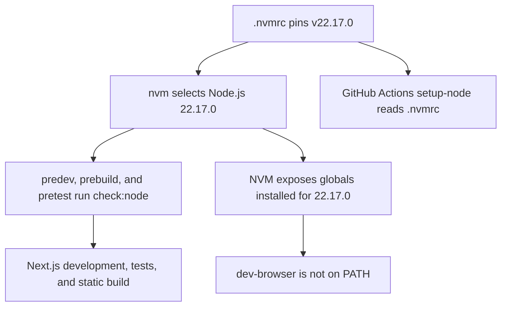

# Node.js 22.23.1 Upgrade Plan

<critical_warning>
> **CRITICAL WARNING:** This change intentionally replaces the exact Node.js `22.17.0` runtime contract with `22.23.1`. After the pin changes, development, build, and test commands must reject Node.js `22.17.0`; every local shell and GitHub Actions run must resolve `22.23.1` before project commands execute.
</critical_warning>

<important_note>
> **IMPORTANT NOTE:** `dev-browser` is installed globally inside the local NVM installation for Node.js `22.23.1`, but global npm packages are isolated per Node.js version. Keep `dev-browser` outside this repository’s application dependencies. Validate it after activating `22.23.1`, and install it globally for that runtime only if `command -v dev-browser` still fails.
</important_note>

## 1. Goal

Upgrade Embeddings from the exact Node.js runtime `22.17.0` to `22.23.1` while preserving the repository’s existing single-source runtime contract and proving that local development, dependency installation, automated tests, static export, GitHub Pages configuration, and browser-based QA still operate correctly.

The upgrade is complete when:

- `.nvmrc`, `package.json`, `package-lock.json`, `README.md`, and `AGENTS.md` declare `22.23.1` consistently.
- The dependency-free runtime preflight accepts `22.23.1` and rejects `22.17.0` with an actionable message requiring `22.23.1`.
- GitHub Actions continues to read `.nvmrc` rather than duplicating a version literal.
- A clean `npm ci`, `npm run lint`, `npm test`, and `npm run build` all exit with code `0` under Node.js `22.23.1`.
- The static export is generated in `out/` and the local application responds on `http://localhost:3002`.
- `dev-browser` resolves from the Node.js `22.23.1` environment, opens the local site, completes the existing contact-to-about navigation regression, captures desktop and mobile evidence, and is cleaned up without leaving a task-owned browser running.

---

## 2. Current State Analysis

### 2.1 Current Implementation Overview

The repository already enforces an exact Node.js version through a single-source contract:

- `.nvmrc` is the authoritative local and CI pin and currently contains `v22.17.0`.
- `package.json` mirrors `22.17.0` in `engines.node`.
- The root package entry in `package-lock.json` mirrors `22.17.0` in `engines.node`.
- `scripts/check-node-version.mjs` reads `.nvmrc`, normalises an optional leading `v`, and compares it with `process.versions.node`.
- `predev`, `prebuild`, and `pretest` all call `npm run check:node` before project work begins.
- `.github/workflows/deploy.yml` configures `actions/setup-node` with `node-version-file: '.nvmrc'` and therefore does not maintain an independent Node.js version.
- `test/node-runtime-contract.test.mjs` derives the supported version from `.nvmrc` and checks package metadata, documentation, deployment configuration, lifecycle hooks, and supported or unsupported runtime behaviour.
- `README.md` and `AGENTS.md` explicitly document `22.17.0`.

The project’s current shell resolves Node.js from `/Users/sacino/.nvm/versions/node/v22.17.0/bin`. That NVM installation does not contain `dev-browser`. The same machine has a working `dev-browser` installation under `/Users/sacino/.nvm/versions/node/v22.23.1/bin/dev-browser`, and Bulma Root selects `22.23.1` through its `.nvmrc`. The mismatch is caused by NVM’s per-version global npm package isolation, not by a machine-wide `dev-browser` failure.

### 2.2 Current Flow

### 2.3 The Core Problem

The application runtime is pinned to Node.js `22.17.0`, while the working `dev-browser` CLI is installed in the separate NVM global package space for Node.js `22.23.1`. As a result, repository commands correctly use `22.17.0`, but browser verification cannot invoke `dev-browser` by name from that environment.

Changing only the active shell or invoking the CLI through an absolute path would leave the tracked runtime contract on `22.17.0`. Changing only `.nvmrc` would make package metadata and documentation drift and would cause `test/node-runtime-contract.test.mjs` to fail. The upgrade must update every mirrored declaration and then validate the application under the new exact runtime.

### 2.4 Affected User Scenarios

| Scenario | Current Behaviour | Required Behaviour |
| --- | --- | --- |
| Local development | `nvm use` selects `22.17.0`; `npm run dev` accepts it | `nvm use` selects `22.23.1`; the app serves on port `3002` |
| Automated tests and build | Lifecycle preflight accepts only `22.17.0` | Lifecycle preflight accepts only `22.23.1`; all required commands pass |
| GitHub Pages deployment | GitHub Actions reads `22.17.0` from `.nvmrc` | GitHub Actions reads `22.23.1` from the same file with no workflow version literal |
| Browser QA | `dev-browser` is absent from the active `22.17.0` NVM global bin | `dev-browser` resolves and controls the local app after `nvm use 22.23.1` |
| Unsupported local runtime | A runtime other than `22.17.0` is rejected | `22.17.0` and every runtime other than `22.23.1` are rejected with the `22.23.1` requirement |

### 2.5 Technical Constraints

- Preserve `.nvmrc` as the only authoritative Node.js version source.
- Keep the version exact. Do not replace it with a range such as `>=22.23.1`, `22.x`, or `^22.23.1`.
- Do not add a separate `node-version` literal to `.github/workflows/deploy.yml`.
- Do not add `dev-browser` to `dependencies` or `devDependencies`; it is external browser tooling managed by its skill and the active NVM environment.
- Preserve the existing application dependency versions. The intended `package-lock.json` change is limited to the root package’s `engines.node` declaration unless `npm ci` proves an existing lockfile incompatibility.
- Preserve the static GitHub Pages architecture, `out/` build target, port `3002`, contact form contract, navigation behaviour, frontend copy, and existing animation implementations.
- Do not update `documents/service-section-animations.md` because the runtime pin does not change service animation code or behaviour.
- Treat existing unrelated working-tree changes as collaborator-owned. Do not revert, rewrite, stage, or include them in this upgrade.

### 2.6 Existing Infrastructure That Can Be Reused

- `.nvmrc` for local NVM selection and GitHub Actions setup.
- `scripts/check-node-version.mjs` for exact runtime enforcement.
- `test/node-runtime-contract.test.mjs` for cross-file drift and preflight assertions.
- Existing npm lifecycle hooks in `package.json`.
- `.github/workflows/deploy.yml` with `node-version-file: '.nvmrc'`.
- Required repository validation commands: `npm run lint`, `npm test`, and `npm run build`.
- `scripts/browser/contact-about-navigation.dev-browser.js` for the existing 20-iteration mobile navigation regression.
- The `dev-browser` cleanup helper at `/Users/sacino/.codex/skills/dev-browser/scripts/close-browser.mjs`.

---

## 3. Desired State

### 3.1 Desired State Requirements

- **REQ-1 (MUST):** `.nvmrc` must contain exactly `v22.23.1` followed by a newline.
- **REQ-2 (MUST):** `package.json` and the root package record in `package-lock.json` must declare exactly `22.23.1` in `engines.node`.
- **REQ-3 (MUST):** `README.md` and `AGENTS.md` must contain no documented Node.js version other than `22.23.1`.
- **REQ-4 (MUST):** `scripts/check-node-version.mjs` and the existing lifecycle hooks must continue deriving the supported runtime from `.nvmrc` without adding a hard-coded `22.23.1` literal to the script.
- **REQ-5 (MUST):** `.github/workflows/deploy.yml` must continue using `node-version-file: '.nvmrc'` and must not contain a `node-version:` property.
- **REQ-6 (MUST):** Node.js `22.23.1` must pass `npm run check:node`; Node.js `22.17.0` must fail and state that the project requires Node.js `22.23.1`.
- **REQ-7 (MUST):** `npm ci`, `npm run lint`, `npm test`, and `npm run build` must exit with code `0` under Node.js `22.23.1`.
- **REQ-8 (MUST):** `npm run build` must generate the expected static export in `out/`, including `out/index.html`, `out/about/index.html`, `out/process/index.html`, and `out/contact/index.html`.
- **REQ-9 (MUST):** `dev-browser` must resolve from the activated Node.js `22.23.1` environment and return help output without an error.
- **REQ-10 (MUST):** Browser verification must exercise the local application at desktop `1440x900` and mobile `390x900`, report no horizontal overflow, uncaught page errors, or unexpected request failures, and complete the existing 20-iteration contact-to-about navigation regression with `failedIterationCount: 0`.
- **REQ-11 (MUST NOT):** The runtime upgrade must not alter application dependencies, page content, component behaviour, contact form fields, routes, or animations.
- **REQ-12 (SHOULD):** If `dev-browser` is missing after activating `22.23.1` on another machine, setup guidance should use the skill’s documented `npm install -g dev-browser` and `dev-browser install` commands rather than weakening the project runtime contract.

### 3.2 Defaults and Fallbacks

- **Default runtime:** Run `nvm install` and `nvm use` from the repository root so `.nvmrc` selects Node.js `22.23.1`.
- **Runtime fallback:** If NVM is unavailable, install or initialise NVM using the existing `README.md` instructions before running project commands. Do not bypass `npm run check:node`.
- **Browser-tool fallback:** After activating `22.23.1`, first use the already installed CLI resolved by `command -v dev-browser`. If it is absent, install it globally for that active runtime with `npm install -g dev-browser`, then run `dev-browser install`.
- **CI compatibility:** Continue using `actions/setup-node@v4` with `.nvmrc`; no GitHub Actions workflow version literal is required.
- **Dependency compatibility:** Preserve all dependency and integrity entries in `package-lock.json`; only the root runtime engine declaration should change.

### 3.3 Verification Checklist

**Functional:**

- [ ] `node --version` prints `v22.23.1` after `nvm use`.
- [ ] The local development server returns HTTP `200` from `http://localhost:3002`.
- [ ] The four public static routes render through `dev-browser` without uncaught page errors.

**Defaults and fallbacks:**

- [ ] `npm run check:node` accepts `22.23.1` and rejects `22.17.0`.
- [ ] `command -v dev-browser` resolves inside the `22.23.1` NVM environment.
- [ ] A missing `dev-browser` installation has one documented recovery path from the skill without adding a repository dependency.

**Compatibility:**

- [ ] `npm ci`, lint, all Node.js tests, and the static export build pass under `22.23.1`.
- [ ] `package-lock.json` retains existing dependency versions and integrity values.
- [ ] GitHub Actions continues to consume `.nvmrc`.

**Ops and documentation:**

- [ ] `README.md` and `AGENTS.md` document `22.23.1` consistently.
- [ ] The task-owned `dev-browser` instance is closed and absent from `dev-browser browsers` after verification.
- [ ] No unrelated working-tree changes are staged or modified.

---

## 4. Additional Context

### 4.1 User-Provided Context

The upgrade was requested after browser verification in Embeddings reported `zsh: command not found: dev-browser`, while `dev-browser` worked in Bulma Root and other applications. The user explicitly requested that this project move to `22.23.1` and that the implementation prove everything still works.

### 4.2 Background and Decisions

- NVM global packages are scoped to each installed Node.js version. The local machine contains working `dev-browser` executables under Node.js `22.11.0` and `22.23.1`, but not under `22.17.0`.
- Bulma Root contains `.nvmrc` value `22.23.1`, which explains why the same CLI is available there.
- The existing runtime-contract architecture should be retained because it already prevents drift across local development, package metadata, documentation, and GitHub Actions.
- Invoking `/Users/sacino/.nvm/versions/node/v22.23.1/bin/dev-browser` by absolute path is a diagnostic workaround, not the desired repository state. The project should select `22.23.1` normally through `.nvmrc`.
- Adding `dev-browser` as an application dependency was rejected because it is agent tooling, not code required by the production static site.
- Widening the engine requirement was rejected because the repository intentionally uses an exact runtime and tests that contract.
- No API, database, or UI contract changes are part of this work.

---

## 5. Implementation Plan

### Step 1: Update the authoritative runtime pin and package metadata

**Objective:** Make Node.js `22.23.1` the exact tracked runtime while preserving `.nvmrc` as the source of truth.

#### 1.1 High-Level Approach

- Change `.nvmrc` from `v22.17.0` to `v22.23.1`.
- Change `package.json` `engines.node` from `22.17.0` to `22.23.1`.
- Change only the root package’s `engines.node` value in `package-lock.json` from `22.17.0` to `22.23.1`.
- Leave `.github/workflows/deploy.yml`, `scripts/check-node-version.mjs`, npm lifecycle hooks, dependency versions, and integrity hashes unchanged because they already derive runtime behaviour from `.nvmrc`.

**Success Criteria:**

- `cat .nvmrc` prints `v22.23.1`.
- `node -e "const p=require('./package.json'); const l=require('./package-lock.json'); if (p.engines.node !== '22.23.1' || l.packages[''].engines.node !== '22.23.1') process.exit(1)"` exits with code `0`.
- `git diff -- package-lock.json` shows the root `engines.node` value changing to `22.23.1` and no dependency version, resolved URL, integrity hash, or transitive engine change.
- `rg -n "node-version-file:\s*['\"]?\.nvmrc|\bnode-version:" .github/workflows/deploy.yml` shows `node-version-file: '.nvmrc'` and no `node-version:` property.
- `node --test test/node-runtime-contract.test.mjs` exits with code `0` after Node.js `22.23.1` is active.

### Step 2: Align developer and agent documentation

**Objective:** Ensure human and agent setup instructions state the same exact runtime as `.nvmrc`.

#### 2.1 High-Level Approach

- Update the Node.js technical requirement in `AGENTS.md` from `v22.17.0` to `v22.23.1`.
- Update both explicit Node.js version references in `README.md`: the prerequisite version and the deployment setup description.
- Preserve the existing NVM commands, port `3002`, deployment flow, static export instructions, and all unrelated documentation.
- Do not modify either system architecture document because runtime selection does not affect service animations or marketing positioning.

**Success Criteria:**

- `rg -n "22\.17\.0" .nvmrc package.json package-lock.json README.md AGENTS.md .github/workflows/deploy.yml scripts test` returns no matches.
- `rg -n "22\.23\.1" .nvmrc package.json package-lock.json README.md AGENTS.md` reports the authoritative pin and each required mirrored or documented declaration.
- The documentation assertion in `node --test test/node-runtime-contract.test.mjs` passes and reports no version drift.
- `git diff -- README.md AGENTS.md` contains only the two Node.js version substitutions required by this upgrade.

### Step 3: Activate Node.js 22.23.1 and verify the runtime guard

**Objective:** Prove that project commands select and enforce the new runtime before dependency or application validation.

#### 3.1 High-Level Approach

- From the repository root, initialise NVM, run `nvm install`, and run `nvm use` so the updated `.nvmrc` selects `22.23.1`.
- Record `node --version`, `command -v node`, `npm --version`, and `npm config get prefix`.
- Run the positive preflight under `22.23.1`.
- Run the negative preflight under the installed `22.17.0` runtime and capture its expected non-zero result and exact requirement message.
- Return the shell to `22.23.1` before continuing.

**Success Criteria:**

- `node --version` prints exactly `v22.23.1`.
- `command -v node` resolves within `/Users/sacino/.nvm/versions/node/v22.23.1/bin` on the current machine.
- `npm config get prefix` resolves to `/Users/sacino/.nvm/versions/node/v22.23.1` on the current machine.
- `npm run check:node` exits with code `0` under `22.23.1`.
- Running `npm run check:node` under `22.17.0` exits non-zero and includes `This project requires Node.js v22.23.1 from .nvmrc`.
- A final `node --version` check prints `v22.23.1` before Step 4 begins.

### Step 4: Verify dependency installation and all automated checks

**Objective:** Prove that the locked dependency graph and all repository validation commands remain compatible with Node.js `22.23.1`.

#### 4.1 High-Level Approach

- Run `npm ci` under Node.js `22.23.1` to validate a lockfile-driven clean installation.
- Run the targeted runtime contract test first for fast feedback.
- Run the repository-required `npm run lint`, `npm test`, and `npm run build` commands.
- Confirm the static export includes the public routes expected by the project.
- Review the working-tree diff after the build and preserve all collaborator-owned changes. Do not stage or revert unrelated files.

**Success Criteria:**

- `npm ci` exits with code `0` and does not rewrite dependency entries in `package-lock.json`.
- `node --test test/node-runtime-contract.test.mjs` exits with code `0`.
- `npm run lint` exits with code `0` and reports zero ESLint errors.
- `npm test` exits with code `0` with every `test/*.test.mjs` test passing.
- `npm run build` exits with code `0` and completes the Next.js static export.
- `test -f out/index.html && test -f out/about/index.html && test -f out/process/index.html && test -f out/contact/index.html` exits with code `0`.
- `git diff -- package-lock.json` remains limited to the root `engines.node` value.
- `git status --short` confirms no unrelated file was staged, reverted, or newly modified by manual edits during the upgrade.

### Step 5: Verify dev-browser in the upgraded environment

**Objective:** Confirm that the original browser-tooling failure is resolved by the runtime upgrade without making `dev-browser` an application dependency.

#### 5.1 High-Level Approach

- With Node.js `22.23.1` active, run `command -v dev-browser` and `dev-browser --help`.
- If the command is missing on another machine, run the skill-documented `npm install -g dev-browser` followed by `dev-browser install`, then repeat the checks.
- Confirm `package.json` and `package-lock.json` do not contain `dev-browser` as an application or development dependency.
- Use the unique browser name `embeddings-node-22-23-upgrade` for all verification in this plan.

**Success Criteria:**

- `command -v dev-browser` returns a non-empty executable path associated with the active Node.js `22.23.1` environment.
- `dev-browser --help` exits with code `0` and prints the CLI usage text.
- `dev-browser status` exits with code `0` after the first browser command starts the daemon.
- `node -e "const p=require('./package.json'); if (p.dependencies?.['dev-browser'] || p.devDependencies?.['dev-browser']) process.exit(1)"` exits with code `0`.
- `rg -n 'node_modules/dev-browser|"dev-browser"' package-lock.json` returns no matches.

### Step 6: Run local application and responsive browser verification

**Objective:** Prove that the upgraded runtime serves the real application and preserves core navigation and responsive rendering.

#### 6.1 High-Level Approach

- Check `http://localhost:3002` before browser work. If it is not responding, start `npm run dev` from the repository root and wait for the URL to return HTTP `200`.
- Run a focused `dev-browser` smoke script against `/`, `/about`, `/process`, and `/contact` using the task-owned browser `embeddings-node-22-23-upgrade`.
- Assert the route-specific heading text: `Be the brand AI agents recommend first` on `/`, `The team behind Australia’s first agentic commerce consultancy` on `/about`, `How we make catalogues agentic-ready` on `/process`, and `Your AI advantage starts here` on `/contact`.
- At `1440x900`, verify the homepage heading, HTTP response, document width, console errors, page errors, and offscreen changed elements; capture a desktop screenshot and record its absolute path.
- At `390x900`, repeat the homepage and contact-page width and error checks; capture a mobile screenshot and record its absolute path.
- Run `dev-browser --browser embeddings-node-22-23-upgrade --timeout 120 run scripts/browser/contact-about-navigation.dev-browser.js` and retain the emitted report path from `~/.dev-browser/tmp/` as validation evidence.
- Close the task-owned browser with `node /Users/sacino/.codex/skills/dev-browser/scripts/close-browser.mjs embeddings-node-22-23-upgrade`, then verify it is absent from `dev-browser browsers`.
- Stop only the development server started by this task. Leave any pre-existing server running.

**Success Criteria:**

- `curl --fail --silent --show-error http://localhost:3002/ >/dev/null` exits with code `0` before browser interaction.
- The browser smoke script receives successful responses for `/`, `/about`, `/process`, and `/contact` and confirms each route-specific heading from the high-level approach is visible.
- Desktop `1440x900` and mobile `390x900` evaluations both report `document.documentElement.scrollWidth <= window.innerWidth`.
- Desktop and mobile checks record zero uncaught `pageerror` events and zero unexpected failed requests.
- Desktop and mobile screenshots are captured, their returned absolute paths exist, and neither screenshot contains secrets or environment values.
- The existing navigation regression reports `iterationCount: 20`, `failedIterationCount: 0`, `unexpectedRequestFailureCount: 0`, and no page errors.
- The navigation regression reaches `http://localhost:3002/about`, title `About Us / Embeddings`, and heading `about us - The team behind Australia’s first agentic commerce consultancy` on every iteration.
- The close helper exits with code `0`, and `dev-browser browsers` does not list `embeddings-node-22-23-upgrade`.

### Step 7: Review the final implementation scope

**Objective:** Confirm the delivered change contains only the runtime upgrade, aligned documentation, and the plan’s implementation record.

#### 7.1 High-Level Approach

- Review `git diff -- .nvmrc package.json package-lock.json README.md AGENTS.md documents/todo/node_22_23_1_upgrade_plan.md`.
- Verify `.github/workflows/deploy.yml`, `scripts/check-node-version.mjs`, `test/node-runtime-contract.test.mjs`, and browser regression source require no implementation changes.
- Append an `Implemented Solution` section to this plan only after every required validation in Steps 1 through 6 has passed.
- Keep existing unrelated working-tree files outside the runtime-upgrade diff and any future commit.

**Success Criteria:**

- The implementation diff changes `.nvmrc`, `package.json`, `package-lock.json`, `README.md`, `AGENTS.md`, and this plan file only, unless a validation failure proves another directly related file requires a focused change.
- No source file under `src/`, no application dependency version, and no GitHub Actions deployment behaviour changes.
- Every command in the Testing Plan has a recorded passing result before an `Implemented Solution` section is appended.
- The appended `Implemented Solution` names every touched file, records the exact runtime and browser-tooling deltas, lists every validation command and outcome, and notes any safe-to-delete generated test evidence without deleting it.

---

## 6. Testing Plan

### 6.1 Source-of-Truth Regression Artefacts

The following exact artefacts and environment observations define the regression and must be used during implementation:

- `/Users/sacino/embeddings/.nvmrc`
  - Current source of truth containing `v22.17.0`.
  - Post-upgrade expectation: contains exactly `v22.23.1` and drives local NVM selection and GitHub Actions.
- `/Users/sacino/embeddings/package.json` and `/Users/sacino/embeddings/package-lock.json`
  - Current mirrored engine declarations containing `22.17.0`.
  - Post-upgrade expectation: both root declarations contain exactly `22.23.1`; dependency versions and integrity entries remain unchanged.
- `/Users/sacino/embeddings/test/node-runtime-contract.test.mjs`
  - Executable source of truth for cross-file runtime consistency, lifecycle hooks, documentation, deployment, and runtime rejection behaviour.
  - Post-upgrade expectation: passes unchanged under Node.js `22.23.1`.
- `/Users/sacino/embeddings/scripts/check-node-version.mjs`
  - Executable preflight that reads `.nvmrc` and produced the old runtime contract.
  - Post-upgrade expectation: passes on `22.23.1`, rejects `22.17.0`, and remains free of a hard-coded supported version.
- `/Users/sacino/embeddings/.github/workflows/deploy.yml`
  - Deployment source of truth using `node-version-file: '.nvmrc'`.
  - Post-upgrade expectation: remains unchanged and therefore selects `22.23.1` automatically.
- `/Users/sacino/.nvm/versions/node/v22.17.0/bin`
  - Reproduces the original environment: Node.js resolves here and `command -v dev-browser` returns no result.
  - Post-upgrade use: retain only as the negative preflight runtime; it must no longer be accepted by the project.
- `/Users/sacino/.nvm/versions/node/v22.23.1/bin/dev-browser`
  - Existing working CLI that returns help output successfully.
  - Post-upgrade expectation: resolves naturally after `nvm use` without an absolute-path workaround.
- `/Users/sacino/embeddings/scripts/browser/contact-about-navigation.dev-browser.js`
  - Existing 20-iteration mobile navigation regression covering `/contact`, the root navigation dialog, and `/about`.
  - Post-upgrade expectation: all 20 iterations pass with no unexpected request failures or page errors.

<critical_warning>
> **CRITICAL WARNING:** Do not replace the real `.nvmrc`-driven preflight or `scripts/browser/contact-about-navigation.dev-browser.js` with a synthetic version assertion or a single static-page check. The exact runtime guard and real contact-to-about browser flow are the primary regression evidence for this upgrade.
</critical_warning>

### 6.2 Unit and Contract Tests

| Test Case | Location and Framework | Expected Result | Validation Command |
| --- | --- | --- | --- |
| Runtime declarations stay aligned | `test/node-runtime-contract.test.mjs`, Node.js test runner | `.nvmrc`, package metadata, lockfile root, README, and AGENTS resolve to `22.23.1` | `node --test test/node-runtime-contract.test.mjs` |
| Deployment retains one runtime source | `test/node-runtime-contract.test.mjs`, Node.js test runner | Workflow uses `node-version-file: '.nvmrc'` and contains no `node-version:` literal | `node --test test/node-runtime-contract.test.mjs` |
| Exact runtime acceptance | `scripts/check-node-version.mjs` through the contract test | `22.23.1` returns no error | `npm run check:node` under Node.js `22.23.1` |
| Old runtime rejection | `scripts/check-node-version.mjs` through direct preflight | `22.17.0` exits non-zero and names required version `22.23.1` | Run `npm run check:node` under Node.js `22.17.0` |
| Full repository regression | All `test/*.test.mjs`, Node.js test runner | Every Node.js test passes | `npm test` |

### 6.3 Integration and System Tests

1. Clean dependency installation
   - Action: Activate Node.js `22.23.1` and run `npm ci`.
   - Expected: Installation exits with code `0` using the tracked lockfile.
   - Verify: Review exit status and confirm `git diff -- package-lock.json` contains only the planned root engine change.

2. Static analysis
   - Action: Run `npm run lint`.
   - Expected: ESLint exits with code `0` and reports zero errors.
   - Verify: Record the command result in the implementation handoff.

3. Static export build
   - Action: Run `npm run build` under Node.js `22.23.1`.
   - Expected: Next.js completes without errors and writes the homepage, about, process, and contact HTML files under `out/`.
   - Verify: Run `test -f out/index.html && test -f out/about/index.html && test -f out/process/index.html && test -f out/contact/index.html`.

4. Local server health
   - Action: Verify port `3002`; if required, start `npm run dev` from `/Users/sacino/embeddings` and wait for the server.
   - Expected: `http://localhost:3002` returns HTTP `200`.
   - Verify: Run `curl --fail --silent --show-error http://localhost:3002/ >/dev/null`.

5. Responsive route smoke test
   - Action: Use `dev-browser --browser embeddings-node-22-23-upgrade` to open `/`, `/about`, `/process`, and `/contact` at desktop `1440x900` and mobile `390x900` where applicable.
   - Expected: The respective headings `Be the brand AI agents recommend first`, `The team behind Australia’s first agentic commerce consultancy`, `How we make catalogues agentic-ready`, and `Your AI advantage starts here` are visible; there is no horizontal overflow, and there are no page errors or unexpected request failures.
   - Verify: Record the structured browser output and absolute screenshot paths.

6. Existing navigation regression
   - Action: Run `dev-browser --browser embeddings-node-22-23-upgrade --timeout 120 run scripts/browser/contact-about-navigation.dev-browser.js`.
   - Expected: The report records 20 successful contact-to-about navigations, zero failed iterations, zero unexpected request failures, and no page errors.
   - Verify: Retain and reference the returned `~/.dev-browser/tmp/contact-about-navigation-regression.json` path.

7. Browser cleanup
   - Action: Run `node /Users/sacino/.codex/skills/dev-browser/scripts/close-browser.mjs embeddings-node-22-23-upgrade`.
   - Expected: The helper exits with code `0` and the browser name is absent from the managed browser list.
   - Verify: Run `dev-browser browsers` and inspect the returned names.
