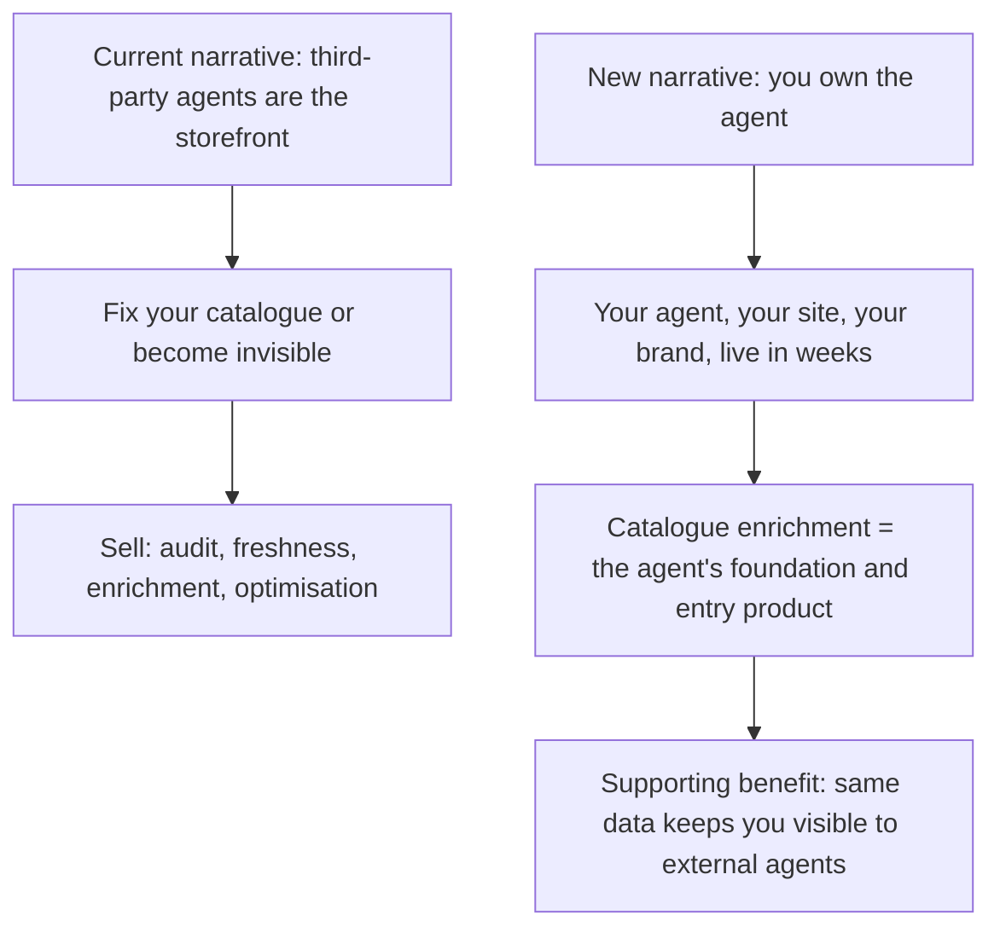

# ~~Owned-Agent Site Copy Migration Plan~~ ✅ **COMPLETED**

<critical_warning>
> **CRITICAL WARNING:** Superseded visual components must be COMMENTED OUT, never deleted. Comment out the external reference (import line and JSX usage) at the call site with a one-line note, and leave the component file on disk untouched. This is a hard user directive. Precedent already exists in the codebase: `HeroDesktopDataFlow.jsx` keeps its rejected "Variant B" as a commented block, and `documents/service-section-animations.md` records `OptimisationSeismograph.jsx` as retained-but-unwired.
</critical_warning>

<critical_warning>
> **CRITICAL WARNING:** Site copy must NEVER name Google, Bunnings, or Buddy as a competitor or incumbent agent vendor, and must NEVER state performance or pricing figures from the internal opportunity guide (no "2–4×" uplift, no "US$0.50 per session", no "US$260 million ARR", no "six weeks" incumbent-build claims). Contrast with the incumbent is implicit only ("live in weeks", "change your own prompts", "no search lock-in"). Two exceptions remain allowed: (1) Google and OpenAI may be named as third-party MARKET evidence with source links (the existing McKinsey / Deloitte / Adobe / OpenAI / UCP timeline and stat cards), because that is sourced ecosystem reporting, not competitor positioning; (2) the exact phrase `Google Retail Search` may appear in the supported-search-platform integration lists (agent section body and process Deploy stage), never inside `AgentConversationShowcase.jsx`. Additionally, pricing stays entirely off copy per REQ-13: no figures, no pricing-model descriptions, and no "cheaper" claims anywhere.
</critical_warning>

<important_note>
> **IMPORTANT NOTE:** `test/contact-form-contract.test.mjs` asserts the contents of `AGENTS.md` itself (the locked contact-page copy strings and contact form rules). Contact page copy, the `AGENTS.md` `<contact_form_rules>` block, and that test file MUST change together in one coordinated step or `npm test` fails.
</important_note>

## 1. Goal

Migrate the embeddings.au marketing site from its current "catalogue readiness" positioning (fix your catalogue so third-party AI agents recommend you) to the new "owned agent" positioning (we build the AI shopping agent that runs on YOUR site, in YOUR brand, grounded in YOUR catalogue), as defined by the product source of truth `documents/reference/ai_shopping_agent.md`.

The migration is an augment-and-reframe, not a rebuild:

- The owned agent becomes the headline product on every page.
- Catalogue enrichment (the current site's entire story) is retained and repositioned as the credibility foundation and entry product that powers the agent.
- External-agent readiness (being recommended by ChatGPT/Google agents) is demoted from headline thesis to a supporting benefit of good catalogue data.
- One new homepage section (with a new visual) presents the agent's capabilities: conversational discovery, in-conversation checkout, order and returns support, self-service retailer control (shown, not just stated), revenue analytics, and pluggable search.
- Existing diagrams are altered only where the copy around them changes with good reason; anything superseded is commented out, never deleted.

Done means: all four public routes (`/`, `/process`, `/about`, `/contact`) plus metadata, navigation, and footer speak the owned-agent narrative; the claims policy above is enforced; `npm run lint`, `npm run build`, and `npm test` pass under Node v22.17.0; browser verification at 1440x900 and 390x900 shows no errors or overflow; and `AGENTS.md`, `documents/service-section-animations.md`, and `documents/agentic-shopping-positioning.md` are updated to match.

---

## 2. Current State Analysis

### 2.1 Current Implementation Overview

The site is a statically exported Next.js 14 App Router marketing site (Tailwind CSS, GitHub Pages at embeddings.au, no server runtime). Its live narrative, documented in `documents/agentic-shopping-positioning.md`, is fear-of-disintermediation: third-party AI agents (ChatGPT, Google's consumer agents) shop on behalf of consumers, so retailers must fix their catalogues or become invisible. The antagonist is "the AI agent"; the promise is "be recommended first".

Copy inventory of the old frame, by file:

| File | Old-frame copy |
| --- | --- |
| `src/app/page.jsx:502` | Hero H1 "Be the brand AI agents recommend first" |
| `src/app/page.jsx:504-508` | Hero subhead "Google and OpenAI agents already shop for 700 million consumers. We help Australian retailers win that recommendation, starting with your catalogue." |
| `src/app/page.jsx:97-122` | `heroProofSignals`: 700M+ / UCP / $3–5T market-stat pills (duplicates of timeline stats) |
| `src/app/page.jsx:340-344` | Timeline closing "Retailers who aren't agentic-ready risk falling behind." / "The ones who are? They're capturing market share right now." |
| `src/app/page.jsx:394-403` | WhyNow title "Your customers aren't shopping anymore — their AI agents are" and ChatGPT-scans-catalogues body ending "You become invisible." |
| `src/app/page.jsx:356-387` | `whyNowCards`: Disintermediation / The data quality gap / The race is on (each with sourced third-party stats) |
| `src/app/page.jsx:458-466` | Services intro "Your catalogue is your competitive moat — we make it unassailable" |
| `src/app/page.jsx:536-556` | Testimonial (anonymous retail executive, catalogue audit and enrichment story) |
| `src/components/ContactSection.jsx:121-127` | CTA "Be the brand AI agents recommend first" / "The retailers preparing their catalogues today are building advantages that compound tomorrow." |
| `src/components/ContactSection.jsx:11-82` | 10 floating snippets (9 catalogue attributes + "AI traffic: +393% YoY") |
| `src/components/HeroDataFlow.jsx:36-114` | Mobile hero visual: "Your catalogue / gaps found / GTIN missing / thin description / stale stock signal" → "AI agent / audit / enrich / rank" → "Consumer answer … Recommendation-ready" |
| `src/components/HeroDataFlow.jsx:25,41` | aria-labels describing catalogue data flowing to "a consumer recommendation" |
| `src/components/HeroDesktopDataFlow.jsx` | Desktop hero SVG (1,193 lines): "Your catalogue" (3 SKU cards) → "AI agent" (neural mesh) → consumer chat with "Ask anything..." prompt. Contains commented-out Variant B as precedent for the comment-out policy |
| `src/components/ServiceTimelineLeftRail.jsx:16-61` | Four service entries (audit / freshness / enrichment / optimisation) with copy about staying "in the recommendation set" |
| `src/app/process/page.jsx` | 3-stage catalogue journey: Audit → Engineer → Optimise; PageIntro "How we make catalogues agentic-ready"; values grid "Built for agentic commerce, not generic AI adoption" |
| `src/app/about/page.jsx` | "Australia's first agentic commerce consultancy", "purpose-built for catalogue readiness", capabilities list, market StatList |
| `src/app/contact/page.jsx:9-23` | Metadata "Contact us to learn how we can integrate AI into your business." + PageIntro "Your AI advantage starts here" + "Ready to experience the future of work?…" (currently LOCKED by `AGENTS.md` `<contact_form_rules>`; the user has now explicitly unlocked contact copy) |
| `src/lib/metadata.js` | Site title "Embeddings: Agentic Shopping Readiness for Australian Retailers" + catalogue-services descriptions |
| `src/schemas/organization-schema.js` | JSON-LD description "AI embeddings experts and consultants specialising in machine learning solutions." (predates even the catalogue positioning) |
| `src/components/Footer.jsx:26-41`, `src/components/RootNavigationPanel.jsx:13-26` | Nav links: why now / services / proof / our process / about us / contact us (all lowercase by design) |

### 2.2 Current Flow

### 2.3 The Core Problem

The site sells only the foundation layer. The headline product in `documents/reference/ai_shopping_agent.md` (a retailer-owned shopping agent with conversational discovery, in-conversation checkout, order/returns support, self-service control, and a pluggable search layer) has zero presence on the site. A prospective customer arriving today cannot discover that Embeddings builds owned agents at all, so the site cannot resonate with the buyers the new direction targets.

### 2.4 Affected User Scenarios

| Scenario | Current experience | Impact |
| --- | --- | --- |
| Retail executive wanting a Buddy-style agent for their own site | Sees only catalogue services; no agent offer | Lost lead for the headline product |
| Existing catalogue-enrichment prospect | Sees the full old narrative | Still served; must not be lost in the reframe (catalogue remains the entry product) |
| Visitor arriving from search/social | Meta title/description and JSON-LD describe catalogue readiness or generic AI consulting | Mis-set expectations before first paint |

### 2.5 Technical Constraints

- **Static export**: `npm run build` outputs to `out/`; no server-side functionality. All components default to Server Components; `'use client'` only where hooks/browser APIs are needed.
- **Animation protection (`AGENTS.md` `<animation_standards>`)**: never add `prefers-reduced-motion` gates; do not replace, simplify, remove, or rewrite the existing frontpage animation DESIGNS (`HeroDataFlow.jsx`, `CatalogueTransformation.jsx`, service timeline animations, `ContactSection.jsx` floating snippets). This plan changes only text labels, aria-labels, and snippet strings inside those components; timing, keyframes, particle systems, structure, and visual design stay identical. The user has explicitly authorised copy-level changes to the hero SVG and other diagrams as part of this migration.
- **Content rules (`AGENTS.md`)**: British English everywhere; `’` (U+2019) apostrophes in all user-facing strings; nav and footer labels stay lowercase.
- **Contact form contract**: fields stay exactly name, email, company, phone, message, budget. The user unlocked contact page COPY, not the field model. Do not add catalogue-readiness/SKU/platform/priority fields (`test/contact-form-contract.test.mjs` enforces this and must keep enforcing it).
- **React/Next work must follow the `vercel-react-best-practices` skill** (read before writing the new component).
- **Validation gate**: `npm run lint`, `npm run build`, `npm test` (Node v22.17.0 via `nvm use 22.17.0`; the version gate in `scripts/check-node-version.mjs` hard-fails other versions), plus `dev-browser` checks on `http://localhost:3002` at 1440x900 and 390x900.
- **Copy-assertion tests**: `test/process-page-catalogue-positioning.test.mjs` hard-codes old process-page phrases; `test/contact-form-contract.test.mjs` asserts `AGENTS.md` rule text and locked contact copy. Both must be updated in lockstep with the copy they assert.
- **Pre-existing dirty files**: `documents/todo/hero_video_one_conversation_plan.md`, `documents/todo/hero_video_whole_project_plan.md`, `public/sitemap.xml`, and a staged rename of `documents/reference/ai_shopping_agent.md` belong to other completed work. Do not revert or include them; do not edit the two completed hero-video plan documents.

### 2.6 Existing Infrastructure That Can Be Reused

- `SectionIntro`, `FadeIn`/`FadeInStagger`, `Container`, `PageIntro`, `GridList`, `StatList`, `Button`, `NoiseOverlay`, `surface-elevation-*` utility classes: build the new agent section entirely from these primitives.
- The desktop hero SVG already depicts catalogue → agent → consumer chat; ownership is a labelling change, not a structural one.
- Fictional demo data is already established (Sapphire Blue A-Line Midi Dress, GTIN 0614141123456, $189.00 AUD, stock 142) in `CatalogueTransformation.jsx` and `ContactSection.jsx`; reuse it in the new agent conversation so the site's product universe stays coherent.
- `documents/reference/ai_shopping_agent.md` is the product capability ceiling: every capability shown or claimed on the site must map to its § Proposed Product or § Longer-Term Product Scope.

---

## 3. Desired State

### 3.1 Desired State Requirements

- **REQ-1 (MUST)**: The owned agent leads every page: hero, metadata, and JSON-LD describe building retailer-owned AI shopping agents, with catalogue enrichment presented as the foundation/entry product.
- **REQ-2 (MUST)**: The product is referred to descriptively only ("your shopping agent" / "your AI shopping agent" / "your agent"). No invented product name anywhere.
- **REQ-3 (MUST)**: A new homepage section with `id="agent"` demonstrates the agent's capabilities in TWO parts: (a) a branded conversation (discovery → recommendation → in-conversation checkout → order-status follow-up), and (b) a retailer-facing control strip that SHOWS self-service control (a prompt/canned-response edit publishing instantly, "no ticket, no release cycle") alongside compact analytics stat tiles (sessions, conversion, assisted revenue). A capability chip list covers: conversational discovery, checkout in the chat, order & returns support, bring your own search, self-service control, revenue analytics. Every capability shown maps to `documents/reference/ai_shopping_agent.md` § Proposed Product.
- **REQ-4 (MUST NOT)**: No site file may name Google, Bunnings, or Buddy as competitor/incumbent, and no site file may contain "2–4×"-style uplift figures, per-session pricing, ARR figures, or incumbent build-time claims. Sourced third-party market stats already on the site (McKinsey, Deloitte, Adobe, OpenAI user counts, UCP launch) remain allowed with their source links. Naming supported SEARCH PLATFORMS as integrations (Algolia, Coveo, Elasticsearch, Google Retail Search, retailer-owned indexes) is explicitly allowed; the exact phrase `Google Retail Search` in an integration list is an ecosystem mention, not competitor positioning, but it must not appear inside `AgentConversationShowcase.jsx` (keeps the component-level competitor-name test guard simple).
- **REQ-5 (MUST)**: Superseded visual components or sections are commented out at their reference site (import + JSX) with a one-line explanatory comment; no component file is deleted.
- **REQ-6 (MUST)**: Existing animation designs are preserved: `HeroDesktopDataFlow` (neural mesh, particles, timing), `CatalogueTransformation` (before/after + shimmer), all four service SVG animations, and the `ContactSection` floating-snippet system change at the text-string level only.
- **REQ-7 (MUST)**: The process page presents the full owned-agent journey in three stages: Foundation (catalogue audit + enrichment + freshness), Deploy (agent build: branding, prompts, search integration, checkout and API connections), Operate (analytics, optimisation, self-service handover).
- **REQ-8 (MUST)**: Contact page copy is refreshed to the new direction; the form field contract (name, email, company, phone, message, budget) and Formspree wiring are unchanged.
- **REQ-9 (MUST)**: `AGENTS.md` (contact copy rules, key_templates, animation-protection list), `documents/service-section-animations.md` § Section Copy, and `documents/agentic-shopping-positioning.md` are updated so no project document contradicts the shipped site.
- **REQ-10 (MUST)**: All copy is British English with `’` apostrophes; nav/footer labels stay lowercase; new body copy avoids em dashes (use commas or full stops); existing untouched strings keep their current punctuation.
- **REQ-11 (MUST)**: `npm run lint` (zero errors), `npm run build` (completes), and `npm test` (all pass) under Node v22.17.0, plus dev-browser verification of all four routes at 1440x900 and 390x900 with no console errors, page errors, or horizontal overflow.
- **REQ-12 (SHOULD)**: External-agent readiness appears exactly once as a supporting benefit sentence in the services section, not as a headline anywhere.
- **REQ-13 (MUST NOT)**: Pricing stays entirely off copy: no figures, no pricing-model descriptions (no "per session", "platform fee", "usage-based", tiers), and no "cheaper"/"lower cost" claims. Pricing is value-based and deliberately non-prescriptive; the contact CTA is the enquiry path. Speed/flexibility of delivery may be stated qualitatively ("weeks", "without waiting on anyone") but "implementation" is never presented as a feature in itself, and the operating-model problem area is never a marketing message. All copy MUST follow the Messaging Priority Matrix in §4.2.

### 3.2 Defaults and Fallbacks

- **Defaults**: Implement the "Recommended" option recorded for each decision in §4.2. Alternatives are documented for context; do not implement them unless the user redirects.
- **Copy latitude**: Recommended copy strings below are the default. The executor may polish phrasing provided the meaning, claims policy (REQ-4), terminology (REQ-2), and every string that a test asserts stay intact. If a copy string is changed from the recommended default, its asserting test must be updated to the shipped string in the same step.
- **Fallback order for uncertainty**: (1) this plan, (2) `documents/reference/ai_shopping_agent.md`, (3) `AGENTS.md`. If a capability is not in the reference guide, do not show or claim it.

### 3.3 Verification Checklist

**Functional:**
- [ ] Hero, metadata, and JSON-LD lead with the owned agent (REQ-1)
- [ ] `id="agent"` section renders the conversation storyboard, control strip, analytics tiles, and capability chips (REQ-3)
- [ ] Process page shows Foundation / Deploy / Operate (REQ-7)
- [ ] Contact copy refreshed; form fields unchanged (REQ-8)

**Claims policy:**
- [ ] `grep -rn "Bunnings\|Buddy" src/` returns nothing
- [ ] `grep -rn "2–4\|2-4×\|\$0.50\|US\$260\|per session" src/` returns nothing
- [ ] `grep -rni "cheaper\|lower cost\|platform fee\|usage-based\|per-session" src/` returns nothing (REQ-13)
- [ ] "Google"/"OpenAI" appear in `src/` only inside sourced market-stat data (timeline cards, whyNow cards, stat lists, about-page ecosystem references), existing source URLs, and the exact integration phrase `Google Retail Search` in the agent section body and process Deploy stage; `grep -n "Google" src/components/AgentConversationShowcase.jsx` returns nothing

**Comment-out policy:**
- [ ] No component file deleted; any superseded reference is commented out with a note (REQ-5)

**Ops/Docs:**
- [ ] `AGENTS.md`, `documents/service-section-animations.md`, `documents/agentic-shopping-positioning.md` updated (REQ-9)
- [ ] Lint, build, tests, and both-viewport browser checks pass (REQ-11)

---

## 4. Additional Context

### 4.1 User-Provided Context

Decisions made explicitly by the user for this migration (settled; do not relitigate):

1. **Direction**: "we want to focus more on the Owned-agent deployment; the other stuff there is more in service of that. e.g. the catalogue and searchability." The agreed hierarchy: "the owned agent leads, catalogue enrichment becomes the credibility foundation and entry product, and external-agent readiness survives as a supporting benefit of good catalogue data rather than the headline."
2. **Contact page**: previously locked copy "can change; everything is up for grabs. That was stopping AI agents changing the contact page copy when we weren't changing direction." The lock existed to prevent drive-by edits, not to survive a deliberate repositioning. The FIELD contract was not unlocked, only copy.
3. **Diagrams / comment-out policy (verbatim)**: "we are not 'deleting', simply commenting out, preferably by commenting out an external reference to it, so it's not bloating up the code either." And: "Only remove/alter existing diagrams where it makes sense. e.g. it may make sense to alter/redo the first diagram given the new direction, although we should only PROBABLY comment out other diagrams if we're changing the copy around it w/ good reason. That said, I'm open to suggestions, and this is not a hard directive; just an intuition/thing to consider. My main req. is only commenting out rather than outright deleting IF we decide to move forward w/ new diagrams."
4. **Product naming**: descriptive, no product name ("your shopping agent"); no invented brand.
5. **Competitor contrast**: implicit only; never name Google as the incumbent; matches the completed hero-video rule.
6. **Stats policy**: no uplift or pricing figures from the internal guide; qualitative benefits only; keep existing sourced third-party market stats where still relevant.
7. **Process page**: full journey reframe (Foundation → Deploy → Operate), catalogue stages folding into stage 1.
8. **New sections/diagrams**: the user asked for "multiple options with a recommendation" for each; these are recorded in §4.2 with the recommended option as the implementation default.
9. **Blindspot-pass confirmations** (user selected each recommended option; these are now settled decisions, not open options): the agent showcase section sits immediately AFTER the hero and before the timeline; the hero proof pills are repurposed to the three product-promise pills (accepting the required one-assertion update to `test/homepage-stat-source-links.test.mjs`); the social-share/OG featured image (`src/lib/images.ts`, `public/images/`, and the JSON-LD `image` field) is DEFERRED as a known follow-up outside this migration's scope. Do not change `src/lib/images.ts` or the schema `image` value in this migration.
10. **Hero H1 (final, supersedes the earlier BSP pick)**: the user judged the earlier choice (`Your AI shopping agent. On your site. In your brand.`) as the right direction but "not very snappy, catchy, or clever" and asked for competitor-researched alternatives. After reviewing competitor headlines (see §4.2 Slogan research), the user selected: **`The shopping agent that’s actually yours`**. Rationale: ownership twist on the category in seven words, implicit contrast with platform-owned agents without naming anyone, and it claims the positioning whitespace no researched competitor occupies.
11. **Messaging priority policy (user directive)**: the incumbent-problem areas from `documents/reference/ai_shopping_agent.md` § Customer Problems are NOT equal-weight marketing messages. The user set an explicit highlight/qualitative/off-copy policy, recorded as the Messaging Priority Matrix in §4.2. Key points in the user's words: implementation is "not really something to highlight DIRECTLY, more to talk about in terms of speed and flexibility of our approach"; customer control is "very high value, worth highlighting and even showing" with change velocity "probable as part of customer control"; pricing "should stay off copy, just qualitatively state cheaper at most (maybe not at all)" because "the pricing is value-based and we do not want to be prescriptive on the model (open to various price arrangements w/out stating as such. Prompt to enquire for more info)"; search lock-in is high value and we may "say who even" (name the supported platforms); operating model is "not worth highlighting".

### 4.2 Background and Decisions

**Source of truth.** `documents/reference/ai_shopping_agent.md` defines the product: a configurable, retailer-controlled shopping-agent platform (catalogue ingestion/enrichment, conversational discovery, pluggable search layer, embeddable widget, custom branding, self-service prompt/policy management, custom API integrations for orders/returns/loyalty/inventory, in-conversation cart and checkout, analytics, governance). Core thesis: the constraint on incumbent offerings is organisational delivery, not technology; differentiation is faster, cheaper, more flexible, more controllable, more complete, better branded, better measured. Its competitive claims are hedged ("reportedly", "as described in the transcript") which is why REQ-4 exists.

**Diagram decisions (options considered, with recommendation):**

- **D1 Hero visual (`HeroDataFlow.jsx` mobile + `HeroDesktopDataFlow.jsx` desktop)**
  - Option A (Recommended): relabel in place. The desktop SVG already reads "Your catalogue" → "AI agent" → consumer chat ("Ask anything..."); change the centre label "AI agent" → "Your agent" (two `<text>` elements, `HeroDesktopDataFlow.jsx:773` and `:851`), update both aria-labels to describe the retailer-owned flow, and re-copy the mobile variant's three cards to the ownership story (see Step 3). Zero animation-design change; honours the user's intuition that the first diagram is the one worth altering.
  - Option B: build a new conversation-first hero visual and comment out the `<HeroDataFlow />` reference in `page.jsx`. Rejected: discards a protected, high-effort animation whose structure already matches the new story.
  - Option C: leave untouched. Rejected: the mobile variant's "gaps found → audit/enrich/rank → Recommendation-ready" copy tells the old story explicitly.
- **D2 New agent showcase visual (new component)**
  - Option A (Recommended): conversation storyboard. A branded chat panel showing one continuous conversation (discovery → two product cards → add to cart → in-conversation checkout → order-status follow-up), built from existing card/pill primitives with CSS-only staggered reveals, reusing the Sapphire Blue Midi Dress demo data. Shows the differentiators instead of claiming them, and matches the completed "One Conversation" hero-video concept the user already approved for the same story.
  - Option B: capability icon grid only. Rejected as primary: tells rather than shows; kept as a supporting chip row under Option A.
  - Option C: split-screen agent UI + self-service control panel ("your brand, your rules"). Originally deferred, then PARTIALLY REVIVED by the user's messaging-priority directive that customer control is "worth highlighting and even showing": a compact control strip with analytics tiles joins the conversation storyboard as the showcase's second element (see Step 4 and REQ-3). The full split-screen concept remains rejected; the control strip is a supporting element, not a co-equal visual.
- **D3 `CatalogueTransformation.jsx` (before/after cards)**: Keep unchanged (Recommended). It now demonstrates the foundation layer; only the surrounding `SectionIntro` copy changes. Alternative (third panel "→ powers your agent") rejected: crowds a protected animation for marginal gain.
- **D4 Service timeline SVG animations (Audit X-Ray, Freshness Pipeline, Enrichment Typewriter, Optimisation Ripple)**: Keep all four unchanged (Recommended); they depict data mechanics that are direction-neutral. Only the `services` copy array in `ServiceTimelineLeftRail.jsx` gets light reframing. Alternative (comment out Optimisation Ripple) rejected: contextual optimisation remains a sold service.
- **D5 `ContactSection.jsx` floating snippets**: Option A (Recommended): swap three snippet STRINGS to conversation-flavoured data (see Step 8) so the background hints at the agent while catalogue attributes still dominate. Animation system untouched. Option B (leave all ten) acceptable fallback if the swap ever conflicts with the snippet-opacity test's expectations.
- **D6 Process page images**: keep the three `StylizedImage` photos; update only the `ProcessImageSignals` overlay values to the new stages (Step 9).

**Navigation decision**: footer "offer" section gains `{ title: 'the agent', href: '/#agent' }` as its first link. The overlay panel (`RootNavigationPanel.jsx`) keeps exactly six links in three rows by replacing `{ href: '/#why-now', label: 'why now' }` with `{ href: '/#agent', label: 'the agent' }`; "why now" stays reachable via the footer. Alternative (7 links in the panel) rejected: breaks the 2-per-row grid.

**Testimonial decision**: keep `page.jsx` testimonial copy unchanged. It is a catalogue audit/enrichment story, which is exactly the entry-product proof the new hierarchy needs. Do not invent agent-deployment testimony; no such client exists.

**Messaging Priority Matrix (binding for all copy in this plan and future site copy):**

| Message area | Policy | Where it lands in this plan |
| --- | --- | --- |
| Customer control (incl. change velocity) | Highlight AND show. Change velocity folds into control ("no ticket, no release cycle") | Hero pill `Yours`; showcase control strip (Step 4); process Operate |
| In-conversation checkout | Highlight prominently; hardest to build, strongest differentiator | Hero pill `One chat`; showcase checkout beat; chips; process Deploy |
| Post-sales support | Highlight; easy to understand, high customer value | Showcase order-status beat; `order & returns support` chip; process Operate |
| User experience / branding | Highlight; easy to understand, high customer value | Hero H1/subhead; showcase rendered in retailer brand; process Deploy |
| Search openness (anti lock-in) | Highlight; name supported platforms once; line flavour: open, flexible, never tied to one search index | Agent section body + process Deploy named-platform line; `bring your own search` chip |
| Integrations | Highlight (orders, returns, inventory, commerce APIs) | Showcase beats; process Deploy |
| Analytics | Highlight; straightforward, high value | Showcase control-strip stat tiles; `revenue analytics` chip; process Operate |
| Speed/flexibility of delivery | Qualitative only ("weeks", "without waiting"); never present "implementation" as a feature in itself | Hero pill `Weeks`; process page framing |
| Pricing | OFF copy entirely: no figures, no pricing-model descriptions, no "cheaper" claim. Pricing is value-based and deliberately non-prescriptive; the contact CTA is the enquiry path | Enforced by REQ-4/REQ-13; nothing to write |
| Operating model | Not a marketing message at all | Absent from all copy (verified) |
| Implementation mechanics | Not highlighted directly | Absent except as speed/flexibility above |

**Slogan research (competitor headlines, retrieved during planning):** Constructor AI Shopping Agent: "Help your online customers discover great products faster" (constructor.com/solutions/ai-shopping-agent). Rep AI: "Turn anonymous website traffic into paying customers with an AI Shopping Assistant" (hellorep.ai/channel/website). Zowie: "The AI agent your customers buy from again." with tagline "AI agents that work for your numbers." (getzowie.com/retail-and-commerce). Manifest AI: "Manifesting the future of eCommerce" (getmanifest.ai). Pattern: winners are outcome-led one-liners that name the category; none lead with ownership, which is the whitespace the chosen H1 claims. Options considered and rejected: `Every shopper gets a personal shopper` (catchiest but names neither AI, agent, nor ownership); `One conversation, from ‘show me’ to sold` (duplicates the `#agent` section title's job); and `Your AI shopping agent. On your site. In your brand.` (the earlier BSP-confirmed pick, judged correct in direction but "not very snappy, catchy, or clever" per the user, and lacking the ownership twist of the chosen line).

**Also noted**: `src/app/embeddings-description.md` is a legacy, unreferenced pre-catalogue-era description file; leave it alone (out of scope). The `thank-you` page copy is neutral and stays. `_disabled_pages/` stay disabled. The completed hero-video plan documents in `documents/todo/` reference old site copy as historical record; do not edit them. The social-share/OG featured image is a deferred follow-up (user decision, §4.1 item 9): leave `src/lib/images.ts`, `public/images/`, and the JSON-LD `image` field untouched even though the current image reflects the old positioning.

---

## 5. Implementation Plan

### ~~Step 1: Metadata and structured data~~ ✅ **COMPLETED**
**Objective:** Search results, social shares, and JSON-LD lead with the owned agent before any page renders.

#### 1.1 High-Level Approach
- `src/lib/metadata.js`: set `siteMetadata.title` to `Embeddings: AI Shopping Agents for Australian Retailers`; set `siteMetadata.description` to `We build AI shopping agents that retailers own. Your catalogue, your brand, your customer conversations. Discovery, checkout, and support on your own site.`; set `pageMetadata.home.description` to `We build AI shopping agents that Australian retailers own. Grounded in your enriched catalogue, connected to your systems, and live on your site in weeks.`
- `src/schemas/organization-schema.js`: set `description` to `Australian consultancy that builds retailer-owned AI shopping agents and the enriched product catalogues that power them.`; set `alternateName` to `Embeddings: AI Shopping Agents for Australian Retailers`.

**Success Criteria:**
- `src/lib/metadata.js` contains the three strings above verbatim and no occurrence of "Agentic Shopping Readiness" or "feedback services"
- `src/schemas/organization-schema.js` contains the two strings above verbatim and no occurrence of "machine learning solutions"
- `npm run build` completes and `grep -rn "AI Shopping Agents for Australian Retailers" out/index.html` matches

### ~~Step 2: Homepage hero copy~~ ✅ **COMPLETED**
**Objective:** The first viewport states the owned-agent offer.

#### 2.1 High-Level Approach
- `src/app/page.jsx` H1 (line 501-503): **`The shopping agent that’s actually yours`** (user-selected after competitor slogan research; supersedes the earlier `Your AI shopping agent. On your site. In your brand.` pick; see §4.1 item 10 and §4.2 Slogan research). Note the `’` apostrophe (U+2019) is mandatory.
- Subhead (lines 504-508): `We build shopping agents that Australian retailers own. Grounded in your enriched catalogue and connected to your commerce systems, your agent takes customers from first question to checkout, and keeps helping after the sale.`
- Buttons unchanged (`Contact us`, `Learn how it works`).
- `heroProofSignals` (lines 97-122): repurpose the three pills from market stats to product signals, keeping the component and styling: `{stat: 'One chat', label: 'discovery to checkout'}`, `{stat: 'Yours', label: 'brand, prompts, data'}`, `{stat: 'Weeks', label: 'from catalogue to live'}`. Remove the now-inapplicable per-pill source links by omitting `source` and rendering the pill without the link when `source` is absent (small conditional in `HeroProofSignals`); update the `aria-label` to `Your shopping agent at a glance`. The market stats remain on the timeline cards. **User-confirmed over the alternatives** (keep market-stat pills: duplicates the timeline and re-centres the hero on the old frame; comment out `<HeroProofSignals />`: loses the proof row and needs the same test change).
- Known test coupling: the `homepage proof strip and hero spacing stay mobile-readable` test in `test/homepage-stat-source-links.test.mjs` asserts the `Source · {source.label}` pill markup that only `HeroProofSignals` renders. Once the pills lose their sources, that single assertion must be updated (Step 11); every other assertion in that file (timeline source labels, WhyNow stats, JSON-LD, spacing, service-loop signals) is untouched by this plan and must keep passing.

**Success Criteria:**
- `src/app/page.jsx` contains `The shopping agent that’s actually yours` and the subhead above verbatim, with `’` apostrophes for any contractions
- `src/app/page.jsx` no longer contains `Be the brand AI agents recommend first` in the hero, nor `win that recommendation`
- `heroProofSignals` contains exactly the three new entries; `HeroProofSignals` renders without a source pill when `source` is undefined; `npm run lint` passes

### ~~Step 3: Hero diagram relabel (D1 Option A)~~ ✅ **COMPLETED**
**Objective:** The existing hero animation depicts the retailer-owned flow without changing its animation design.

#### 3.1 High-Level Approach
- `src/components/HeroDesktopDataFlow.jsx`: change the two `AI agent` `<text>` labels (lines 773, 851) to `Your agent`; update the wrapper aria-label (line 15) to `Retail catalogue data powering the retailer’s own AI agent, which answers a customer in a branded chat.` Keep every path, keyframe, particle, and the commented Variant B block untouched.
- `src/components/HeroDataFlow.jsx`: update `DesktopHeroDataFlowShell` aria-label (line 25) to match. Re-copy `MobileHeroDataFlow` cards: card 1 keeps heading `Your catalogue`, badge `gaps found` → `enriched`, list `GTIN missing / thin description / stale stock signal` → `complete attributes / rich descriptions / live stock signal`; card 2 heading `AI agent` → `Your agent`, chips `audit / enrich / rank` → `discover / checkout / support`; card 3 heading `Consumer answer` → `Your customer`, bubble text → `Found it. Sapphire Blue Midi, size 10, in stock. Checkout here in this chat?`, footer `Recommendation-ready` → `Sold in one conversation`. Layout, ping animation, and gradients unchanged.

**Success Criteria:**
- `grep -c "Your agent" src/components/HeroDesktopDataFlow.jsx` returns 2 and `grep -c ">AI agent<" src/components/HeroDesktopDataFlow.jsx` returns 0
- `src/components/HeroDataFlow.jsx` contains `discover`, `checkout`, `support`, `Your customer`, and `Sold in one conversation`; contains no `audit`/`enrich`/`rank` chips and no `Recommendation-ready`
- `test/hero-data-flow-second-consumer-bubble-padding-symmetry.test.mjs` and `test/responsive-heavy-visuals.test.mjs` still pass (structure untouched)

### ~~Step 4: New agent showcase section (D2 Option A)~~ ✅ **COMPLETED**
**Objective:** Demonstrate the agent's capabilities by showing one conversation, immediately after the hero.

#### 4.1 High-Level Approach
- New file `src/components/AgentConversationShowcase.jsx` (Server Component, no `'use client'`): a rounded dark panel styled like the site's existing dark sections containing THREE elements (REQ-3):
  1. **Conversation storyboard** (customer-facing): five beats built from divs/pills (customer: `I need a dress for a spring wedding, size 10, under $200` → agent reply with two compact product cards reusing the Sapphire Blue A-Line Midi Dress / GTIN 0614141123456 / $189.00 demo data → customer: `The sapphire one. Can I pay here?` → agent: order summary + `Paid · order #8412 confirmed` state → follow-up beat `Where’s my order?` / `Order #8412 left the warehouse this morning.`), revealed with CSS-only staggered fade/translate keyframes matching existing conventions (no IntersectionObserver gating beyond the existing `FadeIn` primitives, no `prefers-reduced-motion` conditionals).
  2. **Control strip** (retailer-facing, beneath or beside the conversation on desktop, stacked on mobile): SHOWS self-service control per the Messaging Priority Matrix. A compact panel labelled `your controls` with: a canned-response field mid-edit (e.g. tone rule `Always offer the in-store pickup option` being typed), a `Publish` state flipping to `Live` with a timestamp chip `live in seconds`, and the caption `No ticket. No release cycle. Your team changes the agent’s prompts, tone, and rules directly.` This folds change velocity into customer control, per the user directive.
  3. **Analytics tiles** (inside or adjacent to the control strip): three small stat tiles in the site's stat-tile style labelled `sessions`, `conversion`, `assisted revenue`, with obviously-illustrative demo values (e.g. `1,284`, `+18%`, `$42k`); caption `Reporting your team can act on.` These are demo-UI values, not marketing claims, so they do not violate REQ-4/REQ-13; they must read as product-interface mockup, not as promised results (no "up to", no ROI framing).
- Capability chip row (in the section, under the showcase): `conversational discovery`, `checkout in the chat`, `order & returns support`, `bring your own search`, `self-service control`, `revenue analytics`. (Brand coverage moved to the hero and section body; analytics and search openness earn chips per the Messaging Priority Matrix.)
- `src/app/page.jsx`: add a `Services`-style wrapper section with `id="agent"`, `SectionIntro` eyebrow `the agent`, title `One conversation from ‘I’m looking for…’ to ‘it’s on its way’`, body: `Your agent greets customers on your site, speaks in your brand, and answers from your enriched catalogue. It recommends, checks stock, takes payment in the conversation, and handles the follow-up questions that usually cost a support ticket. You control the prompts, the tone, and the rules, without waiting on anyone. And it plugs into the search you already run: Algolia, Coveo, Elasticsearch, Google Retail Search, or your own index.` Render `<AgentConversationShowcase />` inside; place the rendered section between the hero `Container` and `<AgenticTimeline />` (**user-confirmed placement**). The named-platform sentence lives HERE in `page.jsx`, never inside `AgentConversationShowcase.jsx` (REQ-4).
- Source-order constraint: `test/homepage-stat-source-links.test.mjs` locates the WhyNow block via `source.indexOf('// Services', whyNowStart)`. The new section's function and any new comments MUST NOT introduce the string `// Services` anywhere before the existing `// Services — Before/after catalogue transformation visual` comment block, and `function WhyNow()` must remain defined before that comment in the file.
- Read the `vercel-react-best-practices` skill before writing the component; keep it a static Server Component so the homepage bundle does not grow client JS.

**Success Criteria:**
- `src/components/AgentConversationShowcase.jsx` exists, contains no `'use client'` directive, no `prefers-reduced-motion`, and no occurrence of `Google`, `OpenAI`, `Bunnings`, or `Buddy`
- `src/app/page.jsx` renders the section with `id="agent"` between the hero and `<AgenticTimeline />`; `http://localhost:3002/#agent` scrolls to it; the section body contains the named-platform sentence including `Google Retail Search`
- All five conversation beats, the control strip (`your controls`, `Live` state, `No ticket. No release cycle.` caption), the three analytics tiles (`sessions`, `conversion`, `assisted revenue`), and all six capability chips render at 1440x900 and 390x900 with no horizontal overflow (dev-browser check)
- Analytics tile values read as product-UI mockup only: no `up to`, no `ROI`, no uplift multiplier anywhere in the component
- Every capability shown maps to `documents/reference/ai_shopping_agent.md` § Proposed Product (manual check against the list in that file)

### ~~Step 5: Timeline and WhyNow reframe~~ ✅ **COMPLETED**
**Objective:** Market urgency now argues for owning the conversation instead of feeding external agents.

#### 5.1 High-Level Approach
- `src/app/page.jsx` `AgenticTimeline`: keep the heading and all four sourced cards verbatim (allowed market evidence). Replace the closing statement (lines 339-344) with `Retailers who own the conversation keep the customer.` and sub-line `The rest are handing their relationships to someone else’s agent.`
- `WhyNow` section: title → `Your customers will talk to an AI agent. Make sure it’s yours`; body → `When shopping moves into a third-party chat, the platform owns the relationship, the data, and the follow-up sale. A shopping agent you own keeps discovery, checkout, and after-sales support on your site, in your brand, answering from your catalogue.` Cards: keep all three stats and sources; retitle/rebody: card 1 `Disintermediation` body → `AI agents become the storefront. If the agent belongs to a platform, the customer relationship, loyalty activation, and first-party data go with it. Your own agent keeps them.`; card 2 title `The data foundation` body → `An agent is only as good as the catalogue behind it. Missing descriptions, stale inventory, and inconsistent taxonomy produce wrong answers, whether the agent is yours or a platform’s.`; card 3 `The race is on` body → `Early movers are already putting branded agents in front of their customers. Every month without one is a month of conversations, and conversions, happening somewhere else.`

**Success Criteria:**
- `src/app/page.jsx` contains the new closing statement, WhyNow title, and three card bodies verbatim (or executor-polished equivalents that still contain `own the conversation`, `Make sure it’s yours`, and no reintroduced `You become invisible`)
- All three `whyNowCards` retain their `stat`, `statLabel`, and `source` values unchanged
- Every assertion in `test/homepage-stat-source-links.test.mjs` passes except the hero-pill `truncate">Source ·` assertion, which is updated in Step 11 (all timeline/WhyNow/JSON-LD/spacing assertions pass without modification)

### ~~Step 6: Services section reframe (foundation framing)~~ ✅ **COMPLETED**
**Objective:** Catalogue services read as the agent's foundation and entry product, with external-agent readiness as the single supporting benefit.

#### 6.1 High-Level Approach
- `src/app/page.jsx` `Services` intro: title → `Your catalogue is your agent’s brain. We make it complete.`; body → `Everything your agent says starts with your product data. Our four services turn the catalogue into an asset an agent can read, trust, and sell from, and the same enriched data keeps you visible wherever external AI agents shop. No other consultancy in Australia has this combination of LLM pipeline expertise and data engineering capability.` (The second clause is the one REQ-12 supporting-benefit mention.)
- `src/components/ServiceTimelineLeftRail.jsx` `services` array, light edits only: service 2 body's final sentence → `A fresh catalogue means your agent never recommends what you can’t sell.`; service 3 body's final sentence → `If an agent can’t understand your product data, it can’t sell your products.`; services 1 and 4 bodies unchanged; all four eyebrows, titles, `loopTitle`, `signal`, `mobileSummary`, and `animationKey` values unchanged. Bridge copy (`implementation loop` heading block) unchanged.
- D3/D4 decision applies: `CatalogueTransformation.jsx` and all four animation components untouched.

**Success Criteria:**
- `src/app/page.jsx` contains the new Services title and body; `competitive moat` no longer appears
- `src/components/ServiceTimelineLeftRail.jsx` diffs touch only the two body strings; `git diff` for `CatalogueTransformation.jsx` and the four animation components is empty
- `test/catalogue-transformation-responsive-steps.test.mjs` passes unmodified

### ~~Step 7: ContactSection CTA and snippets (D5 Option A)~~ ✅ **COMPLETED**
**Objective:** The site-wide closing CTA sells ownership.

#### 7.1 High-Level Approach
- `src/components/ContactSection.jsx`: h2 → `Put your own agent in the conversation`; body → `The retailers deploying their own shopping agents today are building customer relationships that compound tomorrow.`
- Floating snippets: replace three strings only: `'AI traffic: +393% YoY'` → `'order #8412: shipped'`, `'stock: 142 units'` → `'checkout: in conversation'`, `'category: Dresses > Midi'` → `'agent: on-brand reply sent'`. All positional/timing values and the animation system unchanged.

**Success Criteria:**
- `src/components/ContactSection.jsx` contains the new h2/body and the three new snippet strings; snippet array length is still 10; `snippetOpacityBoost`/`maxSnippetOpacity` untouched
- `test/contact-section-snippet-opacity.test.mjs` passes unmodified (verified during planning: it asserts opacity values and the shared keyframe class only, never the snippet text)

### ~~Step 8: Process page full journey reframe (REQ-7)~~ ✅ **COMPLETED**
**Objective:** `/process` describes catalogue-to-live-agent delivery in three stages.

#### 8.1 High-Level Approach
- `src/app/process/page.jsx`: metadata → title `From Catalogue to Live Agent`, description `How Embeddings builds retailer-owned AI shopping agents: catalogue foundation, agent deployment, and live operation.` PageIntro title → `How we take you from catalogue to live agent`; body → `We start with the product data, because your agent is only as good as what it knows. Then we build the agent around it, connect your commerce systems, and hand you the controls.`
- Stage sections (keep `Section`, `ProcessImageSignals`, image assignments, and `priority: true` on the first image):
  - `Discover` → title `Foundation` (imageWhiteboard, signals `74/100 ready` / `128 fixes` kept): body merges the current audit copy with enrichment: audit against merchant and agent standards, prioritised remediation, LLM enrichment, freshness pipelines. Keep the `Included in this phase` TagList with existing tags.
  - `Build` → title `Deploy` (imageLaptop, signals → `search` / `plugged into your stack` and `checkout` / `in the conversation`): body: ground the agent on the enriched catalogue; integrate the search you already run, naming the platforms once (`Algolia, Coveo, Elasticsearch, Google Retail Search, or your own index`) with the openness line that you are never tied to one search index; brand the interface into your design system; configure prompts, canned responses, and guardrails; connect cart, checkout, order-status, and returns APIs; stage rollout with testing and rollback. Keep the Blockquote (catalogue-gap testimony still fits the foundation-first story).
  - `Deliver` → title `Operate` (imageMeeting, signals → `analytics` / `assisted revenue` and `control` / `self-service`): body: conversation and revenue analytics, containment and drop-off monitoring, trend-responsive catalogue optimisation, and self-service handover so your team changes prompts, policies, and canned responses without an engineering ticket.
- `Values` grid: intro title → `Built for retail conversations, not generic AI adoption`; six items reframed: `Agent-readable data` (keep), `Freshness as a signal` (keep), `Measurable revenue` (sessions, conversion, assisted revenue), `Brand-safe conversations` (governance, review paths, PII controls), `Retail workflow fit` (keep), `Your controls` (prompts, policies, canned responses stay in your hands).

**Success Criteria:**
- `src/app/process/page.jsx` renders sections titled `Foundation`, `Deploy`, `Operate` in order; `function ProcessImageSignals` and `image={{ src: imageWhiteboard, priority: true }}` remain
- The page mentions checkout, order-status or returns connections, self-service control, and analytics at least once each; `How we make catalogues agentic-ready` no longer appears
- `test/process-page-catalogue-positioning.test.mjs` is updated in the same change (Step 11) and passes; `test/process-page-image-wrapper-responsive-width.test.mjs` passes unmodified

### ~~Step 9: About page reframe~~ ✅ **COMPLETED**
**Objective:** `/about` positions the team as the builders of retailer-owned agents on a data-engineering foundation.

#### 9.1 High-Level Approach
- `src/app/about/page.jsx`: metadata description → `The Australian consultancy building retailer-owned AI shopping agents, combining LLM pipeline engineering and data infrastructure at scale.` PageIntro title → `The team building Australia’s retailer-owned shopping agents`; first paragraph reframed: winners own the conversation AND the best product data; we combine LLM pipeline engineering with data infrastructure to deliver both. Second paragraph → `We don’t hand you a strategy deck and wish you luck. We enrich your catalogue, build your agent on top of it, and hand you the controls.` Founding paragraph: keep the origin story, extend the gap statement to `retailers had decades of product data locked in formats AI couldn’t parse, and no way to put their own agent in front of customers`. Outcomes paragraph: replace the UCP/Instant-Checkout closing clause with `ends with an enriched catalogue and a shopping agent your team controls`.
- `proofSignals`: `focus` value → `retailer-owned shopping agents`; other two unchanged (mirrors into `IntroProofBand` and `ProofLedger` automatically). `ProofLedger` heading/body: swap `catalogue-readiness depth` → `shopping-agent depth` in the body sentence.
- `capabilities`: keep three pillars; retitle 01 → `Agent & LLM Pipeline Engineering` with body covering both agent grounding and catalogue enrichment at scale; 02 unchanged; 03 body: keep Merchant Centre/GTIN expertise, generalise the closing to `the emerging standards of agentic commerce` (Google/OpenAI naming allowed but optional here).
- `Culture` intro title → `Built for retail conversations, not generic AI consulting`; body reframed to the one problem: putting a trustworthy agent between the retailer and the customer, on the retailer's terms. `StatList` market stats keep as-is (sourced).

**Success Criteria:**
- `src/app/about/page.jsx` contains `retailer-owned shopping agents` in `proofSignals` and the new PageIntro title; `purpose-built for catalogue readiness` and `agentic commerce consultancy` no longer appear
- All three `StatList` entries keep their values and source links
- `npm run lint` passes

### ~~Step 10: Contact and thank-you copy~~ ✅ **COMPLETED**
**Objective:** Contact page speaks the new direction; form contract untouched.

#### 10.1 High-Level Approach
- `src/app/contact/page.jsx`: metadata description → `Contact us to put your own AI shopping agent on your site.`; PageIntro title options: (A, Recommended) `Your agent starts here`; (B) `Own the conversation from today`. Implement A with body → `Ready to own the conversation with your customers? Tell us about your catalogue and commerce stack, and we’ll map the fastest path to a live agent.`
- `src/app/contact/ContactForm.jsx`: heading `business enquiries` and guidance line `Share the essentials and we’ll respond with the right next step.` stay; fields, budget options, Formspree action, `_subject`, `_next`, analytics event names all unchanged.
- `src/app/contact/ContactDetails.jsx`: unchanged, including the trailing empty `Border` placeholder. `src/app/thank-you/page.jsx`: unchanged.

**Success Criteria:**
- `src/app/contact/page.jsx` contains the two new strings; `Your AI advantage starts here` and `future of work` no longer appear anywhere in `src/`
- `git diff` for `ContactForm.jsx`, `ContactDetails.jsx`, and `thank-you/page.jsx` is empty
- `test/contact-form-contract.test.mjs` passes after its coordinated update in Step 11

### ~~Step 11: Navigation, footer, AGENTS.md, and test updates (coordinated)~~ ✅ **COMPLETED**
**Objective:** Discovery routes point at the new section, and every self-referential contract (AGENTS.md rules, copy-assertion tests) matches the shipped copy in one atomic change.

#### 11.1 High-Level Approach
- `src/components/Footer.jsx`: `offer` section links become `the agent` (`/#agent`), `why now` (`/#why-now`), `services` (`/#services`), `proof` (`/#proof`). Lowercase preserved.
- `src/components/RootNavigationPanel.jsx`: first row becomes `the agent` (`/#agent`) + `services`; remaining rows unchanged apart from dropping `why now` (still reachable in the footer). Six links, three rows preserved.
- `AGENTS.md`: (1) `<contact_form_rules>`: replace the three locked copy strings with the new shipped strings (metadata description, PageIntro title, PageIntro body); keep the field contract, side-panel, and empty-Border rules as-is. (2) `<key_templates>`: add `AgentConversationShowcase.jsx` with a one-line description; update the one-line descriptions for `page.jsx` (homepage now includes the agent showcase) and `HeroDataFlow.jsx` (retailer-owned flow). (3) `<animation_standards>`: add `AgentConversationShowcase.jsx` to the protected-animation list.
- Tests: update `test/process-page-catalogue-positioning.test.mjs` (new expected phrases: `How we take you from catalogue to live agent`, `Foundation`, `Deploy`, `Operate`, new signal values; keep structural assertions and the generic-AI forbidden list, adding `agentic-ready` to the forbidden phrases for the process page). Update `test/contact-form-contract.test.mjs` AGENTS.md/copy assertions to the new strings while keeping every field-contract and forbidden-field assertion. Update the `homepage proof strip and hero spacing stay mobile-readable` test in `test/homepage-stat-source-links.test.mjs`: replace the `truncate">Source ·` pill-markup assertion with assertions that the three new product pills (`One chat`, `Yours`, `Weeks`) render and that the hero grid classes are unchanged; leave every other test in that file untouched. Add `test/homepage-owned-agent-positioning.test.mjs` (node:test, same readFileSync pattern) asserting: `page.jsx` contains the hero H1 `The shopping agent that’s actually yours` and `id="agent"`; `AgentConversationShowcase.jsx` contains no `Google|OpenAI|Bunnings|Buddy` and no `up to|ROI`; no file in `src/` contains `Bunnings`, `Buddy`, `$0.50`, `2–4×`, or (case-insensitive) `cheaper`, `per-session`, `platform fee` (REQ-13 pricing guard; the named-platform phrase `Google Retail Search` in `page.jsx` and the process page is expected and allowed).

**Success Criteria:**
- Footer and panel render the new link sets; every `href` resolves (manual click-through of all six panel links + four footer offer links in dev-browser)
- `AGENTS.md` contains the new contact strings and `AgentConversationShowcase.jsx` in both `<key_templates>` and `<animation_standards>`
- `node --test test/process-page-catalogue-positioning.test.mjs test/contact-form-contract.test.mjs test/homepage-stat-source-links.test.mjs test/homepage-owned-agent-positioning.test.mjs` passes

### ~~Step 12: Documentation updates~~ ✅ **COMPLETED**
**Objective:** No project document contradicts the shipped site.

#### 12.1 High-Level Approach
- `documents/service-section-animations.md` § Section Copy: update the two changed service body strings (Step 6) verbatim; note that animations were unchanged. (Mandated by `AGENTS.md` whenever service-section copy in that document drifts.)
- `documents/agentic-shopping-positioning.md`: rewrite as the owned-agent positioning reference. Preserve the still-true agentic-shopping explainer and market-milestone table; replace the "catalogue is the moat" central thesis with the ownership hierarchy (agent leads, catalogue is the foundation and entry product, external-agent readiness is a supporting benefit); document the claims policy (implicit contrast, no guide figures) and the descriptive product naming decision; reproduce the full Messaging Priority Matrix from §4.2 of this plan (including the pricing-off-copy policy and its value-based rationale) so future copy work inherits it; update the home-page structure rationale to the new section order (hero → agent showcase → timeline → shift → testimonial → services → CTA); keep the copy conventions section. State `documents/reference/ai_shopping_agent.md` as the product source of truth. This rewrite is explicitly user-authorised repositioning, not a code-driven update, so it does not violate the `AGENTS.md` rule against updating this file from code changes.

**Success Criteria:**
- `documents/service-section-animations.md` § Section Copy strings match `ServiceTimelineLeftRail.jsx` exactly (diff by eye or grep per string)
- `documents/agentic-shopping-positioning.md` contains the ownership hierarchy, the claims policy, and a reference to `documents/reference/ai_shopping_agent.md`; no longer states "catalogue data quality is the single most important factor"

### ~~Step 13: Full validation~~ ✅ **COMPLETED**
**Objective:** Prove the migration against the project's validation gate.

#### 13.1 High-Level Approach
- Run under Node v22.17.0 (`nvm use 22.17.0`): `npm run lint`, `npm run build`, `npm test`.
- Ensure the dev server responds on `http://localhost:3002` (start `npm run dev` from the repo root if not); dev-browser sweep of `/`, `/process`, `/about`, `/contact` at 1440x900 and 390x900: capture screenshots with absolute paths, check console errors, page errors, horizontal overflow, and that `/#agent`, `/#why-now`, `/#services`, `/#proof` anchors land correctly.
- Run the § 3.3 claims-policy greps.

**Success Criteria:**
- Lint: zero errors. Build: completes. Tests: all pass, zero failures
- Eight screenshots captured (4 routes x 2 viewports) showing the new copy with no overflow; zero console/page errors recorded
- All three § 3.3 claims-policy greps return the expected empty/allowed-only results

---

## 6. Testing Plan

### 6.1 Source-of-Truth Regression Artefacts

- `documents/reference/ai_shopping_agent.md`: the product capability ceiling. Every capability shown in the agent showcase and claimed in copy must appear in its § Proposed Product or § Longer-Term Product Scope. Verified manually per Step 4; expected outcome: full mapping with zero unsupported capabilities.
- `test/process-page-catalogue-positioning.test.mjs` and `test/contact-form-contract.test.mjs`: existing enforcement of the OLD contracts. They must fail before their Step 11 updates if run against the new copy (proving they guard real strings) and pass after. Expected post-change behaviour: pass, with field-contract and structural assertions retained verbatim.
- Current site copy captured in § 2.1 of this plan: the regression baseline for "what must disappear" (grep targets such as `Be the brand AI agents recommend first`, `You become invisible`, `Your AI advantage starts here`).

<critical_warning>
> **CRITICAL WARNING:** Do not weaken `test/contact-form-contract.test.mjs` while updating it. The field-contract assertions (name/email/company/phone/message/budget present; catalogue-readiness/SKU/platform/priority fields forbidden; Formspree action and `/thank-you` redirect present) must survive unchanged; only the locked copy-string expectations move to the new strings.
</critical_warning>

### 6.2 Unit Tests

| Test Case | Component | Expected Result |
| --- | --- | --- |
| Updated phrase assertions | `test/process-page-catalogue-positioning.test.mjs` | New stage titles and signals asserted; structural assertions unchanged; passes |
| Updated AGENTS.md/copy assertions | `test/contact-form-contract.test.mjs` | New contact strings asserted; field contract untouched; passes |
| Updated hero-pill assertion | `test/homepage-stat-source-links.test.mjs` | Product pills asserted in the proof-strip test; all other tests in the file unmodified; passes |
| New positioning guard | `test/homepage-owned-agent-positioning.test.mjs` | Hero H1 + `id="agent"` present; competitor names and guide figures absent from `src/`; passes |
| Untouched suites | remaining `test/*.test.mjs` | All pass without modification |

### 6.3 Integration Tests

1. Full static export
   - Action: `nvm use 22.17.0 && npm run build`
   - Expected: build completes; `out/index.html` contains the new hero H1 and `id="agent"`
   - Verify: grep `out/index.html`
2. Browser sweep (validation gate)
   - Action: dev-browser on `http://localhost:3002` at 1440x900 and 390x900 across `/`, `/process`, `/about`, `/contact`; click all panel/footer navigation links; scroll through all homepage sections so `FadeIn` reveals fire
   - Expected: new copy renders; anchors land; zero console/page errors; no horizontal overflow; protected animations (hero flow, before/after shimmer, four service SVGs, floating snippets) still animate
   - Verify: screenshots at absolute paths + recorded console output
3. Full suite
   - Action: `nvm use 22.17.0 && npm test`
   - Expected: 0 failures
   - Verify: node test-runner summary

---

## 9. UI/UX Changes

### 9.1 Visual Components

| Component | Location | Purpose | Interaction |
| --- | --- | --- | --- |
| `AgentConversationShowcase` (new) | Homepage `#agent` section | Show discovery → checkout → order-status in one branded conversation, plus a retailer-side control strip (instant prompt edit) with analytics tiles | CSS-only staggered reveal; no client JS |
| `HeroDataFlow` / `HeroDesktopDataFlow` (relabelled) | Homepage hero | Catalogue → your agent → customer chat, ownership framing | Existing animations unchanged |
| `HeroProofSignals` (repurposed) | Homepage hero | Product promise pills replacing duplicated market stats | Source pill omitted when no source |
| `ContactSection` (re-copied) | All routes, closing CTA | Ownership CTA with 3 conversation-flavoured snippets | Existing float animation unchanged |
| Process stage sections (re-copied) | `/process` | Foundation / Deploy / Operate journey | Existing layout and images unchanged |

---

## Implemented Solution

All 13 steps implemented and validated. Migration shipped the owned-agent narrative across all four public routes, metadata, JSON-LD, navigation, project rules, and documentation.

### New files

- **`src/components/AgentConversationShowcase.jsx`** — static Server Component (no `'use client'`, no client JS added to the homepage bundle). Three parts per REQ-3:
  - *Conversation storyboard*: five beats inside a mock retailer-branded browser window (`yourstore.com.au` + `your brand` chip). Discovery (`I need a dress for a spring wedding, size 10, under $200`) → two product cards reusing the Sapphire Blue A-Line Midi Dress / GTIN `0614141123456` / `$189.00` demo data plus a second Blush Crepe Wrap Midi → `The sapphire one. Can I pay here?` → order summary with `Paid · order #8412 confirmed` → `Where’s my order?` / `Order #8412 left the warehouse this morning.`
  - *Control strip*: `your controls`, a `tone rule` field mid-edit (`Always offer the in-store pickup option`) with a blinking caret, a `Publish` label crossfading to a green `Live` state, a `live in seconds` chip, and the caption `No ticket. No release cycle. Your team changes the agent’s prompts, tone, and rules directly.` The animated Publish/Live pair is `aria-hidden` with an `sr-only` equivalent.
  - *Analytics tiles*: `sessions 1,284`, `conversion 4.8%`, `assisted revenue $42k` under a `your reporting` header with a `SAMPLE` chip and the caption `Reporting your team can act on.`
  - Capability chips: `conversational discovery`, `checkout in the chat`, `order & returns support`, `bring your own search`, `self-service control`, `revenue analytics`.
- **`test/homepage-owned-agent-positioning.test.mjs`** — 5 tests: hero H1 + `#agent` anchor + named-platform sentence present and old-frame phrases gone; showcase is a Server Component with no `prefers-reduced-motion`; every conversation beat, control-strip string, analytics label, and capability chip present; no `Google`/`OpenAI`/`Bunnings`/`Buddy`/`up to`/`ROI` in the showcase; and a recursive `src/` scan enforcing the REQ-4/REQ-13 claims policy (no competitor names, guide figures, or pricing language).

### Modified files

| File | Change |
| --- | --- |
| `src/lib/metadata.js` | Site title → `Embeddings: AI Shopping Agents for Australian Retailers`; site and home descriptions rewritten to the owned agent |
| `src/schemas/organization-schema.js` | `description` and `alternateName` rewritten. `image` left untouched (deferred per §4.1 item 9) |
| `src/app/page.jsx` | Hero H1 `The shopping agent that’s actually yours` + new subhead; `heroProofSignals` repurposed to `One chat` / `Yours` / `Weeks` with sources dropped and `HeroProofSignals` rendering the source pill conditionally (ternary, `rendering-conditional-render`); new `AgentShowcase()` section (`id="agent"`, eyebrow `the agent`, named-platform sentence incl. `Google Retail Search`) rendered between the hero and `<AgenticTimeline />`; timeline closing statement, WhyNow title/body, all three WhyNow card bodies, and the Services intro reframed. All timeline/WhyNow stats and source links unchanged |
| `src/components/HeroDesktopDataFlow.jsx` | Live centre label `AI agent` → `Your agent`; wrapper aria-label reworded. Commented-out Variant B/C blocks left byte-identical |
| `src/components/HeroDataFlow.jsx` | Both aria-labels reworded; mobile cards re-copied (badge `gaps found` → `enriched` with amber → emerald tint, list → `complete attributes / rich descriptions / live stock signal`, `AI agent` → `Your agent`, chips → `discover / checkout / support`, `Consumer answer` → `Your customer`, bubble → checkout offer, footer → `Sold in one conversation`) |
| `src/components/ServiceTimelineLeftRail.jsx` | Two body strings only (services 2 and 3). All eyebrows, titles, `loopTitle`, `signal`, `mobileSummary`, `animationKey` unchanged |
| `src/components/ContactSection.jsx` | h2 → `Put your own agent in the conversation`; body reframed; three snippet strings swapped. Array length still 10; all positional/timing/opacity values unchanged |
| `src/app/process/page.jsx` | Metadata, PageIntro, and three stages retitled `Foundation` / `Deploy` / `Operate` with rewritten bodies and new signal overlays (`plugged into your stack`, `in the conversation`, `assisted revenue`, `self-service`); Operate list items retitled; Values intro and three grid items reframed. `ProcessImageSignals`, images, and `priority: true` preserved |
| `src/app/about/page.jsx` | Metadata, PageIntro title and both paragraphs, founding/outcome paragraphs, `proofSignals.focus` → `retailer-owned shopping agents`, ProofLedger body, capability 01 retitled `Agent & LLM Pipeline Engineering`, capability 03 generalised, Culture intro reframed. All three `StatList` values and source links unchanged |
| `src/app/contact/page.jsx` | Metadata description and PageIntro title/body only. `ContactForm.jsx`, `ContactDetails.jsx`, and `thank-you/page.jsx` untouched (verified: empty `git diff`) |
| `src/components/Footer.jsx` | `offer` section gains `the agent` (`/#agent`) as its first link; `why now` retained |
| `src/components/RootNavigationPanel.jsx` | `why now` replaced by `the agent` (six links, three rows preserved); panel helper copy reframed off `catalogue-readiness` |
| `src/styles/components.css` | Added `.agent-beat` staggered reveal keyframes, `.agent-caret` blink, and the `.agent-publish-label` / `.agent-live-label` crossfade. No `prefers-reduced-motion` gates |
| `AGENTS.md` | `<contact_form_rules>` locked copy strings updated to the shipped contact copy; `AgentConversationShowcase.jsx` added to `<key_templates>` and to the `<animation_standards>` protected list; `page.jsx` and `HeroDataFlow.jsx` descriptions updated |
| `documents/service-section-animations.md` | § Section Copy services 2 and 3 bodies updated verbatim, plus a migration note recording that no animation component changed |
| `documents/agentic-shopping-positioning.md` | Rewritten as the owned-agent positioning reference: ownership hierarchy, product-naming decision, binding claims policy, full Messaging Priority Matrix, owned-agent primary-visual section, reframed problem/what-we-do sections, new home-page section order, updated messaging principles and copy conventions, `documents/reference/ai_shopping_agent.md` named as product source of truth. Corrected the stale Adobe figure (758% → 393%) to match the shipped site |

### Test changes

- `test/process-page-catalogue-positioning.test.mjs` — expectations moved to the new stage titles and signals; `agentic-ready` added to the forbidden list; two new tests added (stage order Foundation → Deploy → Operate, and coverage of checkout / order status / returns / analytics / control / named search platforms). Structural assertions (`ProcessImageSignals`, `priority: true`, mobile-safe overlay classes) unchanged.
- `test/contact-form-contract.test.mjs` — only the locked copy-string expectations moved to the new contact strings. Every field-contract, forbidden-field, Formspree, `/thank-you`, accessibility, and validation assertion is unchanged.
- `test/homepage-stat-source-links.test.mjs` — the single `truncate">Source ·` pill-markup assertion replaced with assertions for the three product pills. All other assertions untouched.
- `test/root-layout-server-shell.test.mjs` — **not anticipated by the plan.** Its `root header intentionally keeps route links in the menu panel` test asserted `/#why-now` in the panel; updated to `/#agent` to match the panel's new link set. No other assertion changed.

### Deviations from the plan (deliberate)

1. **Hero SVG label location.** The plan named `HeroDesktopDataFlow.jsx:773` and `:851` as the two `AI agent` labels, and set success criteria of `grep -c "Your agent"` = 2 / `grep -c ">AI agent<"` = 0. Those two lines are inside the commented-out Variant B and Variant C reference blocks; the only *live* label is the multi-line `<text>` at line 426. The plan also instructs that the commented Variant B block stay untouched. Resolved in favour of the explicit preservation instruction: the live label was changed to `Your agent` and the archived variant blocks were left byte-identical. Current state: `grep -c "Your agent"` = 1, and `>AI agent<` survives only inside commented archive markup.
2. **Analytics `conversion` tile value.** The plan suggested `+18%`. A signed delta reads as an uplift claim, which REQ-4 forbids and which the plan's own success criterion ("no uplift multiplier anywhere in the component") rules out. Shipped `4.8%` instead — a plain conversion rate that reads unambiguously as dashboard UI. A `SAMPLE` chip was added to the reporting panel header to reinforce the mockup framing.
3. **Mobile hero badge colour.** Copy changed from `gaps found` to `enriched`, so the badge tint moved from amber (problem) to emerald (complete). Colour-only follow-on from the mandated copy change; no animation or layout change.
4. **`RootNavigationPanel` helper copy.** Not listed in the plan, but the panel's `catalogue-readiness conversation` sentence contradicted the shipped narrative, so it was reframed. Lowercase nav labels preserved.
5. **Right column left at natural height.** Stretching the control strip and analytics panels to match the taller conversation column was tried and reverted: it pushed each panel's caption to the card floor and left visible voids inside the cards. Natural heights with trailing dark space read better; a code comment records the decision.

### Explicitly not changed (per plan)

- `src/lib/images.ts`, `public/images/`, and the JSON-LD `image` value (deferred follow-up, §4.1 item 9).
- `CatalogueTransformation.jsx` and all four service animation components (D3/D4) — verified empty `git diff`.
- `ContactForm.jsx`, `ContactDetails.jsx`, `thank-you/page.jsx`, `src/app/embeddings-description.md` (legacy, unreferenced, absent from every built page), `_disabled_pages/`, and the completed hero-video plan documents.
- The homepage testimonial (catalogue audit/enrichment story retained as entry-product proof).

### Validation

| Check | Result |
| --- | --- |
| `npm run lint` (Node v22.17.0) | ✅ No ESLint warnings or errors |
| `npm run build` | ✅ Static export completed, 10/10 pages generated, 2/2 exported. Homepage first-load JS 115 kB |
| `npm test` | ✅ 106/106 pass, 0 fail (5 of them from the new positioning guard) |
| Built-output copy check | ✅ `out/index.html` contains the new title, hero H1, and `id="agent"`; all four routes carry the new copy; no `’` escape leaked into rendered text |
| dev-browser sweep, 4 routes × 2 viewports (1440×900, 390×900) | ✅ 8/8: 0px horizontal overflow, 0 console errors, 0 page errors |
| `#agent` / `#why-now` / `#services` / `#proof` anchors | ✅ All land at 96px (`scroll-mt-24`) at both viewports |
| Navigation link sets | ✅ Footer offer = the agent / why now / services / proof; panel = 6 links in 3 rows |
| Showcase render check | ✅ All five beats, control strip, `live in seconds`, all three analytics tiles, and all six chips render at both viewports; no forbidden claim language in rendered text |
| Claims-policy greps (§3.3) | ✅ All empty. `Google` in `src/` appears only in sourced market data, existing source URLs, Merchant Centre / Trends service names, referral-tracking internals, and the allowed `Google Retail Search` integration phrase in `page.jsx` and `process/page.jsx`; zero occurrences in `AgentConversationShowcase.jsx` |

Screenshots captured at `/Users/sacino/.dev-browser/tmp/verified-{home,process,about,contact}-{desktop,mobile}.png` plus isolated section captures at `agent-section-final-{desktop,mobile}.png`.

**Validation note:** an intermediate sweep reported console 404s and 113px mobile overflow. Root cause was a degraded dev-server HMR state after many hot reloads (stale chunk requests 404ing, which left the page unstyled), not a code regression. After a clean dev-server restart the sweep returned 0 errors and 0 overflow on all eight route/viewport combinations. Lint, build, and the full test suite pass independently of the dev server.

**Out-of-scope working-tree state:** `documents/todo/hero_video_one_conversation_plan.md` and `public/sitemap.xml` remain modified. The sitemap diff is only build-generated `lastmod` date bumps (2026-08-13 → 2026-08-14) from `npm run build`. A concurrent commit (`181c7d9`) landed during this work, committing the reference-guide rename, this plan file, and hero-video plan updates; it was left untouched.
